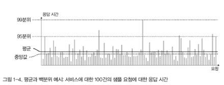
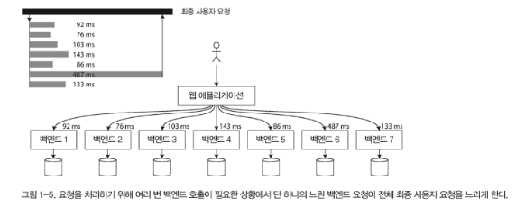

# 1장 신뢰할 수 있고 확장 가능하며 유지보수하기 쉬운 애플리케이션

> 이번 장에서는 우리가 어떤 내용을 다룰 것인지 간략하게 소개하는 파트인 것 같습니다.  
> 목차에 가까워서 간단하게 정리해봤습니다.

## 들어가기 앞서

- 책에선 최근의 애플리케이션은 계산 중심이 아닌 데이터 중심적이라고 표현한다.
    - 이는 "CPU 성능보다 데이터 양, 복잡도가 더 중요해졌다" 라는 것 같다.
- 그래서 데이터 중심 애플리케이션은 데이터베이스 / 캐시 / 검색 색인 / 비동기 메시지 처리 / 배치 처리가 중요해진다.

## 데이터 시스템에 대한 생각

- 데이터 베이스 / 큐 / 캐시등을 모두 데이터 시스템으로 포괄하겠다고 한다.
> 이유는 이렇다.
> 1. 최근의 도구들은 분류하기 어렵고 경계가 모호하다
> 2. 요즘 애플리케이션은 하나의 도구로는 할 수 없는 거대한 요구사항을 가지고 있다.
>    - 작업(work)을 단일도구에서 수행가능한 태스크(task)로 나누고 다양한 도구를 애플리케이션 코드로 연결한다.
>    - 
>    - 그래서 이제부턴 개발자는 데이터 시스템 설계자이기도 함!
- 데이터 시스템을 설계할때는 문제가 많다. 
- 이 책에서는 신뢰성 / 확장성 / 유지보수성에 중점을 둬서 해결하고자 한다.

## 신뢰성

- 신뢰성은 "무언가가 잘못되더라도 지속적으로 올바르게 동작함"으로 이해할 수 있다.
> 여기서 잠깐! 용어정리
> - 결함: 잘못될 수 있는 일
> - 내결함성 / 탄력성: 특정 결함을 예측하고 대처할 수 있는 능력
> - 장애: 사용자에게 필요한 서비스를 제공하지 못하고 시스템 전체가 멈춤
- 결함으로 인해 장애가 발생하지 않게끔 내결함성이 있는 구조를 설계하는 것이 좋다.
- 대부분의 많은 버그는 미흡한 오류 처리부터 시작한다고 한다.
- 아래에는 해결할 수 있는 결함들을 다룬다.

## 넷플릭스의 카오스 몽키

> 어디선가 들어본 적이 있어서 정리했어요~
- 카오스 몽키라는 이름은 "미친 원숭이가 데이터센터에 들어와 마구 케이블을 끊고 인스턴스를 파괴해도 서비스는 계속 된다! 라는 것에서 유래됬다고 한다.
- 카오스 몽키 프로그램은 매일 각 클러스터에서 임의로 인스턴스를 끄는 방식으로 진행한다.
- 그렇게 해서 서비스의 약점을 알게 되고 엔지니어들이 자동 복구 메커니즘을 구축하는 것이다.

## 하드웨어 결함

- 하드웨어 결함은 전자기기가 고장나거나 정전 사태가 발생하거나 누군가가 케이블을 뽑아버리는 물리적인 결함을 말한다.
- 데이터 양과 애플리케이션 계산 요구가 많아지면서 많은 장비가 필요하고, 하드웨어 결함도 많아졌다. 
- 대표적인 대응방법: 각 하드웨어의 중복을 두는 방식 (RAID, 핫 스왑 CPU, 이중 전원, 예비 발전기)

## 소프트웨어 오류

- 하드웨어는 무작위적이고 서로 독립적이다, 다른 부류의 결함으로 시스템 내 체계적 오류(systematic error)가 있다.
- 예시로는 "잘못된 입력 / 자원을 과도하게 사용 / 속도가 너무 느리거나 잘못된 응답 반환 / 작은 결함이 다른 결함을 야기하는 연쇄 장애"가 있다.
- 대응방법: 이렇다 할 방법이 없다. 대신에 "상호작용에 대해 주의깊게 생각하기 / 빈틈없는 테스트 / 프로세스 격리 / 죽은 프로세스 재시작 / 프로덕션 환경에서 시스템 동작 측정 / 모니터링 / 분석"을 하면 좋다.

## 인적 오류

- 사람은 미덥지 않다. 대부분의 중단의 원인이 운영자의 실수다.
- 어쩌면 좋을까?
    - 오류의 가능성을 최소화 하는 방향으로 설계 (잘 설계된 추상화, API, 관리 인터페이스)
    - 실제 데이터를 사용해 실험해볼 수 있지만 실 서비스에 영향이 없는 샌드박스를 제공
    - 단위 테스트 / 전체 시스템 통합 테스트 / 수동 테스트 철저하게 하기 (코너 케이스 다루기 좋다)
    - 인적 오류를 빠르고 쉽게 복구할 수 있게 하기 (설정 변경 빠르게 롤백 / 새로운 코드 천천히 롤아웃 / 데이터 재계산 도구 제공)
    - 성능 지표와 오류율 모니터링

## 확장성

- 성능 저하의 흔한 이유는 부하 증가다.

## 부하 기술하기

- 부하는 간결하게 기술해야 한다.
- 부하는 부하 매개변수로 나타낼 수 있다.
- 부하 매개변수는 웹 서버의 초당 요청 수 / 데이터베이스의 읽기 쓰기 비율 / 동시 활성 사용자 / 캐시 적중률 등이 될 수 있다.

## 성능 기술하기

- 부하가 증가할때 성능에 미치는 영향에 대해 기술해야 한다.
> 부하 매개변수가 커질때..
> - 시스템 자원은 그대로 두면 성능은 어떻게 될까?
> - 성능이 변하지 않으려면 시스템 자원을 얼마나 늘려야 하지?
- 온라인 시스템에서 중요한 사항은 "응답시간"이다. (클라이언트가 요청을 보내고 응답을 받는 시간)
> - 지연 시간: 요청이 처리되길 기다리는 시간
> - 응답 시간: 지연시간 + 요청을 처리하는 시간
- 응답시간은 분포로 다뤄야 한다. 일부 특이 값이 있기 때문. (네트워크 상태부터 OS등 여러 이유가 있을 수 있다.)
    
- 응답시간은 백분위로 보는것이 좋다.
    - 보통 얼마만큼 걸리지? -> 중앙값
    - 특이값을 보고 싶다 -> p95, p99, p999 
- 특이값을 꼬리 지연시간이라고 하는데, 사용자 경험에 직접적인 영향을 끼친다.
>   - 이를 보고.. 내 서비스의 성능 요구사항은 "pXX는 얼마 이하여야 한다"로 기술해야 된다는 것을 깨달음.
- 큐 대기 지연은 높은 백분위에서 응답 시간의 범인이다!
- 선두 차단(head-of-line blocking) 때문에 응답시간이 늘어날 수 있다.
    - 느린 요청 때문에 후속 요청의 대기 시간이 늘어나는 현상
> - 상위 백분위는 여러번 요청해야 하는 서비스에서 중요하다.
> - 하나의 요청의 응답시간만 특이값이 돼도 전체 요청이 영향을 받기 때문이다.
> - 이를 꼬리 지연 증폭(fail latency amplification)이라 한다.
>   
> - 이를 감지하기 위해서 가장 좋은 방법은 히스토그램이다.

## 부하 대응 접근 방식

- 부하 매개변수가 어느 정도 증가해도 좋은 성능을 유지하려면 어떻게 해야 하지?
- 적절한 사양의 장비 몇대를 설정하는게 좋다.
- 일부 시스템은 탄력적(elastic)이다. 부하 증가를 감지하면 자동으로 자원을 추가한다.
- stateless인 서비스를 scale-out하는건 쉽지만, stateful한 서비스를 scale-out하기는 어렵다.
    - 그러니까 데이터베이스를 분산으로 만들어야 하는 고가용성 요구가 있을때까지 단일 노드로 버티자.
- 그렇지만 요즘은 분산 시스템 도구가 좋아져서 분산 테이터 시스템이 필요 없어도 디폴트가 돼지 않을까..? (저자 생각)
>   - rdb를 사용하면 스케일 아웃이 복잡해지고 이를 다루기 위해 비싼 비용을 지불해야 한다.
>   - 반면에 mongodb는 기본으로 샤딩을 지원하는 것으로 알고 있는데, 데바데(?) 인것 같다.
- 특정 애플리케이션에 적합한 확장성을 갖춘 아키텍처는 주요 동작 / 비주류 동작을 가정해 나누어 구축한다. 이 가정은 부하 매개변수가 된다.
    - 미래를 가정한 부하에 대비해 미리 확장하는 것 보다는 빠르게 반복해서 제품 기능을 개선하는 작업이 더 중요하다. (그럴 수 있는 역량을 쌓아두자)
- 이런 아키텍처는 익숙한 패턴으로 나열된 범용적인 구성요소로 구축한다. 앞으로 이 책에서는 이러한 구성 요소와 패턴에 대해 설명한다.

## 유지보수성

- 사람들은 레거시를 유지보수하고 싶어하지 않는다.
- 레거시 소프트웨어를 만들지 않게 설계할 수 있다! 아래만 지키면..
    - 운용성(operability): 운영팀이 원활하게 운영할 수 있게 쉽게 만들기
    - 단순성(simplicity): 복잡도를 제거해 새로운 개발자가 이해하기 쉽게 만들기
    - 발전성(evolvability): 이후에 시스템을 쉽게 변경할 수 있게 만들기 (유연성, 수정 가능성, 적응성)

> 요 아래 부터는 그냥 큰 틀만 제공하고 있네요. 목차 처럼 보세요

## 운용성: 운영의 편리함 만들기

- 운영 중 일부를 자동화 해야 한다.
- 좋은 운영성은 반복되는 태스크를 쉽게 수행하게 해서 운영팀이 고부가가치 활동에 집중할 수 있게 하는 것.
- 이런것을 하면 좋다.
    - 좋은 모니터링으로 런타임 동작과 시스템 내부의 가시성 제공
    - 자동화와 통합을 위한 우수한 자원 제공
    - 좋은 문서와 이해하기 쉬운 운영 모델 제공
    - 기본값을 다시 정의할 수 있게함
    - 관리자가 시스템 상태를 수동으로 제어 가능하게 함

## 단순성: 복잡도 관리

- 복잡도는 다양하게 나타난다.
    - 상태 공간의 급증 / 모듈간 강한 커플링 / 복잡한 의존성 / 일관성 버린 네이밍 / 성능 해결을 목표로 한 해킹 / 임시방편으로 해결한 땜빵
- 시스템을 단순하게 만드는 일은 우발적 복잡도를 줄인다고도 한다.
    - 우발적 복잡도: 소프트웨어가 풀어야 할 문제에 내재하고 있지 않고 구현에서만 발생하는 것
- 우발적 복잡도를 제거하기 위한 좋은 도구는 "추상화"
    - 추상화를 통해 직관적인 외관을 만들고 세부 구현을 숨기자
- 앞으로 책에선 좋은 추상화를 다룰 것이다.

## 발전성: 변화를 쉽게 만들기

- 애자일 작업 패턴은 변화에 적응하기 위한 프레임워크를 제공한다.
- 애자일 커뮤니티는 TDD이나 리팩토링, 변화에 빠르게 대응할 수 있는 패턴을 제공한다.
> 애자일 커뮤니티가 뭔데 나도 끼워조라
- 이 책에서는 다양한 애플리케이션이나 다른 특성을 가진 서비스로 구성된 대규모 데이터 시스템 수준에서 발전성을 높이는 방법을 찾는다.
- 발전성도 시스템에 간단함과 추상화에 밀접한 관련이 있다.

끄ㅌ!