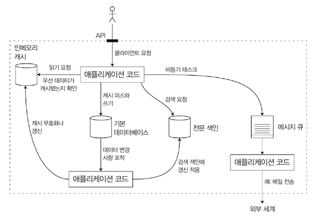
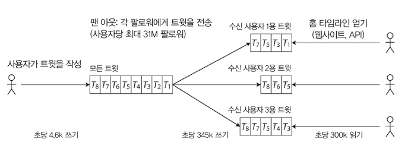
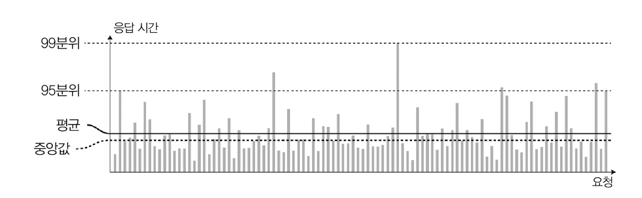
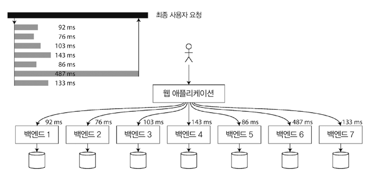

# Introduction
## 애플리케이션을 제한하는 요인 
- 데이터 양
- 데이터의 복잡도
- 데이터의 변화 속도

## 애플리케이션이 필요로 하는 요소 
- 데이터베이스
  - 데이터의 저장을 위함 
- 캐시 
  - 읽기 속도 향상을 위함
  - 비용이 많이 드는 연산 결과를 기억 
- 인덱스 (Search index)
  - 키워드로 데이터를 검색하기 위함
  - 다양한 방법으로 필터링을 할 수 있게 함 
- 스트림 처리 (Stream processing)
  - 비동기 처리를 위해 다른 프로세스로 메세지 전송 
- 배치 처리 (Batch processing)
  - 대량의 데이터를 처리하기 위함
  - 주기적으로 대량의 데이터를 저장하거나 분석

---

---

# 데이터 시스템에 대한 생각 
## 왜 데이터시스템이라는 포괄적 용어로 묶어야 하나? 
### 1. 새로운 도구들은 다양한 Use case에 최적화 되어 있어 전통적인 분류에 딱 들어맞지 않음 
- 전통적 분류
  - 메세지 큐와 데이터 스토어를 확실하게 구분
- 최근 
  - 레디스는 데이터 스토어지만 메세지 큐의 역할을 할 수도 있음
  - 카프카는 메세지 큐 이지만 데이터베이스처럼 지속성을 보장 하기도 함 

### 2. 많은 애플리케이션들이 복잡하고 광범위한 요구사항을 갖고 있음 

- 단일 도구로는 해결 불가 
- 작업(work)을 단일 도구에서 효율적으로 수행 가능한 태스크(task)로 나누어 서로 연결하여 구성
  - 즉, 작업을 특정 단위의 태스크로 나누고, 그 태스크를 수행할만한 도구를 선정하여 구성한다는 뜻
  - ex: 저장은 MySQL, 글로벌 캐시는 레디스, 전문 검색은 엘라스틱 서치로 구성

## 소프트 웨어 시스템에서 중요하게 여기는 세 가지 관심사
- 신뢰성(Reliability)
  - 하드웨어, 소프트웨어 결함, 휴먼 에러가 발생해도 **시스템은 지속적으로 올바르게 동작(원하는 성능 수준에서 정확한 기능)** 해야 한다.
- 확장성(Scalability)
  - 시스템 데이터의 양, 트래픽 양, 복잡도가 증가하여도 이를 처리할 수 있는 적절한 방법이 있어야 함 
- 유지보수성(Maintainability) 
  - 모든 사용자가 시스템 상에서 생산적으로 작업할 수 있게 해야 함 
    - 작업 유지보수, 새로운 use case 추가 등

    
---

---

# 신뢰성 
## 애플리케이션이 올바르게 동작한다는 것 
- 사용자가 기대한 기능을 수행함 
- 사용자가 범한 실수나 예상치 못한 소프트웨어 사용법을 허용할 수 있음 
- 예상된 부하와 데이터 양에서 필수적인 use case를 충분히 만족하는 성능을 가져야 함 
- 허가되지 않은 접근과 오남용을 방지함 

> 결론적으로, **"무언가 잘못되더라도 지속적으로 올바르게 동작한다"** 는 것이 소프트웨어에서의 신뢰성이다.

## 내결함성 or 탄력성을 지닌 소프트웨어 
- 결함(fault)
  - 잘못될 수 있는 일을 의미
  - 사양에서 벗어난 시스템의 한 구성 요소 
- 내결함성(fault-tolerant) or 탄력성(resilient)을 지닌 소프트웨어
  - 결함을 예측하고 대처할 수 있는 시스템
  - 하지만 모든 종류의 결함을 견딜 수 있는 시스템을 만들 수는 없다 
  - **특정 유형의 결험 내성에 대해서만 이야기하자**
- 장애
  - `결함 != 장애` 
  - 사용자에게 필요한 서비스를 제공하지 못하고 시스템 전체가 멈춘 경우

> - 결함 0은 불가능하므로, 결함으로 인해 장애가 발생하지 않게끔 **내결함성 구조를 설계하자**
> - 실제로 많은 중대한 버그는 **미흡한 오류 처리**에 기인함 
> - 고의적으로 결함을 일으켜 내결함성 시스템을 테스트하자 (ex - 넷플릭스 카오스 몽키)
> - 보안은 내결함성 보다는 결함을 예방해야 하는 한 요소다. 문제가 발생하면 되돌릴 방법이 없다. (해결책이 없는 결함)

## 하드웨어 결함 
- HDD 고장, 램 결함, 정전, 네트워크 장애...
- 하드디스크의 평균 장애 시간(MTTF, Mean Time To Failure)은 약 10~50년
  - 10,000개의 디스크로 구성된 클러스터는 평균적으로 하루의 한 개의 디스크가 죽는다고 예상해야 함
- 하드웨어 결함은 무작위적이고 서로 독립적이다 
  - 한 디스크에 장애가 생긴다고 해서 다른 디스크로 전파가 되지는 않는다
  - 서버 랙의 온도, 화재 등과 같은 공통적인 외부 원인이 있는 경우 제외      

### 시스템 장애율을 줄이기 위한 대응
- 하드웨어 문제로 장애가 발생하는 것을 완전히 막을 수는 없기에, 장애율을 줄이기 위해 노력해야 한다.
- 각 하드웨어 구성 요소에 중복(redundancy)을 추가 
  - 디스크는 RAID 구성 설치 
  - 서버는 이중 전원 디바이스와 hot-swap이 가능한 CPU로 구성
  - 데이터센터는 건전지와 예비 전원용 디젤 발전기를 구성 
  - 즉, 구성 요소 하나가 죽는다고 해도 중복된 구성 요소를 대신 사용하여 장애율을 줄일 수 있음

## 소프트웨어 오류 
- 시스템 내 체계적 오류(Systematic error) 
  - 예상하기 어렵고 노드 간 상관관계 때문에 장애가 전파될 수 있음
  - 더욱 더 많은 오류를 유발하는 경향 
- 소프트웨어 결함을 유발하는 버그
  - 특정 상황에 의해 발생하기 전까지 오랫동안 나타나지 않음 
- 신속한 해결책이 없음 
  - 시스템의 가설과 상호작용에 대해 주의 깊게 생각해야 함 
  - 테스트를 빈틈없이 해야 함 
  - 프로세스를 잘 격리해야 함 
  - 죽은 프로세스의 재시작을 허용해야 함 
  - 운영 환경에서 시스템 동작을 모니터링하고 분석하여야 함 

## 휴먼 에러 
- 소프트웨어 시스템을 설계하고, 구축하고, 운영하는 것은 결국 사람이다 

### 신뢰성 있는 소프트웨어를 만들기 위한 접근법 
- 오류의 가능성을 최소화 하는 방향으로 시스템을 설계
  - 잘 설계된 추상화, API, 인터페이스 등을 사용 → 옳은 일을 쉽게할 수 있다 
- 사람의 실수로 장애가 발생할 수 있는 부분을 격리 
  - 실제 데이터를 사용해 안전하게 조회하거나 실험할 수 있지만, 실제 사용자에게는 영향이 없는 **비 프로덕션 샌드박스(sandbox)** 를 제공하자  
- 철저한 테스트 
  - 단위 테스트, 통합 테스트, 수동 테스트까지 모든 수준에서 철저하게 테스트할 것 
  - 정상적인 동작에서는 거의 발생하지 않는 **코너 케이스(corner case)** 를 다루는 데 있어 자동화 테스트가 유용함 
- 인적 오류를 빠르고 쉽게 복구할 수 있도록 구성 
  - 장애 발생 영향 최소화를 위함 
  - 변경 내역을 빠르게 롤백, 새로운 코드를 서서히 roll out 등을 제공 
- 상세하고 명확한 모니터링 대책을 마련
  - 성능 지표, 오류율과 같은 데이터를 제공할 수 있어야 함 
  - 발생하는 일을 추적하고, 장애 해석을 위해 필수적인 요소 
- 조작 교육 및 실습을 시행 

> 애플리케이션은 사용자에 대한 책임이 있다. 

---

---

# 확장성 
- 증가한 부하에 대처하는 시스템 능력을 설명하는 데 사용되는 용어 
- 확장성을 논한다는 것 
  - 확장성이 있다 없다 → 무의미한 논쟁
  - 시스템이 특정 방식으로 커질 경우 이를 대처하기 위한 선택은?
  - 추가적인 부하를 다루기 위해 자원을 어떻게 투입할까? 

## 부하 기술 
- 시스템의 현재 부하를 간결하게 기술해야 함 
  - "부하가 두 배로 되면 어떻게 될까?" 등의 부하 성장 질문을 논의하기 위함 

### 부하 매개변수(load parameter)
- 부하를 나타낼 수 있는 몇 개의 숫자 
- 적합한 부하 매개변수 선택은 시스템 설계에 따라 달라진다 
- 부하 매개변수가 될 수 있는 것들 
  - 웹 서버의 초당 요청 수 
  - 데이터베이스의 읽기 대 쓰기 비율 
  - 실시간 채팅창의 동시 활성 사용자 (active users) 수
  - 캐시의 적중률 (hit rate)

### 트위터를 예로 살펴보자 
- 주요 기능 
  - 트윗 작성 
    - 팔로워에게 새로운 메세지 게시 
    - 평균 초당 4.6k 요청, 피크일 때 초당 12k 요청 이상  
  - 홈 타임라인
    - 사용자가 팔로우한 사람이 작성한 트윗을 볼 수 있는 곳 
    - 초당 300k 요청
- 문제
  - 트윗 양 보다는 팬아웃(fan-out) 때문 
    - 팬아웃?
      - 논리 회로에서, 하나의 논리 게이트의 출력이 얼마나 많은 논리 게이트의 입력으로 사용되는지에 대해 서술할 때에 쓰인다. 
      - 팬 아웃이 크다 == 하나의 출력이 많은 논리게이트의 입력으로 사용된다는 뜻 
        - 팬 아웃이 너무 크면 무리가 많이 가거나 신호가 제대로 전달되지 않을 수 있기 때문에 중간에 버퍼나 NOT 게이트 두 개를 연결하여 해결하기도 한다.

- 관계형 데이터베이스만 사용하면, 질의 부하를 관계형 DB 혼자서 버텨내야 함 
- 트윗은 아래의 방식을 이용하여 문제를 해결하고자 하였음 
  - 
  - 쓰기 < 읽기 
    - 쓰기 시점엔 많은 일을 하게 하고, 읽기 시점에는 적은 일을 하도록 구성
- 초당 4.6k 트윗 → 약 75명의 팔로워에게 전달될 경우 초당 345k 건의 쓰기 
  - 평균값은 사용자마다 팔로워수가 매우 다르다는 사실을 가림 
  - 인플루언서 등 유명인은 팔로워가 많다는 사실을 간과하면 안됨 
    - 단일 트윗이 3천만건 이상의 쓰기 요청이 되어버릴 수도 있음 
  - 즉, 사용자 당 팔로워 분포가 팬아웃 부하를 결정함 (트윗 빈도에 따라서도 편중될 수 있음)
- 결과 
  - 접근 방식을 혼합하여 사용 
  - 팔로워 수가 매우 많은 소수 사용자는 팬 아웃에서 제외 
    - 이는 별도로 가져와 읽는 시점에 사용자의 홈 타임라인에 합침

## 성능 기술하기 
- 시스템 부하를 기술한 후, 부하가 증가할 때 어떤 일이 일어나는지 조사 
  - 부하 매개변수 ↑, 시스템 리소스(CPU, 메모리, 네트워크 대역폭)은 유지 → 시스템 성능은 어떻게 영향을 받을까
  - 부하 매개변수 ↑ → 성능이 변하지 않고 유지되길 원할 경우 늘려야 할 리소스 양 

- 일괄 처리 시스템
  - 보통 **처리량(throughput)** 에 관심을 가짐
    - 처리량: 초당 처리할 수 있는 레코드 수 or 일정 크기의 데이터 집합으로 작업 수행 시 걸리는 전체 시간 
- 온라인 시스템
  - **서비스 응답 시간(response time)** 에 관심을 가짐

> Latency(지연 시간)와 Response time(응답 시간)
> - 동일하지 않은 개념임 
> - 응답 시간
>   - 클라이언트 관점에서 본 시간
>   - 요청을 처리하는 실제 서비스 시간 + 네트워크 지연 + 큐 지연 등을 포함
> - 지연 시간
>   - 요청이 처리되길 기다리는 시간 
>   - 서비스를 기다리며 휴지(latent) 상태인 시간을 말함

- 응답 시간은 많이 변하므로, 단일 숫자가 아니라 측정 가능한 값의 **분포**로 생각해야 함
  - 응답 시간 지연에 영향을 주는 다양한 요인들
    - 컨텍스트 스위치
    - 네트워크 패킷 손실로 인한 TCP 재전송 
    - GC pause 
    - DISK I/O를 유발하는 Page fault
    - 서버 랙의 기계적인 진동 

- 전형적인 응답 시간을 알고 싶을 경우 **평균은 그다지 좋은 지표가 아님**
  - 평균은 얼마나 많은 사용자가 실제로 지연을 경험했는지 알려주지 않는다
  - 그러므로 평균보다는 **백분위**를 사용하자
- 가장 빠른 응답속도 ~ 가장 느린 응답속도 로 정렬하고 중앙값(median)을 지표로 사용해보자 
  - 얼마나 많은 사용자가 중앙값 이상의 응답 시간을 경험했는가? 
  - 중앙값은 단일 요청을 참고한다 
  - Outlier 값을 참고하고자 하면 상위 백분위를 살펴보자 (p95, p99, p999)
    - 요청의 95%, 99%, 99.9%가 특정 기준치보다 더 빠를 경우 특정 기준치가 각 백분위의 응답 시간 기준치가 됨 
    - ex) p95 응답 시간이 1.5인 경우, 100개 요청 중 95개는 1.5초 미만 & 5개는 1.5초 이상 
- 상위 백분위 응답 시간 
  - 꼬리 지연 시간(tail latency)
  - 서비스 사용자 경험에 직접적인 영향을 주므로 중요함
  - 보통 응답시간이 가장 느린 요청을 경험한 고객은 많은 데이터를 갖고 있어서임 (소중한 고객)
    - 우리 회사도... 경험이 있다. (보관함 썰 on)
  - 웹사이트를 빠르게 제공 가능하게끔 보장하여 고객을 행복하게 만드는게 중요
    - 아마존은 응답 시간 요구사항을 99.9분위로 설정
      - 99.99분위 최적화에는 너무 많은 비용이 들어가 이익을 주지 못한다고 여김 

- 백분위는 서비스 수준 목표(SLO, Service Level Objective), 서비스 수준 협약서(SLA, Service Level Agreement)에 자주 사용함 
  - 기대 성능과 서비스 가용성을 정의하는 계약서에도 자주 등장 
  - ex) 응답 시간 중앙값이 200ms 미만이고, 99분위가 1초 미만인 경우 정상 서비스 상태로 간주한다 
  - ex) 서비스 제공 시간은 99.9% 이상이어야 한다 

- 큐 대기 지연 
  - 응답 시간의 상당 부분을 차지
  - 소수의 느린 요청 처리만으로도 후속 요청 처리가 지체됨
    - 선두 차단(head-of-line blocking)
  - 후속 요청이 빠르게 처리되더라도, 이전 요청이 완료되길 기다려야 하는 시간이 있음 
    - 클라이언트는 전체적으로 응답이 느리다고 생각하게 됨 
    - 클라이언트 응답 시간이 중요 

- 시스템의 확장성을 테스트하기 위해 인위적인 부하를 생성하는 경우 
  - 부하 생성 클라이언트는 응답 시간과는 독립적으로 요청을 지속적으로 보내야 함 
  - 다음 요청을 보내기 전에 이전 요청을 기다리게 되는 경우 테스트에서 인위적으로 대기 시간을 실제보다 더 짧게 만들어 평가를 왜곡함

> ### 실전 백분위 
> 
> - 상위 백분위는 단일 최종 사용자 요청의 일부 
>   - 여러번 호출되는 백엔드 서비스에서 특히 중요 
>   - 병렬로 호출해도 사용자 요청은 여전히 병렬 호출 중 가장 느린 호출이 완료되길 기다려야 함 
>     - 이를 Tail latency amplification 이라고 함
> - 관련 알고리즘
>   - Forward decay, T-digest, HdrHistogram...
> - 응답 시간 데이터를 집계하는 올바른 방법은 **히스토그램을 추가**하는 것 

## 부하 대응 접근 방식
### Scale-up
- 수직적 확장 
- 장비 스펙업

### Scale-out
- 다수의 낮은 사양 장비에 부하 분산 
- 비공유 아키텍처
- Stateless 서비스 배포는 간단함 
- Stateful 데이터 시스템을 분산 설치하는 일은 아주 많이 복잡함 
  - 고가용성 요구가 있을때 까지 단일 노드에 DB를 유지하는 것이 가장 효율적임 

### 아키텍처 결정 요소 
- 범용적이고 모든 상황에 맞는 확장 아키텍처는 없다 
- 결정 요소
  - 읽기의 양
  - 쓰기의 양 
  - 저장할 데이터의 양 
  - 데이터 복잡도 
  - 응답 시간 요구사항 
  - 접근 패턴 
- 적합한 확장성을 갖춘 아키텍처 
  - 주요 동작이 무엇이고, 잘 하지 않는 동작이 무엇인지에 대한 가정을 바탕으로 구축
    - 가정이 잘못되면 최악의 경우 역효과를 낳음 
    - 검증되지 않은 제품의 경우, 미래를 가정한 부하에 대비해 확장하기 보다는 빠르게 반복해서 제품 기능을 개선하는 작업이 좀 더 중요함

---

---

# 유지보수성
- 소프트웨어 비용의 대부분은 초기 개발이 아닌 **유지보수**에 들어간다 
- 유지보수 타겟
  - 버그 수정
  - 시스템 운영 및 유지 
  - 장애 조사 
  - 새로운 use case 추가 
  - 기술부채 상환 
  - 새로운 기능 추가 
- 유지 보수 중 고통을 최소화하도록 소프트웨어를 설계하자 

## 소프트웨어 시스템 설계 원칙 
- 운용성(operability)
  - 운영팀이 시스템을 원활하게 운영할 수 있도록 쉽게 만들자 
- 단순성(simplicity)
  - 시스템에서 복잡도를 최대한 제거하여 새로운 엔지니어가 시스템을 이해하기 쉽게 만들자  
- 발전성(evolvability)
  - 시스템을 쉽게 변경할 수 있게 하자 
  - 유연성(extensibility), 수정 가능성(modifiability), 적응성(plasticity) 이라고도 함 

### 운용성: 운영의 편리함을 만들자 
- 좋은 소프트웨어라도 나쁘게 운영할 경우 작동을 신뢰할 수 없다 
  - 운영 중 일부 측면이 자동화가 가능하다면 자동화 하자 
- 좋은 운영성이란
  - 동일하게 반복되는 태스크를 쉽게 수행하게끔 만들어 고부가가치 활동에 노력을 집중하는 것 

### 단순성: 복잡도 관리 
- 복잡성 증가는 유지보수 비용이 증가하는 원인
- 다양한 복잡도 증가 원인  
  - 모듈 간 강한 결합(tight coupling)
  - 복잡한 의존성 
  - 일관성 없는 코드 스타일 (이름, 용어)
  - 임시 방편 해결책
- 낮은 복잡도는 높은 유지보수성을 제공한다 
  - 단순성이 구축하려는 시스템의 핵심 목표여야 한다 
- 단순성 != 기능을 줄인다 
  - 우발적 복잡도(accidental complexity)를 줄인다는 뜻이다 
- 우발적 복잡도 
  - 소프트웨어가 풀어야 할 문제에 내재된 게 아님 
  - 구현에서만 발생하는 것 
  - 줄이기 위한 최상의 도구는 **추상화**다 
    - 좋은 추상화는 깔끔하고 직관적인 외관 아래로 세부 구현을 숨김 
    - 좋은 추상화는 재사용이 가능하며 고품질 소프트웨어로 이어지게 만듬
    - ex) 프로그래밍 언어는 기계어를 추상화, SQL은 데이터베이스를 추상화

### 발전성: 변화를 쉽게 만들자 
- 시스템의 요구사항은 끊임없이 변한다 
  - 애자일, TDD, 리팩토링 ...
- 핵심 
  - 시스템의 민첩성을 높이기
  - 작업을 작게 나눠서 빠르게 피드백 받기
- 간단하고 이해하기 쉬운 시스템은 수정이 쉽다 

---

---

# 정리 
# 요구사항은 둘로 나뉜다 
- 기능적 요구사항 
  - 데이터 저장, 조회, 검색... 
- 비기능적 요구사항
  - 보안, 신뢰성, 법규 준수, 확장성, 호환성, 유지보수성...

# 신뢰성, 확장성, 유지보수성
- 신뢰성
  - 결함이 발생해도 시스템이 올바르게 동작하게 만든다 
  - 내결함성 기술은 최종 사용자에게 특정 유형의 결함을 숨길 수 있게 해준다 
- 확장성
  - 부하가 증가해도 좋은성능을 유지하기 위한 전략 
- 유지보수성 
  - 시스템에서 작업하는 엔지니어와 운영 팀의 삶을 개선하기 위함 
  - 좋은 추상화는 복잡도를 줄이고 변경이 쉬운 소프트웨어를 만들어준다 
  - 좋은 운용성이란, 시스템 건강 상태를 잘 관찰할 수 있고 효율적으로 관리하는 방법을 보유한다는 뜻 
  