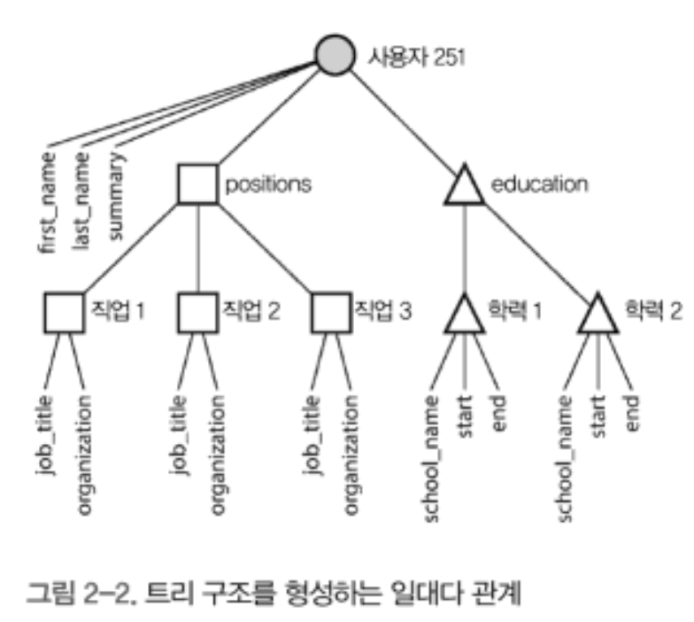
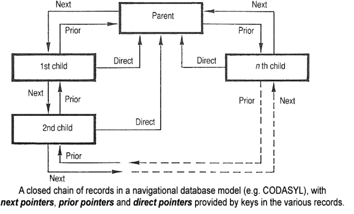
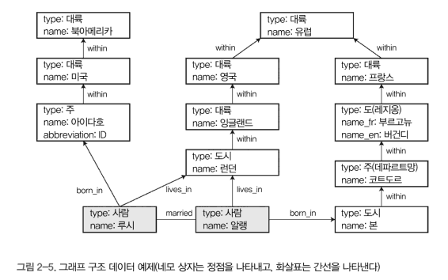

# 데이터 모델과 질의 언어

> 결국 각각의 데이터 모델은 단점과 장점이 있다.  
> 이들은 단점을 보안하기 위해 다른 데이터 모델을 흉내내는것 같다.  
> 하지만 좋은 점만 가져오지는 못하고 단점까지 답습하는 것 처럼 보이기도 한다.  

- 데이터 모델은 중요함.

    - 문제를 어떻게 생각해야 하는지에 대해서도 데이터 모델은 영향을 미친다.
- 대부분의 애플리케이션은 하나의 데이터 모델을 다른 데이터 모델 위에 계층을 둬서 만든다.

    - 개발자들은 현실을 보고 객체나 데이터 구조, 이러한 데이터를 다루는 API를 모델링 함.
    - 데이터 구조를 저장할때, `JSON / XML / RDB 테이블 / 그래프 모델`과 같은 데이터 모델로 표현하게 된다.
- 각 계층은 명확한 데이터 모델을 제공해 하위 계층의 복잡성을 숨긴다.

    > - 이러한 추상화는 다른 그룹의 사람들이 효율적으로 일할 수 있다고 하는데..
    > - 잘 이해가 안된다. DTO같은 걸 의미하는 걸끼?
- 아무튼 이 책에서는 관계형

## 관계형 모델과 문서 모델

- 관계형 모델은..

    - 데이터(table)는 관계로 구성되고 각 관게는 순서 없는 튜플(row) 모음이다.
    - 원래는 비즈니스 데이터 처리에서 많이 사용했다.
    - 트랜잭션 처리(영업 / 금융거래 / 예약 / 재고관리) 혹은 일괄처리(급여 지불 / 공지)를 위해서 썼다.

> 왜 테이블형 모델이 아니라 관계형 모델인걸까?  
> 다른 모델로도 관계를 표현할 수 있지 않나?  
> 어쩌면 이름을 선점한 것 같다.  
> 퀵소트가 가장 빠른 것이 아닌것 처럼..  

### NoSQL의 탄생

- "NoSQL"이라는 이름은 적절하지 못하다
- 비관계형 데이터베이스를 의미하는 인기 트위터 해시태그 였다고 한다.
- NoSQL이 인기를 끈 이유가 뭘까?

    - 대규모 데이터셋이나 매우 높은 쓰기 처리량 달성을 위해서
    - 관계형 스키마의 제한에 반발과 동적이고 표현력이 풍부한 데이터 모델의 대한 바람

### 객체 관계형 불일치

- 대부분의 애플리케이션은 객체지향 프로그래밍 언어로 개발된다.
- 하지만 SQL 데이터 모델을 사용하면 객체지향과 관계형 테이블의 불일치 때문에 전환 계층이 요구된다.
- 이러한 불일치는 `임피던스 불일치`라고 한다.
- ORM을 쓰면 좋지만 두 모델 간의 차이를 완전히 숨길수는 없다.

> - 여기에 빌게이츠 아저씨의 이력서 어쩌고가 시작된다.
> - 대충 "이력서는 문서라서 JSON이 더 나을지도 몰라"라고 하는 내용이다.

- 일부 개발자는 JSON 모델이 애플리케이션 코드와 저장 계층 간 임피던스 불일치를 줄인다고 생각한다.

    > - JSON객체는 js에서 마치 컨테이너 객체처럼 쓰이기 때문에 큰 차이가 없어 보인다.
- 또, JSON은 다중 테이블 스키마 보다 더 나은 지역성을 갖는다.

    - 관계형에서는 조인해서 가져와야 하지만 json은 한번에 가져올 수 있으니까 좋다.
    - 일대다 관계에서 좋다.
    - 

### 다대일과 다대다 관계

- 평문 대신 ID 값을 사용할 때가 있다.
- ID를 사용할지 평문을 사용할지는 중복의 문제다.

    - ID를 사용하는 경우 의미있는 정보는 한곳에 저장하고
    - 평문을 사용하는 경우 모든 레코드에서 정보를 중복해서 저장하게 된다.
    - 중복을 제거하는 일이 정규화의 핵심 개념이기도 하다.
- ID 값을 사용하게 되면 다음과 같은 이점이 있다.

    - 모호함 회피 (이름이 같은 여러 도시가 있는 경우)
    - 생신의 편의성, 평문이 한곳에만 저장되므로 갱신하기 쉽다.

그 래 서!  

- 중복된 데이터를 정규화하려면 다대일 관계가 필요한데 문서모델은 이에 적합하지 않다.
- 문서 모델은 조인에 대한 지원이 약하기 때문이다.

> - MongoDB의 Aggration pipline의 $lookup기능으로 할 수 있다.
> - 뒤에서도 같은 소리를 하는데, 이 책이 오래된 건가? 싶다.

- 조인이 필요없는 애플리케이션을 개발한다고 해도, 나중에는 하게 되어있다. 데이터는 상호연결되기 때문이다.

> - 다대다도 같은 의미에서 같이 묶은 것 같다.

## 문서 데이터베이스는 역사를 반복하고 있나?

NoSQL에서 다대다 관계를 표한하려는 좋은 방법은 뭘까?
초기의 전산화 데이터베이스 시스템으로 돌아가자

### 계층 모델

- 70년대 비즈니스 데이터 처리를 위해 가장 많이 사용한 데이터베이스는 IBM의 IMS다.
- IMS는 JSON과 마찬가지로 모든 데이터를 레코드 내 중첩된 레코드 트리로 표현한다.
- IMS도 다대다 관계 표현에 어려움을 겪었고, 이 때문에 다른 형태의 모델이 등장하게 된 것이다.

### 네트워크 모델



- 코다실 모델이라고 부른다.

    > - 이게 그래프 모델인줄 알았는데, 다르다고 함. 차이는 그래프 모델에서 후술하겠음.

- 코다실 모델은 계층모델을 일반화한다. 트리와 같은 구조에서 모든 레코드는 항상 하나의 부모가 있다.

    > - 문서 모델은 트리와 같은 계층적인 구조를 가질 수 있다! 라면
    > - 코다실 모델은 항상 그래프 구조를 가져야 한다는 소리인것 같다.
    > - 그래프 구조인 이유는 순환 구조를 그릴 수 있는 듯 하다.

- 때문에 코다실 모델은 다대일이나 다대다 관계를 모델링 할 수 있다.
- 하지만, 접근 경로가 복잡하고 비효율적이다.
    
    - 코다실에서 질의는 레코드 목록을 반복해 접근 경로를 따라 커서를 이동시켜서 수행한다. 레코드의  유입 간선이 여러개(다대다 다대일 관계라면 이렇게 됨)라면 많은 관계를 추적해야 한다.
    - 수동으로 접근 경로를 선택하는 방법도 있는데 많이 힘들다

### 관계형 모델

- 관계형 모델은 복잡한 접근 경로가 없다.
- 질의만 하면, 쿼리 옵티마이저가 질의의 어느 부분을 어떤 순서로 어떻게 실행할지 결정하기 때문에 아주 좋다.

### 문서 데이터베이스

- 문서 데이터베이스는 중첩된 레코드를 별도의 테이블이 아닌 상위 레코드 내에 저장한다는 점에서 계층 모델로 돌아갔다.
- 하지만 다대일 / 다대다 관계를 표현할때 id 값으로 표현한다는 점에서 관계형과 크게 다르지 않다.

    - 이를 문서 데이터베이스에서는 `문서 참조`라 부른다.

## 관계형 데이터베이스와 오늘날의 문서 데이터베이스

- 문서 데이터 모델: 스키마 유연성 / 지역성에 기인한 고성능 / 애플리케이션의 데이터 구조와 잘 맞음
- 관계형 데이터 모델: 조인 / 다대일 / 다대다 관계를 더 잘 표현할 수 있다.

### 어떤 데이터 모델이 애플리케이션 코드를 더 간단하게 할까?

- 문서 데이터 모델은 보통 한번에 전체 트리를 적재한다.
- 중첩 항목을 바로 참조할 수 없다는 제약도 있다.
- 다대다 관계가 필요하면 문서 모델은 별로다!
- 어떤 모델이 코드를 더 간단하게 할지는 모른다. (그럼 왜 제목으로 달았을까..?)

### 문서 모델의 스키마 유연성

- 문서 데이터베이스는 데이터에 스키마를 강요하지 않는다.
- 그렇다고 문서 데이터베이스는 Schemaless라고 하기는 어렵다.

    - 암묵적인 스키마가 있기 때문이다.
    - 쓰기: 관계형과 같은 일반적인 스키마
    - 읽기: 데이터 구조가 암묵적이고 읽을때 해석해야 한다.

    > 쓰기는 정적 타입 체크와 비슷하고 읽기는 동적 타입 체크와 비슷

- 스키마의 차이는 애플리케이션이 데이터 타입을 변경하고자 할때 잘 드러난다.
- 문서 데이터베이스는 새로운 데이터 타입을 기존 데이터베이스에 쓰고 읽을때 처리하기만 하면 된다.
```python
if user is not None and "name" in user and "fist_name" not in user:
    user["first_name"] = user["name"].split(" ")[0]
```
- 관계형 데이터베이스는 마이그레이션 과정을 거쳐야 한다.
- 이 방식은 느릴 수 있고 중단 시간도 요구될 수 있다.
```sql
ALTER TABLE users ADD COLUMN fist_name text;
UPDATE users SET first_name = split_part(name, ' ', 1); -- postgresql
```

### 질의를 위한 데이터 지역성

- 문서는 모통 JSON, XML로 문자열이나 이진형태로 저장된다.
- 애플리케이션이 자주 전체 문서에 접근해야 한다면 저장소 지역성을 활용하면 좋다.
- 일반적으로 애플리케이션이 전체 문서가 필요한 경우가 적어서 문서를 아주 작게 유지해야 좋다.

### 문서 데이터베이스와 관계형 데이터베이스의 통합

- 관계형 데이터베이스 시스템은 XML이나 / JSON을 지원하고 있다.
- 문서 데이터베이스는 조인을 지원하고 있다.
- 점점 둘이 비슷해지고 있다.

## 데이터를 위한 질의 언어

- 관계형 모델이 나오면서 새로운 질의 언어도 등장했다.
- SQL인데, 기존의 명령형 코드를 대신해서 나온 선언형 언어다.
- 명령형 vs 선언형

    - 명령형 언어: 특정 순서로 특정 연산을 잘 수행하게끔 지시한다.
    - 선언형 언어: 목표를 달성하기 위한 방법이 아닌 결과가 충족해야 하는 조건과 어떻게 변환할지를 지정한다.

- 선언형 질의 언어는 명령형 언어보다 더 쉽다.
- 상세 구현이 숨겨져 있기 때문에 내부 최적화를 할 수 있다.
- SQL은 특정 순서를 보장하지 않으므로 순서에 의존하지 않아도 된다.

    > - mysql서 인덱스를 이용하면 항상 인덱스를 기준으로 정렬되어야 하며, 인덱스가 아닌 경우는 pk로 정렬된다....

- 선언형 언어는 병령 실행에도 좋다.

### 맵리듀스 질의

- <숙제.. 죄송해요..>

## 그래프형 데이터 모델



- 데이터간 연결이 복잡해지면 그래프로 모델링하는게 더 좋을 수 있다.
- 그래프형 데이터 모델에는 두가지의 방법이 있다. 

    - 속성 그래프 모델
    - 트리플 저장소 모델

- 그래프형 데이터 모델은 코다실(네트워크 모델)과는 다르다.

    - 코다실에서 특정 레코드를 탐색하는 방법은 접근 경로 중 하나를 탐색하는 방식이다.
    - 그래프 데이터베이스는 고유 ID를 가지고 있어 정점을 직접 참조하거나 색인을 이용할 수 있다.

### 속성 그래프 모델

- 속성 그래프 모델은 정점과 간선으로 구성된다.
- 정점은 `식별자 / 유출 간선 집합 / 유입 간선 집합 / 속성 컬랙션(키-값 쌍)`
- 간선은 `식별자 / 꼬리 정점(시작) / 머리 정점(끝) / 레이블 / 속성 컬랙션(키-값 쌍)`
- 속성 컬랙션은 스키마가 없어 많은 유연성을 제공한다.
- postgres에서 이렇게 구현할 수 있다.
    ```sql
    CREATE TABLE vertices (
        vertex_id interger PRIMARY KEY,
        properties json
    );

    CREATE TABLE edges (
        edge_id integer PRIMARY KEY,
        tail_vertex integer REFERENCES vertices (vertex_id),
        head_vertex integer REFERENCES vertices (vertex_id),
        label text,
        properties json
    );
    ```

### 사이퍼 질의 언어

- 사이퍼는 속성 그래프를 위한 선언형 질의 언어다.
- 각 정점에는 이름이 들어가고 이 이름과 화살표를 사용해 정점간 간선을 만들 수 있다.
```cypher
CREATE
    (KOREA:Location {name:'한국', type:'country'}),
    (JEJU:Location  {name:'제주', type: 'island'}),
    (ejun0:Person   {name:'준영'}),
    (JEJU) -[:WITHIN]-> (KOREA),
    (ejun0) -[:BORN_IN]-> (JEJU) -- 어? 아닌데
```
- MATCH 문을 이용해 *한국에서 일본으로 이민온 모든 사람들의 이름찾기* 같은것도 할 수 있다.
- 질의를 하면 모든 사람들의 정점부터 출발해서 알맞는 정점(한국, 일본)을 찾는다.
- 개수에 따라서 도착 정점에서 거꾸로 출발할 수도 있다. (최적화)
```cypher
MATCH
    (person) -[:BORN_IN]-> () -[:WITHIN*0...]-> (kr:Location {name: '한국'})
    (person) -[:LIVES_IN]-> () -[:WITHIN*0...]-> (jp:Location {name: '일본'})
RETURN person.name
```

### SQL의 그래프 질의

- 
