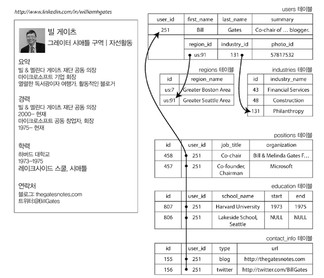
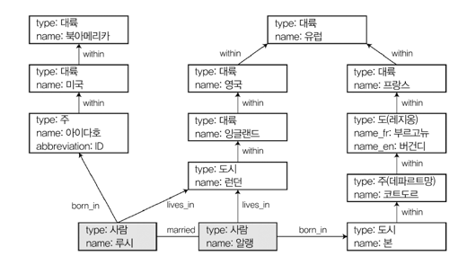
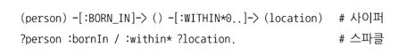

# Introduction
- 데이터 모델은 소프트웨어 개발에서 가장 중요한 부분 
  - 문제를 어떻게 생각하는지에 대해서도 영향
- 데이터 모델을 표현하는 방법은 다 다르다 
  - 애플리케이션 개발 
    - 현실(사람, 조직, 행동, 상품...) → 객체, 데이터 구조 → API 모델링 
  - 데이터 구조 저장
    - JSON, XML, 문서, RDBMS, Graph...
  - 데이터베이스 소프트웨어 개발 
    - JSON, XML, 관계형, 그래프 데이터 → 메모리/디스크 또는 네트워크 상의 byte 단위로 표현하는 방법을 결정 
    - 다양한 방법으로 데이터를 질의, 탐색, 조작 및 처리할 수 있게 개발함 
  - 하드웨어 개발
    - 전류, 빛의 파동, 자기장 등의 관점에서 byte를 표현하는 방법을 개발 
- 각 계층은 명확한 데이터 모델을 제공하여 하위 계층의 복잡성을 숨긴다 (추상화)
> **_데이터 모델은 그 위에서 소프트웨어가 할 수 있는 일과 할 수 없는 일에 지대한 영향을 주므로, 애플리케이션에 적합한 데이터 모델을 선택하는 작업은 상당히 중요하다._**
> - 데이터 모델마다 장단점이 있기 때문 

---

---

# 관계형 모델과 문서 모델 
## 관계형 모델 
- SQL, RDBMS
- 관계로 구성되고, 관계는 순서 없는 튜플(tuple) 모음임 
  - 튜플 = SQL의 row 
- 정규화된 구조로 데이터를 저장하고 질의할 필요가 있을 때 선택 
  - 트랜잭션 처리
  - 일괄 처리 
- 관계형 모델의 목표 
  - 정리된 인터페이스 뒤로 세부 구현사항을 숨기는 것 

## NoSQL의 탄생 
- Not Only SQL
- 비관계형 데이터베이스
- NoSQL 탄생 배경 (feat. 분산 환경 & 대규모 트래픽)
  - 대규모 데이터셋, 높은 쓰기 처리량 달성을 RDBMS보다 쉽게 할 수 있는 뛰어난 확장성이 필요해짐 
  - 상업적인 DB보다 무료 오픈소스 소프트웨어에 대한 선호도 증대 
  - 관계형 모델에서 지원되지 않는 특수한 질의 동작이 필요 
  - 관계형 스키마는 여러 제한이 있음 → 더욱 동적이고 표현력이 풍부한 데이터 모델이 필요
> **_애플리케이션은 각각 요구사항이 다르며, 유스케이스마다 최적의 기술 선택이 다를 수 있다._**

## 객체와 관계형 간의 불일치 

- 객체지향 언어와 SQL 데이터 모델의 **임피던스 불일치(impedance mismatch)** 가 존재 
  - 객체 → 관계형 데이터베이스로 저장 시 데이터 전환 계층이 필요 
  - Hibernate와 같은 ORM을 이용해서 어느정도 해결이 가능하나, 완벽한 해결은 불가 
- 위 그림과 같이 객체 하나를 표현하는 데 SQL을 사용하면 매우 복잡해진다...
  - 이력서와 같은 데이터 구조는 모든 내용을 갖추고 있는 "문서"이므로, JSON 형태의 표현이 더 적합하다 
  - MongoDB, CouchDB, 등의 document-oriented db가 이를 지원함 
- JSON 모델은 위 그림에서의 multi-table 스키마보다 **더 나은 지역성(locality)** 을 가짐 
  - 관계형 모델 : 프로필을 가져오기 위해 다중 질의 or 다중 조인이 필요
  - JSON 모델 : 질의 한번으로 그냥 가져오면 됨 (레코드 내에 중첩된 레코드 트리 형태로 표현)

## 다대일과 다대다 관계 
- ID, 텍스트 저장 여부는 **중복의 문제**
  - 의미 있는 정보는 한 곳에만 저장하고, ID를 참조하도록 구성 
  - 변경에 용이 (변경 발생 시 한곳만 변경하면 됨)
  - ID는 아무런 의미 없는 값을 사용하는 게 좋다. 의미가 있을 경우 추후 변경될 가능성이 있기 때문. ID가 변경된다면 참조하고 있는 곳의 값도 변경 해주어야 함 
    - ex: 영한쌤의 주민번호 PK 썰 
  - 정규화의 핵심 : 중복을 제거 
- 다대일 관계는 문서 모델에 적합하지 않음 
  - 문서 기반 데이터모델은 약한 조인 모델을 가지고있어 잘 지원되지 않음(?)

## 개발자가 고민해야 할 문제 
- 비정규화된 데이터를 중복된 상태로 둘지, 레코드와 또 다른 레코드의 참조를 수동으로 해결할지 결정해야

## 과거의 모델과 관계형 모델을 비교해 보자  
### 네트워크 모델 
- 코다실(Congress on Data Systems Languages)에서 제안
- 계층 모델  
  - 트리 구조 
  - 모든 레코드는 정확하게 하나의 부모가 존재
- 네트워크 모델
  - 레코드는 다중 부모가 있을 수 있음 
  - 레코드 간 연결이 외래 키 보다는 포인터와 더 비슷하게 되어있음 
  - 레코드 접근 방법 (접근 경로)
    - 최상위 레코드(root)에서 부터 연속된 연결 경로를 따르는 방법 
    - 다대다 관계에서는 다양한 접근 경로를 계속 추적해야 함 (다양한 관계를 전부 추적)
- 계층 모델, 네트워크 모델 모두 **원하는 데이터에 대한 경로가 없으면 찾기 어려운 상황에 놓임**
- 접근 경로 변경도 어려움 (재작성 수반)

### 관계형 모델 
- 알려진 모든 데이터를 배치하는 작업을 수행함 
- 관계(테이블) = 튜플(로우) 컬렉션 
- 복잡한 데이터를 보고싶을 때, 복잡한 접근 경로를 따라가는게 아님 
  - 임의 조건과 일치하는 테이블의 일부 or 모든 로우를 선택해서 읽을 수 있음 
  - 일부 컬럼을 키로 지정 → 컬럼과 일치하는 특정 로우를 읽을 수 있음 
  - 다른 테이블과 관계에 대해 신경쓰지 않고 임의 테이블에 새 로우 삽입 가능 
- 접근 경로
  - Query optimizer가 Query의 실행 순서를 결정하고, 사용할 index를 자동으로 결정 
  - **접근 경로를 사용자가 만드는게 아니라 Query optimizer가 만듦** → 개발자는 경로에 대해 생각할 필요가 없음 
- 애플리케이션에 새로운 기능을 추가하는 작업이 네트워크 모델에 비해 훨씬 쉬움

### 문서 모델
- 별도 테이블이 아닌 상위 레코드 내에 중첩된 레코드를 저장 (계층 모델과 유사)
- 다대다, 다대일 : 고유한 식별자로 참조 
  - 관계형 모델에서는 이게 외래키고
  - 문서 모델에서는 문서 참조(document reference)라고 함

## 관계형 데이터베이스 vs 문서 데이터베이스 
- 내결함성과 동시성 처리를 포함해서 고려해야 할 차이점이 많이 있음 
- 문서 모델의 장점
  - 스키마 유연성
  - 지역성(locality) 
    - 같이 참조되는게 가까이에 위치함 
  - 일부 애플리케이션에서 사용하는 데이터 구조와 더 가까움 
- 관계형 모델의 장점
  - 조인, 다대일, 다대다 관계를 잘 지원함 

## 애플리케이션 코드를 더 간단하게 할 수 있는 데이터 모델
- 문서 모델 
  - 애플리케이션의 데이터가 문서와 비슷한 구조일 때 
    - 일대다 관계 트리로 한 번에 전체 트리를 적재할 때
  - 위와 같은 경우 관계형 기법은 불필요한 복잡성을 추가함
    - 다루기 힘든 스키마
    - 불필요하게 복잡한 애플리케이션 코드 발생 
  - 제한 사항
    - 문서 내 중첩 항목을 바로 참조할 수 없다고 함 
      - 계층 모델에서 접근 경로와 유사함 
      - 깊게 중첩되어 있는게 아니라면 괜찮음 
    - 미흡한 조인 지원 
      - 문제가 될수도 아닐수도... 
      - 이벤트 기록과 같은 경우에는 다대다 관계가 필요 없음 
- 관계형 모델
  - 애플리케이션에서 다대다 관계가 사용될 때
  - 데이터 간 상호 연결이 많을 때 
  - 위와 같은 경우 문서 모델을 사용하면 불필요한 복잡성을 추가함 
    - 비정규화된 데이터 일관성을 유지하기 위해 추가 작업 필요 
    - 조인은 흉내라도 낼 수 있으나, 복잡도가 애플리케이션으로 이동함 

> **_애플리케이션 코드를 더 간단하게 만들 수 있는 데이터 모델은 데이터 항목 간 존재하는 관계 유형에 따라 다르다._**

## 문서 모델의 스키마 유연성 
- JSON : 스키마를 강요하지 않음 
- 스키마가 없다는건...
  - 임의의 키와 값을 문서에 추가할 수 있음 
  - 읽을 때 문서에 포함된 필드의 존재 여부가 보장되지 않음 
- 쓰기 스키마(schema-on-write) 
  - 정적(컴파일 타임) 타입 확인과 유사함 
  - 관계형 모델의 전통적인 접근 방식 
  - 스키마는 명시적이고, 쓰여진 모든 데이터가 스키마를 따르고 있음을 보장
  - 새로운 필드가 생긴다면 마이그레이션을 수행해야 함 
    - 스키마 변경이 필수적임
- 읽기 스키마(schema-on-read)
  - 동적(런타임) 타입 확인과 유사함 
  - 데이터 구조는 암묵적임 
    - 데이터베이스가 스키마를 강요하지 않음 
  - 데이터를 읽을 때만 해석되는 스키마 
    - 읽을 때만 어느정도 스키마를 가정하고 읽음 (암묵적 스키마)
  - 새로운 필드가 생길 경우 그냥 생김
    - 새로운 필드가 생기기 전의 데이터는 필드가 없을 뿐
  - 컬렉션 안의 항목이 어떤 이유로 모두 동일한 구조가 아닐 때 유리함
    - 스키마 변경이 잦을 때 등 

## 질의를 위한 데이터 지역성 
- 문서 모델은 BSON(이진변형), JSON 등으로 저장됨
- 전체 문서에 자주 접근할 경우, 저장소 지역성(storage locality)을 활용하면 성능 상 이점을 챙길 수 있음 
- 문서의 일부에만 접근해도 전체 문서를 적재해야 한다
  - 그러므로, 저장소 지역성은 문서의 많은 부분을 필요로 하는 경우에만 성능상 이점을 제공한다 
  - 따라서, 문서를 아주 작게 유지하면서 크기가 증가하는 쓰기는 피하는게 좋다
- 지역성을 위해서, 관련 데이터를 함께 그룹화하는 개념은 중요하다
  -  문서 모델에만 한정적인 내용이 아님

## 문서 데이터베이스와 관계형 데이터베이스의 통합
- RDBMS에서 JSON, XML 타입의 컬럼을 지원하기 시작함 
- 반대로 문서 데이터베이스에도 관계형 조인을 지원하기 시작함 

> **_관계형 데이터베이스와 문서 데이터베이스는 시간이 지남에 따라 점점 더 비슷해지고 있음(서로 부족한 부분을 보완)_**
> - 저자에 따르면, 관계형과 문서의 혼합 모델은 미래 데이터베이스들이 나아가야 할 올바른 길이라고 표현함
> - 어떻게 생각하시는가?

---

---

# 데이터를 위한 질의 언어 
- 선언형 질의 언어 
  - SQL
  - 관계 대수의 구조와 유사함 
  - 목표를 달성하기 위한 **_방법이 아닌 알고자 하는 데이터의 패턴(결과가 충족해야 하는 조건, 정렬, 그룹화,집계)을 지정**_
    - 목표를 달성하기 위한 방법은 Query optimizer가 수행
    - 결과를 위한 알고리즘이 아닌, 결과의 패턴만 지정하므로 병렬 실행으로 더 빨라질 가능성이 큼 
  - 데이터베이스 엔진의 상세 구현이 숨겨져 있음
    - 질의를 변경하지 않아도 성능 향상 가능 
- 명령형 질의 언어 
  - 특정 순서로 연산을 수행하게끔 컴퓨터에게 지시 
    - 병렬 처리가 매우 어려움  
  - 목표를 달성하기 위한 방법을 지정 
  - 코드를 단계 별로 실행 → 조건을 평가 → 변수 갱신 ...
  - 성능 향상을 위해 코드를 재작성해야 할 수도 있음 (알고리즘이 변경되면서...)

## 맵리듀스(MapReduce) 질의 
- 클러스터 환경에서 분산 실행 및 대량의 데이터를 처리하기 위한 프로그래밍 모델 
- Read-only 질의를 수행할 때 사용 
- 선언형과 명령어의 그 중간 
  - 여러 함수형 프로그래밍의 `map`, `reduce` 함수를 기반으로 함 
  - 순수 함수여야 함
    - 입력으로 전달된 데이터만 사용
    - 추가적인 데이터 베이스 질의 수행 X
    - Side effect(부수 효과)가 없어야 함 
- 질의 작성보다 어려울 수 있음 
  - MongoDB는 집계 파이프라인(aggregation pipeline)을 제공하여 맵리듀스를 대체

---

---

# 그래프형 데이터 모델
- 다대다 관계가 매우 일반적인 경우, 그래프로 데이터를 모델링하는 것이 더 좋음 
- 그래프를 구성하는 객체
  - Vertex (Node)
  - Edge 
- 그래프 예
  - 
  - 소셜 그래프 
    - 사람 : Vertex
    - 친구 관계 : Edge
  - 웹 그래프
    - 웹페이지 : Vertex
    - 다른 페이지에 대한 링크 : Edge
    - 페이지 랭크는 웹 그래프를 사용해 웹 페이지의 인기와 검색 결과에서 순위를 지정 
  - 도로 그래프
    - 교차로 : Vertex
    - 도로 : Edge 
    - 네비게이션 시스템은 도로 그래프에서 두 지점간 최단 경로를 검색 

- 동종 데이터에만 국한되지 않음
  - ex: 페이스북
    - 사람, 장소, 이벤트, 체크인... : Vertex
    - 친구인지, 장소에 체크인 했는지, 코멘트, 이벤트 참석... : Edge

- 그래프 모델
  - 속성 그래프 모델
    - Neo4j, Titan, InfiniteGraph
  - 트리플 저장소 모델 
    - Datomic, AllegroGraph

- 그래프용 선언형 질의 
  - Cypher, SPARQL, Datalog
- 그래프용 명령형 질의 
  - Gremlin

## 속성 그래프 모델
### Vertex 구성 
- 고유한 식별자
- Outgoing edge 집합 
- Incoming edge 집합 
- 속성 컬렉션(key-value pair)

### Edge 구성
- 고유한 식별자
- 시작 Vertex (꼬리 정점)
- 종료 Vertex (머리 정점)
- 두 정점 간 관계 유형을 설명하는 label
- 속성 컬렉션(key-value pair)

### 탐색
- vertex 끼리는 edge로 연결됨 
- vertex가 주어지면 연결된 edge를 찾을 수 있음
- 그래프를 순회 (일련의 vertex를 따라 앞 또는 뒤 방향으로 순회)

### 장점
- 데이터 모델링을 위한 많은 유연성 제공 
- 발전성이 좋음 
  - 애플리케이션에 기능을 추가하는 경우, 그래프를 쉽게 확장할 수 있음 

## 사이퍼 질의 언어 
- 속성 그래프를 위한 선언형 질의 언어 
- Neo4j 그래프 db를 위해 만들어짐 

## SQL의 그래프 질의 
- 그래프 데이터를 RDBMS에 넣어도 질의를 할 수는 있다 
- 재귀 공통 테이블식(recursive common table expression)을 사용해서 표현 가능...
- 근데 이렇게까지 써야 할까? 그냥 그래프 데이터를 쓰자...

> **_애플리케이션에 적합한 데이터 모델을 선택하자_** 

## 트리플 저장소와 스파클 
- 속성 그래프 모델과 거의 비슷함 
- 모든 정보를 주어, 서술어, 목적어 처럼 매우 간단한 세 부분의 구문 형식으로 저장함 
  - ex: (Alice, follows, Bob)
- 주어 = Vertex
- 목적어 = 문자열이나 숫자같은 원시 데이터 타입의 값  or 그래프의 다른 정점
  - ex: (Alice, age, 33) or (Alice, hometown, (London))

## 시맨틱 웹
- '의미론적인 웹'으로, 인터넷에 분산되어 있는 웹 문서, 파일, 웹서비스 등과 같은 수많은 형태의 정보(또는 자원)들 사이의 의미와 관계를 기계(컴퓨터)가 데이터로 처리하고 사용자에게 제공할 수 있도록 하는 기술
- 웹에 존재하는 수많은 웹페이지들에 메타데이터(Metadata)를 부여하여, 기존의 잡다한 데이터 집합이었던 웹페이지를 '의미'와 '관련성'을 가지는 거대한 데이터베이스로 구축하고자 하는 방향
- 기존 웹을 확장하여 컴퓨터가 이해할 수 있는 잘 정의된 의미를 기반으로 의미적 상호운용성(semantic interoperability)을 실현하여, 다양한 정보자원의 처리 자동화, 데이터의 통합 및 재사용등을 컴퓨터가 스스로 수행

### 여기서 태어난 개념이 RDF 데이터 모델 
- Resource Description Framework
- 그냥 이런게 있구나..

## 스파클 질의 언어

- SPARQL
- RDF 데이터 모델을 사용한 트리플 저장소 질의 언어 
- 저자가 훌륭한 질의 언어라고 평가하고 있음

## 데이터 로그 
- Datalog는 스파클, 사이퍼보다 훨씬 오래된 언어다 
- 질의 언어의 기반이 되는 초석을 제공함 
- 데이토믹은 데이터 로그를 질의 언어로, 캐스캘로그(Cascalog)는 데이터 로그의 구현체 
  - 캐스캘로그는 하둡의 대용량 데이터셋에 질의를 위한 용도임 
- 서술어(주어, 목적어) 형태로 표현 

---

---

# 정리 
- 애플리케이션의 요구사항에 가장 적합한 모델을 찾자 
- 관계형 모델 고안 이유 
  - 데이터를 하나의 큰 트리 형태로 표현하려고 노력했으나, 다대다 관계에 트리구조는 적합하지 않았다 
- NoSQL 고안 이유 
  - 관계형 모델이 적합하지 않은 애플리케이션이 있다 
  - 문서 데이터베이스
    - 데이터가 문서 자체에 포함 
    - 문서 간 관계가 거의 없는 유스케이스에 적합 
  - 그래프 데이터베이스 
    - 모든것이 잠재적으로 관련 있다는 유스케이스에 적합 
- 문서, 관계형, 그래프 모델은 모두 널리 사용되고 있다 
- 한 모델을 다른 모델로 흉내낼 수 있지만 그러지말자 
  - 결과가 대부분 엉망이다. 걍 최적화 되어있는 모델을 선택하여 사용하자.
  - 따라서, 단일 만능 솔루션은 없다. 각각 목적에 맞는 다양한 시스템을 사용해야 한다.
- 문서, 그래프 데이터베이스의 장점
  - 스키마 강제 X → 변화하는 요구사항에 맞춰 애플리케이션을 쉽게 변경할 수 있음 
- 애플리케이션은 데이터가 특정한 구조를 갖는다고 가정한다 
  - 명시적 스키마(쓰기 강요) or 암시적 스키마(읽을 때)의 문제일 뿐이다 
- 각 데이터 모델은 고유한 질의 언어와 프레임워크를 제공한다 
  - SQL, 맵리듀스, MongoDB 집계 파이프라인, 사이퍼, 스파클, 데이터로그...