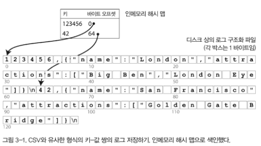
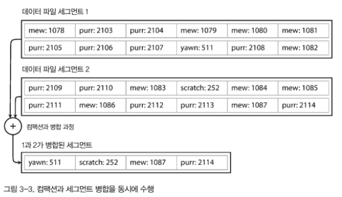
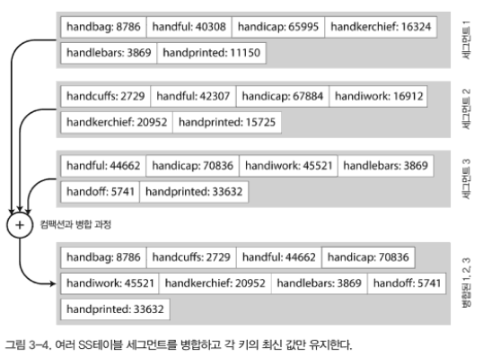
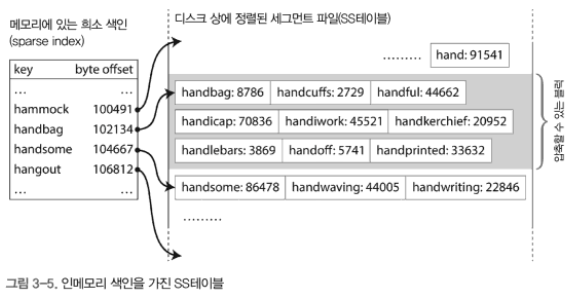
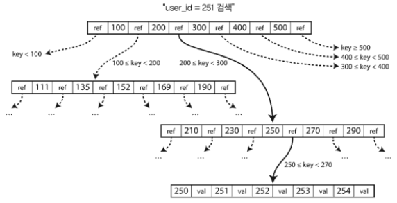
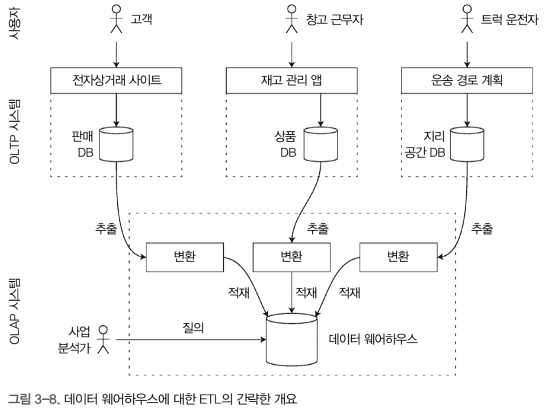
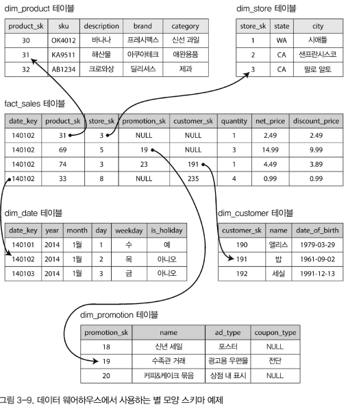
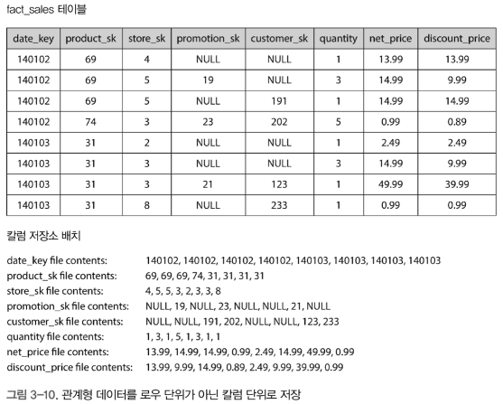
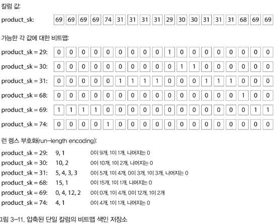

# 저장소와 검색

이번 장에서는..

1. 데이터베이스가 데이터를 저장하는 방법과 데이터를 요청했을 때 다시 찾을 수 있는 방법을 설명함.
2. 저장소 엔진에 대해 알아본다.

    - 로그 구조(log-structured)
    - 페이지 지향(page-oriented)

## 데이터베이스를 강력하게 만드는 데이터 구조

- 많은 데이터베이스는 내부적으로 `추가 전용` (append-only) 데이터 파일인 로그를 사용한다.

    - 여기서 `로그`는 추가 전용 파일에 레코드가 연속적으로 작성된 파일이다.
    - 앞으로 `추가 전용`이라는 표현을 많이 쓴다. 이는 파일에 이어쓰는 것을 말한다.
    - _음... mysql외의 dbms는 제대로 배우지 못해서 잘 모르겠다._

-  비용에 대한 고민

    - 순차적으로 모든 레코드를 검색하면 O(n)이나 걸리기 때문에 `색인`과 같은 구조가 필요해진다.
    - 하지만 색인은 쓰기 과정에서 오버헤드가 발생한다. (쓰기 작업시 색인도 같이 갱신해야 해서)
    - 고로, 이런 트레이드오프를 잘 고민해야 한다.

### 해시 색인

- 해시 색인

    - 키-값 데이터를 색인하는 방법으로 유용
    - 사전 타입(map)과 매우 유사한 형태

- 간단한 색인 전략

    - 디스크 상의 데이터를 색인하기 위해서 인메모리 해시 색인 데이터 구조를 활용할 수 있다.
    - 키를 데이터 파일의 바이트 오프셋에 매핑해 인메모리 해시 맵을 유지하는 전략

        - _바이트 오프셋을 이용한 색인은 파일 포맷 구조에서도 이런 형태는 자주 보이는 것 같다._
        - _헤더에 오프셋을 적어두고 영역을 나누는 것을 본적이 있다 (midi파일 같은거)_
        
    - 비트캐스크가 근본적으로 사용하는 방식

        - 비트캐스크는 Riak의 기본 저장소 엔진 ~~Riak이 뭔데~~
        - 해시 맵을 메모리에서 관리하고, 메모리에 모든 키를 저장
        - 고성능 읽기, 쓰기 보장
        - 각 키의 값이 자주 갱신되는 상황에 매우 적합 (CRUD의 update가 많을때 적합)

### 세그먼트

- 세그먼트

    - 파일에 항상 추가를 하면 결국 디스크 공간이 부족
        - _디스크가 아무리 커도 리눅스의 파일 크기 제한이 있기도 함. (OS별로 상이한것 같다)_
    - 세그먼트(segment) 단위로 로그파일을 나눔
    - 세그먼트가 특정 크기 이상으로 커지면 다른 세그먼트 파일을 열고 씀
    - 이후 병합과 컴팩션 과정으로 세그먼트들을 취합
        
        - 병합은 여러개의 세그먼트를 합치는 것
        - 컴팩션은 중복된 키-값 중에 최신의 키-값만 저장하는 것

- 세그먼트의 해시 테이블

    - 각 세그먼트는 키를 파일 오프셋에 매핑한 자체 인메모리 해시 테이블을 갖음
    - 각 키를 찾으려면 최신 세그먼트 해시 맵부터 오래된 세그먼트 해시 맵까지 확인
    - 병합 과정을 통해 세그먼트 수를 줄이면 많은 해시 맵을 확인할 필요 없다.

## 저장소 구현에서 중요한 문제 몇가지들 (세그먼트와 해시 맵 관련해서)

- 파일 형식
- 레코드 삭제

    - 키-값을 삭제하려면 삭제 레코드를 추가해야 함
- 고장 복구

    - 인메모리 해시 맵을 데이터베이스 재시작시 복구해야 함
    - 비트캐스크는 각 세그먼트 해시 맵에 대한 스냅샷을 디스크에 저장해둬서 빠르게 로딩이 가능함
- 부분적 레코드 쓰기

    - 레코드를 쓰는 도중에 데이터베이스가 죽는 상황을 복구해야 함
    - 비트캐스크 파일은 체크섬을 포함해 로그의 손상된 부분을 탐지하고 무시할 수 있음 (_체크섬을 이용해 손상된 부분을 어떻게 탐지하지?_)
- 동시성 제어

    - 쓰기 작업은 하나의 쓰기 스레드만 사용함
    - 세그먼트에서 읽기는 추가전용이고 레코드가 불변이라 동시 읽기가 가능

## 추가 전용 로그의 장단점

- 장점

    1. 순차적인 쓰기 작업은 무작위 쓰기보다 빠름. 참조지역성을 갖기 때문임
    2. 로그가 추가전용이나 불변일때 동시성 고장 복구가 간단 (덮어쓰기가 없어 리스크가 적다)

- 단점 (해시 테이블 색인 제한 사항)

    1. 키가 너무 많으면 문제가 됨 (인 메모리라서)
    2. 범위 질의에 좋지 않다

## SS테이블과 LSM트리

- SS테이블

    - 세그먼트 파일내 키-값 쌍을 키로 정렬
    - 정렬된 문자열 테이블(Sorted String Table)라고 해서 SS테이블이라 칭함

- SS테이블의 장점

    1. 세그먼트 병합시 파일이 메모리보다 커도 간단하고 효율적

        - 병합 정렬과 비슷한 방식으로 정렬한다.
        
    2. 파일에서 특정 키를 찾기 위해 더는 메모리에 모든 키의 색인을 유지할 필요가 없음

        - 정렬되어 있기 때문에 키가 색인에 없어도 위치를 유추할 수 있다.
        

- 정렬된 구조 유지하기

    - 쓰기가 들어오면 인메모리 균형 트리(balanced tree, 레드 블랙 트리, AVL 등)에 기록 

        -  이 메모리를 멤테이블(memtable)이라고 함
    - 멤테이블이 수 메가바이트 정도의 임계값보다 커지면 SS테이블 파일로 리스크에 기록

        - SS테이블 파일은 키로 정렬되어 있음
        - 새로운 SS테이블 파일은 가장 최신 세그먼트가 됨
    - 읽기가 들어오면 키를 찾는 순서는 멤테이블 -> 최신 세그먼트 -> 두번째 세그먼트 ... -> 마지막 세그먼트

    - 가끔 세그먼트 파일을 합치는 병합과 컴팩션 과정을 수행

        - 이때 덮어쓰거나 삭제된 값은 버려진다.

- 고장 복구용 로그

    - 데이터베이스가 고장나면 멤테이블에 있는 가장 최신 쓰기는 소실된다.
    - 쓰기를 즉시 추가할 수 있는 `분리된 로그`가 필요하다
    - 분리된 로그는 복구용이기 때문에 정렬이 필요없다.
    - SS테이블로 기록되었을때 분리된 로그는 버려도 좋다

### SS테이블에서 LSM 트리 만들기

- LSM 저장소 엔진

    - 전술한 알고리즘은 LevelDB / RocksDB / 여러 키-값 저장소 엔진에서 사용한다
    - 카산드라와 HBase에서 유사한 저장소 엔진을 사용한다
    - 이 색인 구조를 로그 구조화 병합 트리(Log-Structured Merge-Tree)라고 한다.
    - 정렬된 파일 병합과 컴팩션 원리를 기반으로 하는 저장소 엔진을 LSM 저장소 엔진이라 칭함

### 성능 최적화 

- 블룸 필터(Bloom filter)

    - LSM트리 알고리즘은 데이터베이스에 존재하지 않는 키를 찾는 경우 느릴 수 있음

        - 키가 존재하지 않는 경우, 멤테이블 부터 모든 세그먼트를 확인해야 하기 때문
    - 이를 해결하기 위해 저장소 엔진은 블룸 필터를 추가적으로 사용
    - 블룸 필터는 집합 내용을 근사한 메모리 효율적 데이터 구조

        - 키가 데이터베이스에 존재하지 않음을 알려준다.

- SS테이블 압축 / 병합 정략

    _LSM 트리의 기본 개념은 백그라운드에서 연쇄적으로 SS테이블을 지속적으로 병합하는 것_

    - 사이즈 계층 컴팩션(size-tiered compaction)

        - 큰 SS테이블에 작은 SS테이블을 연이어 병합

    - 레벨 컴팩션(leveled compaction)

        - 키 범위를 더 작은 SS테이블로 나눔
        - 오래된 데이터는 개별 레벨로 이동
        - 컴팩션을 점진적으로 진행

## B 트리

- B 트리

    
    - Balanced Tree
    - 가장 널리 사용되는 색인 구조
    - _원리는 설명하지 않겠습니다!_
    

- VS 로그 구조화 색인

    - 로그 구조화 색인: 수 MB 이상의 가변크기인 세그먼트로 나누고 순차적으로 세그먼트 기록
    - B 트리: 고정된 4KB 가량의 블록이나 페이지로 나누고 읽기 / 쓰기 단위로 사용

### 신뢰할 수 있는 B 트리 만들기

- 고아 페이지

    - 부모가 없는 페이지
    - 중간 페이지가 너무 커져서 페이지를 분할할때 데이터베이스가 고장나면 발생할 수 있음

- 쓰기 전 로그(write-ahead log, WAL) / 리두 로그(redo log)

    - B 트리를 복구하기 위해 필요한 복구 로그
    - 쓰기 전에 B 트리의 변경사항을 기록하는 추가 전용 파일

- 동시성 제어

    - 래치(latch; 가벼운 잠금)으로 동시에 쓸때 보호한다.
    - _동시성 제어 관점에서 로그 구조화 접근 방식이 더 쉽다._
    - _전술한 바와 같이 이런 문제는 덮어쓰기에서 발생하고 로그 구조화 접근 방식은 덮어쓰기를 하지 않기 때문_

### B 트리 최적화

- 고장 복구를 위한 WAL/redo-log 대신 `쓰기 시 복사(copy-on-write scheme)`를 사용

    - 변경된 페이지는 다른 위치에 기록
    - 상위 페이지의 새로운 버전을 만들어 새로운 위치를 가리키게 함
    - _? mysql의 undo log와 같은 구조를 말하는 것인가?_

- 페이지에 키를 축약해 저장

- 키 범위가 가까운 페이지들 끼리 같이 묶어서 저장

- B+트리와 같이 형제 페이지끼리 링크

## B 트리와 LSM 트리 비교

- B 트리: 읽기에서 빠름
- LSM 트리: 쓰기에서 빠름

### LSM 트리의 장점

1. 쓰기 처리량을 높게 유지할 수 있다.

    - 여러 페이지를 덮어쓰는 것이 아니라 **순차적으로** 컴팩션된 SS테이블 파일을 쓰기 때문
    - HDD에서 많이 유리하다.

2. 압축률이 더 좋다.

    - B 트리 저장소 엔진은 내부 파편화로 인해 디스크 공간 일부가 남는 현상이 생길 수 있다.
    - 페이지로 나누기 때문
    - 레벨 컴팩션을 사용하면 특히 더 좋다.

### LSM 트리의 단점

1. 컴팩션 과정이 **진행중인 읽기와 쓰기의 성능에 영향**을 준다.

    - 반면 B 트리의 성능은 예측하기 쉽다.

2. 높은 쓰기 처리량 

    - 데이터베이스가 점점 커질수록 컴팩션을 위해 더 많은 디스크 대역폭을 사용하게 된다.

3. 같은 키의 다중 복사본

    - 로그 구조화 저장소 엔진은 다른 세그먼트에 같은 키의 다중 값이 존재할 수 있다.
    - 반면 B 트리는 각 키가 색인의 한 곳에만 정확하게 존재한다.
    - **강력한 트랜잭션 시맨틱(semantic)을 제공하는 데이터베이스는 B 트리가 훨씬 낫다**

## 기타 색인 구조

### 색인 안에 값 저장하기

- 값을 저장하는 두 가지 방식

    - 실제 Row값을 저장
    - 다른 곳에 저장된 Row를 참조

- 힙 파일 접근 방식 

    - 값이 다른 곳에 저장된 Row를 참조, 저장된 곳을 힙 파일이라 함
    - 여러 보조 색인이 존재할 때 데이터 중복을 피할 수 있다.
    - 값을 갱신할때 새 값의 크기가 더 큰 경우 힙 파일 참조 위치를 변경해야 해기 때문에 성능에 불이익이 생김

- 클러스터드 색인/인덱스

    - 실제 Row값을 저장

- 커버링 색인/인덱스

    - 클러스터드 색인과 비클러스터드 색인 사이의 절충안
    - 색인 안에 칼럼 일부만 저장하는 방식
    - 일부 질의에선 빠르게 빠르게 응답할 수 있다.

### 전문 검색과 퍼지 색인

- 틀린 단어 / 유사한 키 / 동의어에 대해서 검색할 수 있는 색인

- 루씬의 색인

    - 문서나 질의의 오타에 대처하기 위해 특정 편집 거리 (edit distance; 편집 거리 1은 한 글자가 추가되거나 없거나 다른 경우) 내 단어를 검색할 수 있음
    - 루씬의 인메모리 색인은 여러 키 내 문자에 대한 `유한 상태 오토마톤`으로 트라이(trie)와 유사하다.
    - 이 오토마톤은 레벤슈타인 오토마톤으로 변환할 수 있는데, 특정 편집 거리 내에서 효율적인 단어 검색을 제공한다.

- 최근의 퍼지 검색 기술은 머신러닝을 이용한 방향으로 진행중

### 모든 것을 메모리에 보관

- 인메모리 데이터베이스

    - 데이터셋이 그렇게까지 크지 않은 경우 메모리에 전체를 보관
    - 이러면 인메모리 데이터베이스는 데이터 지속성을 달성하고자 함
    - 이를 위해 디스크에 스냅샷 기록 / 변경사항의 로그 기록 / 복제을 사용할 수 있음
    - 대표적으로, VoltDB, MemSQL, Oracle TimesTen이 있다.
    - **Redis는 비동기로 디스크에 기록하기 때문에 약한 지속성만 제공함**

- 인메모리 데이터베이스의 장점

    1. 인메모리 데이터 구조를 디스크에 기록하기 위한 형태로 부호화 하는 오버헤드 절감

    2. 디스크 기반 색인으로 구현하기 어려운 데이터 모델 제공

        - 예를 들어 Redis는 우선순위 큐나 Set같은 데이터 구조를 데이터베이스 같은 인터페이스로 제공

- 안티 캐싱(anti-caching)

    - 메모리가 충분하지 않을 때, 가장 최근에 사용하지 않은 데이터를 메모리에서 디스크로 내보내고 나중에 다시 적재하는 방식
    - 가상 메모리와 스왑 파일의 수행 방식과 유사하지만 메모리 페이지 단위가 아닌, 개별 레코드 단위로 작업할 수 있기 때문에 더 효율적

- 그리고..

    - 이 방식은 여전히 전체 색인이 메모리에 있어야 하는 단점이 있다.
    - 비휘발성 메모리 기술이 더 발전하면 유용하게 사용할 듯

## 트랜잭션 처리나 분석?

- 트랜잭션

    - 초창기 트랜잭션은 판매 / 발주 / 급여 지불과 같은 커머셜 트랜잭션(commercial transation; 상거래)의 의미였다.
    - 현재의 트랜잭션은 논리 단위 형태로서 읽기와 쓰기 그룹을 나타내고 있다.
    
    > 트랜잭션이 반드시 ACID 속성을 가질 필요는 없음.
    > 트랜잭션 처리는 주기적으로 수행되는 `일괄 처리`작업과 달리 클라이언트가 지연 시간(low-latency)이 낮은 읽기와 쓰기를 가능하기 한다는 의미다.

- 트랜잭션 처리

    - 보통 애플리케이션은 색인을 사용하고 키에 대한 적은 수의 레코드를 찾는다.
    - 또, 사용자 입력을 기반으로 삽입되거나 갱신될 수 있다.
    - 이러한 작업을 트랜잭션 처리라고 한다.
    - 보통 대부분의 애플리케이션은 대화식이기 때문에 이러한 경우 온라인 트랜잭션 처리(OLTP)라 한다.

- 데이터 분석

    - 최근에는 데이터베이스를 데이터 분석용으로도 많이 사용하는 추세
    - 데이터 분석과 트랜잭션 처리는 접근 패턴이 매우 다름
    - 분석 질의는 사용자에게 `데이터를 가져오는 것`이 아니라 `많은 수의 레코드를 스캔해 일부 칼럼만 읽어 집계 통계를 계산`한다.
    - 아래와 같은 것들을 한다.
        - 1월의 각 매장의 총 수익은 얼마지?
        - 최근 프로모션 기간동안 평소보다 얼마나 더 많은 바나나를 판매했지?

- 온라인 분석 처리(online analytic processing, OLAP)

    - 데이터 분석 질의는 회사 경영진이 더 나은 의사결정을 하게끔 보고서를 제공한다.
    - 트랜잭션 처리와 구별하기 위해 온라인 분석 처리라고 한다.
    
    > OLAP에서 온라인의 의미는 불분명하다.
    > 분석가가 탐색 질의를 위해 OLAP 시스템을 대화식으로 사용한다는 것 때문이 아닐까..

- OLTP vs OLAP

    

### 데이터 웨어하우징

- 데이터 웨어하우스

    - 분석가들이 OLTP 작업에 영향을 주지 않고 마음껏 질의할 수 있는 개별 데이터베이스
    - 회사내 모든 다양한 OLTP 시스템의 데이터의 읽기 전용 복사본이다.
    - 데이터는 OLTP 데이터베이스에서 추출한 데이터를 전처리한 후 데이터 웨어하우스에 적재한다.
        - 이 과정을 ETL(Exctract-Transform-Load)라고 한다.
    

----

여기서 부터는 분석에 최적화된 저장소 엔진에 대해 설펴봅니다.

### OLTP 데이터베이스와 데이터 웨어하우스의 차이점

- 데이터 웨어하우스 데이터 모델

    - SQL은 분석 질의에 적합하기 때문에 보통 관계형 모델을 사용한다.

- 역할 분리

    - 두 데이터베이스는 같은 SQL 질의 인터페이스를 지원함
    - But, 다른 질의 패턴에 맞게 최적화 되어있기 때문에 시스템 내부는 다름
    - 때문에, 벤더는 트랜잭션 처리와 분석 작업부하 둘 중 하나를 지원하는데 중점을 둔다.

- 테이블의 폭

    - 데이터 웨어하우스는 보통 테이블의 폭이 매우 넓다. (칼럼 수가 엄청 많다)

## 분석용 스키마: 별 모양 스키마와 눈꽃송이 모양 스키마

- 별 모양 스키마(star schema)

    - 트랜잭션 처리 영역과 달리 분석에서는 데이터 모델의 다양성이 적다.
    - 사실 테이블과 차원 테이블의 관계가 별과 같다고 해서 별 모양 스키마다.
    
    - 사실 테이블(fact table)

        - 스키마의 중심에 있다.
        - 각 로우는 특정 시각에 발생한 이벤트를 의미한다.
    - 차원 테이블(dimension table)

        - 사실 테이블의 외래 키 참조는 차원 테이블을 가리킨다.
        - 이들은 `누가 / 언제 / 어디서 / 무엇을 / 어떻게 / 왜`를 나타낸다.
        - 다양한 제품을 구매하면, 개별 로우로 사실 테이블에 저장된다.
        - 날짜와 시간도 차원 테이블을 사용해 표현한다. -> 날짜의 추가적인 정보를 부호화 하고 추후 분석 질의를 편하게 하기 위함
    
- 눈꽃송이 모양 스키마

    - 별 모양 스키마의 변형으로 차원이 하위차원으로 더 세분화된 형태

## 칼럼 지향 저장소

- 필요성

    - 테이블에 로우가 엄청나게 많다면 효율적으로 저장하고 질의하는게 어려워진다.
    - 사실 테이블의 칼럼 엄청 많은 것에 반해 분석 질의는 몇몇개의 칼럼만 필요하다.
    - 대부분의 OLTP 데이터베이스에서 저장소는 **로우 지향** 방식으로 데이터를 배치하기 때문에 불리하다.

- 칼럼 지향 저장소

    - 각 칼럼별로 모든 값을 함께 저장한다.
    

### 칼럼 압축

- 칼럼 압축

    - 데이터를 압축하면 디스크 처리량을 줄일 수 있다.
    - 보통 칼럼에서 고유값의 수는 로우 수에 비해 적음.
    - 때문에 압축 효율이 높다.
- 비트맵 부호화

    - 고유값 하나가 하나의 비트맵을 나타낸다.
    - 이를 런 렝스 부호화 하면 크기를 많이 줄일 수 있다.
    - _고유값이 너무 많은 경우 오히려 불리하다._
    

.... 뒤는 의미가 없는 것 같아욤! 나중에 필요할때 봅시다