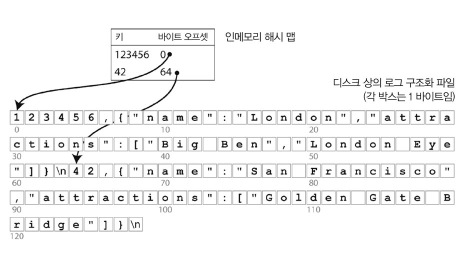
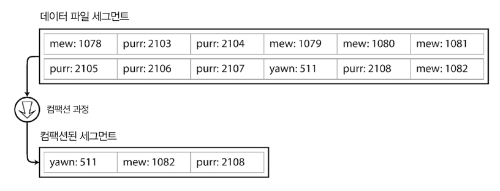
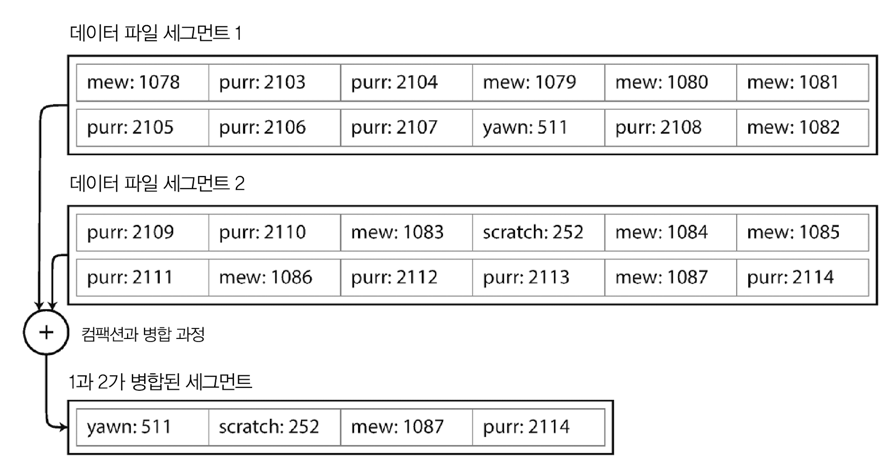
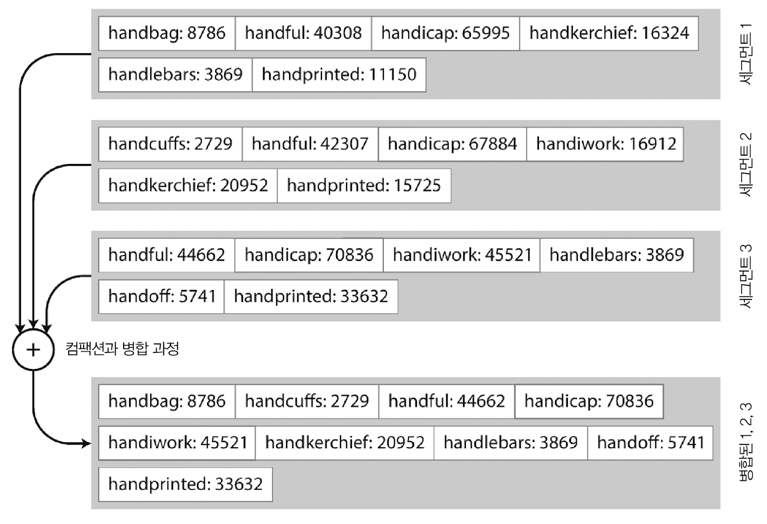
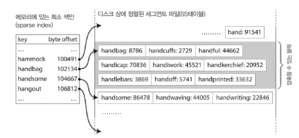
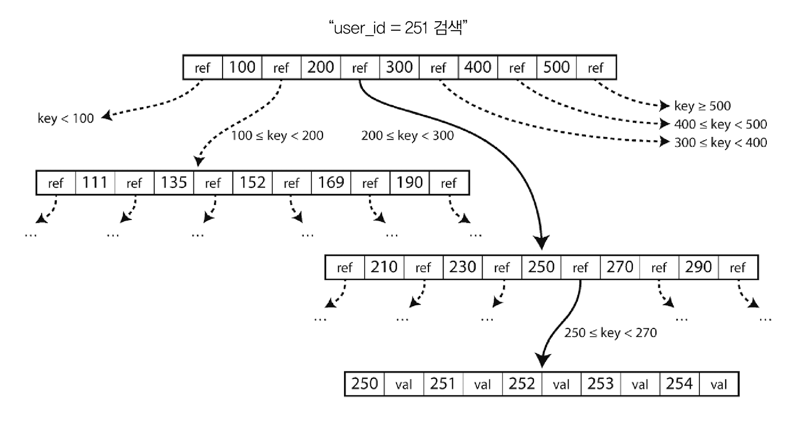
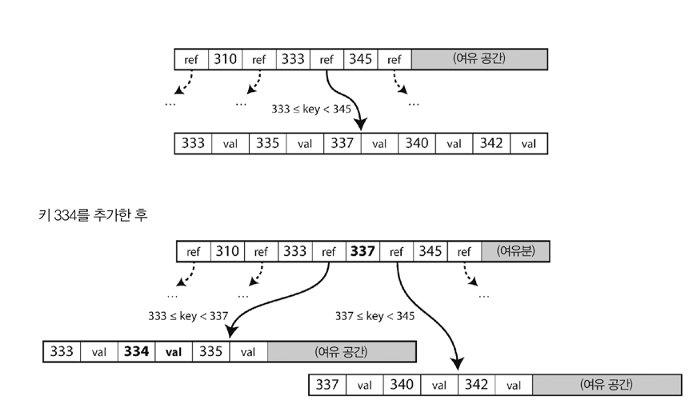
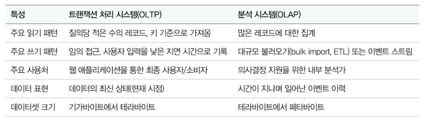
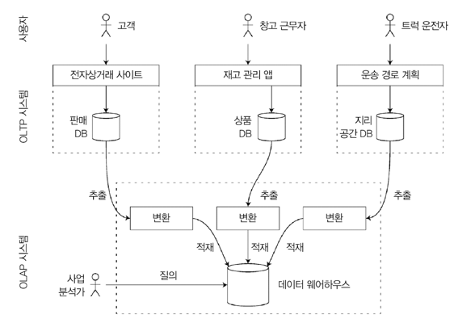
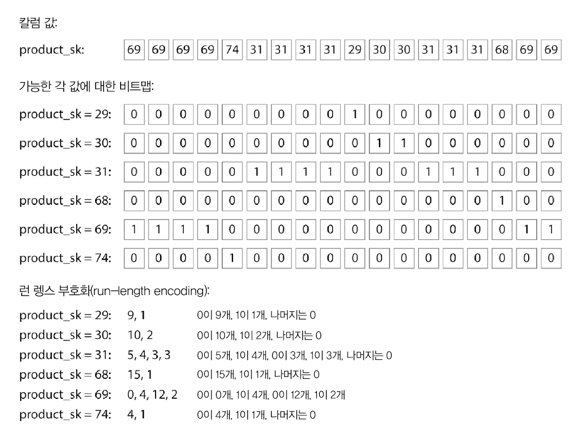

# Introduction
- 이번 장에서 알아볼 것 
  - 데이터베이스가 데이터를 저장하는 방법
  - 데이터를 요청했을 때 다시 찾을 수 있는 방법
- 개발자가 "데이터베이스 저장/검색을 내부적으로 처리하는 방법"에 대한 대략적인 개념을 이해해야 하는 이유  
  - 적합한 엔진을 선택하기 위함 
  - 특정 작업 부하(work load) 유형에서 좋은 성능을 내게끔 엔진을 조정하기 위함

---

---

# 데이터베이스를 강력하게 만드는 데이터 구조 
- 많은 데이터베이스는 내부적으로 **추가 전용(append-only) 데이터 파일인 로그(log)** 를 사용함 
  - 본 도서에서의 로그의 의미 : **연속된 추가 전용 레코드**
- 인덱스(Index, 색인)
  - 데이터베이스에서 특정 키의 값을 효율적으로 찾기 위한 **데이터 구조**
  - 어떤 부가적인 메타데이터를 유지하는 것 
  - 메타 데이터는 **이정표 역할을 해서 원하는 데이터의 위치를 찾는 데 도움**을 줌 
  - 인덱스는 기본 데이터로부터 파생된 추가적인 구조임 
    - 데이터베이스 내용에는 영향 X (물론, 인덱스 리빌드/빌드에 많은 시간이 걸릴 순 있다...)
    - 질의 성능에는 영향 O 
      - Write 과정에서 오버헤드 발생
        - 데이터 갱신 시마다 index도 갱신해야 하므로... 
      - Read는 빨라짐 
  - 인덱스를 사용하는 것은 저장소 시스템에서 아주 **중요한 트레이드오프** 사항이다. 
    - 인덱스를 잘 선택할 경우 Read 속도 향상 
    - 모든 Write 속도는 저하됨 
    - 개발자가 적절한 인덱스를 선택하는 것이 중요 (데이터베이스에 대한 이해가 수반돼야 함)

## 해시 Index

- Key를 데이터 파일의 byte offset에 매핑
  - 근데 그림처럼 연속으로 저장돼 있으면 앞의 value의 길이가 변할 경우 뒤의 offset도 전부 갱신되어야 하지 않나..?
- 램에 모든 Key가 저장될 수 있을 경우 고성능 Read/Write 보장 
- Key에 할당된 Value가 자주 갱신되는 상황에 적합 

### 특정 크기의 Segment로 로그 나누기 

- 파일에 항상 추가만 할 경우 디스크 공간이 부족해지므로, 특정 크기의 Segment로 로그를 나눈다
  - 세그먼트를 나눠도 같은 디스크 공간을 차지할 것 같은데, 디스크 공간이 부족해지니까 나눈다는 것은 무슨 의미일까 
  - 파일을 하나 열어두었을 때의 용량이 부족해진다는 의미일까? 파일을 닫고 새로운 세그먼트에 쓴다고 되어있으니까..?
  - 아니면 더 효율적으로 용량 관리를 수행하기 위함이려나? MySQL이 데이터 페이지 사이즈를 고정 해두고 사용하는 것 처럼..? 
- Compaction 수행 
  - 로그에서 중복된 키를 버리고, 각 키의 최신 갱신 값만 유지하는 것
  - 여러 세그먼트들을 병합할 수 있음 
    - 쓰여진 세그먼트를 변경하는 개념이 아니라(변경 불가), 새로운 병합된 세그먼트를 생성함 
  - 병합, 컴팩션은 백그라운드 스레드에서 수행
    - 수행되는 동안 이전 세그먼트 파일을 사용해 Read/Write 처리 
  - 병합 이후에는 새로 병합한 세그먼트를 사용하게끔 전환 
  - 이전 세그먼트 파일 삭제 
- 각 세그먼트들은 Key-value(byte offset) 형태의 인메모리 해시 테이블로써 사용됨 
  - 키의 값을 조회 요청 → 최신 세그먼트의 해시맵 확인 → 키가 없을 경우 두 번째 최신 세그먼트 등을 확인 
  - 병합을 통해 세그먼트 수를 적게 유지하기 때문에 많은 해시맵을 확인할 필요가 없음

### 이를 구현하기 위해 세부적으로 고려해야 하는 것들..
- 파일 형식
  - byte 형식의 문자열을 encoding한 binary format이 가장 빠르고 간단함  
- 레코드 삭제
  - key와 value를 삭제하고 싶을 때, tombstone(묘비)이라고도 불리는 특별한 삭제 레코드를 추가해야 함 
  - 세그먼트가 병합될 때 tombstone은 병합되지 않는다 
- Crash 복구 
  - DB 재시작 시 인메모리 해시맵은 손실됨 
  - 전체를 다시 복구하는 것은 오랜 시간이 걸릴 수 있으므로, 조금 더 빠르게 로딩할 수 있게 스냅숏을 디스크에 저장해두고 복구에 이용할 수 있음 
- 부분적으로 레코드 쓰기 
  - DB는 로그에 레코드를 추가하고 있는 도중에도 죽을 수 있음 (손상된 로그) 
  - 체크섬을 이용해서 로그의 손상을 탐지하고, 무시하게 할 수 있음 
- 동시성 제어 
  - 쓰기를 엄격하게 순차적으로 로그에 추가하고 싶을 때 → 하나의 Writer 스레드만 사용 
  - 다중 스레드로 동시에 읽는 것은 문제가 없다 → 세그먼트는 append-only거나 immutable하기 때문

### 추가 전용 로그는 여러 측면에서 좋은 설계임 
- 추가, 세그먼트 병합은 순차적인 쓰기 작업 
  - 무작위 쓰기보다 훨씬 빠름 
  - SSD에서도 효과가 좋음 
- 추가 전용 & 불변 
  - 동시성 제어가 간단함 
  - Crash 복구 또한 훨씬 간단함 
- 오래된 세그먼트 병합은 file system fragmentation을 피할 수 있음 
  - https://en.wikipedia.org/wiki/File_system_fragmentation
  - SSD는 랜덤액세스가 빨라서 안해도 괜찮지만, 예전의 HDD는 랜덤액세스가 느려서 성능 저하가 발생했음

### 해시 테이블 인덱스의 제한 사항 
- 메모리에 저장해야 하므로 Key가 너무 많으면 문제가 됨 
- 범위 질의(range query)에 효율적이지 않음 

## SSTable & LSM Tree
### SSTable : Sorted String Table

- Key-value 쌍을 key로 정렬된 순서로 저장하는 테이블
- 해시 index를 가진 로그 segment 보다 좋은 점
  - Merge sort와 유사한 방식으로 segment 병합을 수행함 
    - 각 세그먼트를 읽음 → 각 파일의 첫 번째 키를 봄 → 가장 작은 키를 출력 파일로 복사 → 반복...
      - 동일한 key를 가진 세그먼트가 있을 경우, 가장 최근 값만 유지하고 오래된 값은 버림 
    - 병합 segment 파일 생성 (key 로 정렬된 상태)
  - 파일에서 특정 키를 찾기 위해 메모리에 모든 key index를 유지할 필요가 없음
    - 정렬을 이용해 key를 찾기가 쉽다 
      - 
      - ex: handiwork 위치를 찾기 위해 handbag을 찾고, 그 이후 부터 handiwork가 나올 때까지 스캔하면 됨
  - 레코드들을 블록으로 그룹화하고 압축해서 저장하고, index가 압축 블록의 시작을 가리키게 할 수 있다 
    - 디스크 공간 절약, I/O 대역폭 사용 감소 

### SSTable 생성 및 유지
- 데이터를 key로 정렬하려면? 
  - 유입되는 write는 임의 순서로 발생하는데..?
- 디스크 상에 정렬된 구조를 유지하는 것이 가능은 하나, **메모리에 유지하는 것이 훨씬 쉬움**
  - Red-black tree, AVL tree 등을 이용
  - 임의 순서로 키를 삽입해도 정렬된 순서로 키를 다시 읽을 수 있음
- 저장소 엔진 만들기 
  - 쓰기 기능
    - 쓰기 발생 → 인메모리 balanced tree(ex: Red-black tree)에 삽입 
      - 인메모리 트리는 memtable 이라고도 함 
  - memtable이 임곗값 이상의 용량을 차지하는 경우
    - SS table file로 디스크에 기록
      - 트리가 이미 key로 정렬된 key-value 쌍을 유지 중이기 때문에 효율적으로 수행 가능 
      - 새로운 SS table 파일은 DB의 가장 최신 segment가 됨
  - 읽기 기능 
    - 읽기 요청 발생 → memtable에서 key를 조회 → 없으면 디스크의 가장 최신 세그먼트 조회 → 없으면 이전 세그먼트 조회 → 없으면 이전 세그먼트 조회... 반복
  - 세그먼트 파일 병합, 컴팩션 기능 제공 (백그라운드에서 수행되도록)
- 문제 
  - DB고장 시, 아직 디스크로 기록되지 않았지만, 멤테이블에는 존재하는 가장 최신 데이터는 손실됨
  - 쓰기를 즉시 추가할 수 있도록, 로그/스냅숏을 디스크 상에 유지해야함

### LSM Tree : Log-Structured Merge Tree
- 카산드라, HBase에서도 유사한 저장소 엔진을 사용함 
- LSM Tree는 로그 구조화 파일 시스템의 초기 작업의 기반이 되었음
- 정렬된 파일 병합과 컴팩션 원리를 기반으로 하는 저장소 엔진을 LSM 저장소 엔진이라고 부름 
- Lucene
  - 엘라스틱 서치, 솔라에서 사용하는 전문 검색 index 엔진 
  - 용어 사전(term dictionary)를 저장하기 위해 유사한 방법을 사용 
  - 검색 질의로 단어가 들어옴 → 단어가 언급된 모든 문서 조회 
    - key를 단어(용어)로, value는 단어를 포함한 모든 문서의 ID List로 하는 key-value 구조로 구현 
  - Lucene에서는..
    - 용어-포스팅목록 매핑은 SS table과 같은 정렬 파일에 유지 
    - 필요에 따라 백그라운드에서 병합

### 성능 최적화 
- LSM Tree 알고리즘은 DB에 존재하지 않는 Key를 찾는 경우 느릴 수 있음 
  - Key의 존재 여부를 확인하기 까지 모든 segment를 확인해야 하기 때문 
- 이를 최적화 하기 위해 **Bloom filter**를 추가적으로 사용
  - [블룸 필터 - 위키](https://ko.wikipedia.org/wiki/%EB%B8%94%EB%A3%B8_%ED%95%84%ED%84%B0)
    - 원소가 집합에 속하는지 여부를 검사하는 데 사용되는 확률적 자료구조 
    - **원소가 집합에 속하지 않는 것으로 판단되었을 때, 실제로 원소가 집합에 속하는 부정 오류가 절대 발생하지 않는다**는 특징이 있음 
      - 반대로, 원소가 집합에 속한다고 판단되었을 때는 실제로는 원소가 집합에 없을 수도 있음(긍정 오류) 
    - 집합에 원소 추가는 가능하나 삭제는 불가능
  - 이를 이용하면 key가 db에 존재하지 않음을 알려줌 → 존재하지 않는 키를 위한 불필요한 디스크 I/O를 줄일 수 있음
- SS Table을 압축하고 병합하는 순서와 시기를 결정하는 다양한 전략 
  - Size-tiered/leveled compaction 
    - Size-tiered compaction 
      - 상대적으로 좀 더 새롭고 작은 SS table을 상대적으로 오래됐고 큰 SS table로 병합 
    - Leveled compaction
      - key 범위를 더 작은 SS table로 나눔 
      - 오래된 데이터는 개별 level로 이동 → 점진적인 compaction 수행 → 디스크 공간 절약 
- LSM tree의 기본 개념 
  - 백그라운드에서 연쇄적으로 SS table을 지속적으로 병합하는 것 
  - 데이터 셋이 준비된 메모리 용량보다 훨씬 더 커도 효과적임  
  - 데이터가 정렬된 순서로 저장돼 있으므로 효율적인 범위 질의 수행 가능 
  - Write가 순차적이기 때문에 높은 쓰기 처리량 보장 가능 

## B-Tree
- LSM Tree Index는 가장 일반적인 Index 타입이 아님 
- 가장 널리 사용되는 구조는 `B-Tree`임 
- Key로 정렬된 Key-value pair 유지 
  - key-value 검색과 범위 질의에 효율적 
- 설계 철학이 LSM Tree와는 매우 다름 
  - LSM tree
    - DB를 수 메가바이트 이상의 가변 크기를 가진 segment로 나눔 
    - 항상 순차적으로 segment를 기록 
  - B-Tree
    - 4KB 크기(or more)의 고정 크기 **블록 또는 페이지**로 나눔 
    - 한번에 하나의 페이지에 읽기 또는 쓰기를 수행 
- 각 페이지는 주소나 위치를 이용해 식별
  - 
  - 하나의 페이지가 다른 페이지를 참조할 수 있음 
  - 포인터와 비슷하나 메모리 대신 디스크에 있음 

### 구성 
- Root page
  - B Tree의 시작점
- 중간에 있는 page들은 여러 키와 하위 페이지의 참조를 포함 (key 범위 담당)
- Leaf page
  - 개별 Key를 포함하는 페이지 
  - 각 key의 value를 포함하거나, value를 찾을 수 있는 페이지의 참조를 포함한다

### 특징 
- branching factor (분기 계수)
  - 한 페이지에서 하위 페이지를 참조하는 수 (그림 상에서 ref의 수를 의미하는듯)
- B Tree에 존재하는 key의 값을 갱신하려면... 
  - key를 포함하고 있는 리프 페이지 검색 → 페이지 값 수정 → 페이지를 다시 디스크에 기록 
- 새로운 key를 추가하려면...
  - 
  - 새로운 키를 포함하는 범위의 페이지 검색 → 해당 페이지에 key-value 추가 
  - 여유 공간이 없을 경우, 페이지 하나를 반쯤 채워진 페이지 둘로 분할 → 상위 페이지가 새로운 키 범위의 하위 부분들을 알 수 있게 갱신 
- 트리가 계속 **균형을 유지하는 것을 보장**
- n개의 key를 가진 B Tree는 깊이가 항상 `O(log n)`임 
  - 대부분 DB는 depth 가 3~4 정도면 충분 
    - 분기 계수 500, 4KB 페이지, 4 depth의 B Tree는 256TB의 데이터를 저장할 수 있음
  - 많은 페이지 참조를 따라가지 않아도 됨 

### 신뢰 가능한 B Tree 만들기 
- 기본적인 쓰기 동작 
  - 새로운 데이터를 디스크 상의 페이지에 덮어 씀 
  - 페이지 위치를 변경하지 않는다고 가정함 → 페이지를 가리키는 모든 참조는 온전하게 남음  
- 일부 페이지만 기록하고 DB 고장이 발생하면 Index가 훼손됨 
  - orphan page가 발생할 수 있음 
- DB가 스스로 복구할 수 있게 하려면...
  - 디스크 상에 Write-ahead log(WAL, 또는 redo log라고도 함)라고 하는 데이터 구조를 추가하여 B Tree를 구현함 
    - 트리 페이지에 변경된 내용을 적용하기 전에 모든 B 트리의 변경 사항을 기록하는 추가 전용 파일임 
    - DB가 복구될 때 일관성 있는 상태로 B Tree를 다시 복원하는 데 사용함 
- 같은 자리의 페이지를 갱신하는 작업
  - 다중 스레드가 동시에 B Tree에 접근할 경우, 주의 깊은 동시성 제어가 필요
    - 일관성이 깨진 상태의 트리에 접근하지 않도록 주의해야 함 
  - Latch로 트리 데이터 구조를 보호함  

### B Tree 최적화 
- 페이지 덮어 쓰기와 고장 복구를 위한 WAL 유지 대신 일부 데이터베이스는 copy-on-write scheme 을 사용함
  - 변경된 페이지는 다른 위치에 기록 → 트리에 상위 페이지의 새로운 버전을 생성 → 새로운 위치를 가리키게 함 
- 페이지에 전체 키를 저장하지 않고, 키를 축약해서 사용하여 공간을 절약 
  - 트리 내부 페이지에서 key가 key 범위 사이의 경계 역할을 하는 데 충분한 정보만 제공하면 됨 
  - 페이지 하나에 key를 더 많이 채우면, 더 높은 분기 계수를 얻어 depth를 줄일 수 있음
- 페이지는 디스크 상 어디에나 위치 가능 
  - 키 범위가 가까운 페이지들이 디스크 상에 가까이 있어야 할 필요가 없기 때문 
  - 하지만 질의가 정렬된 순서로 키 범위의 상당 부분을 스캔해야 한다면, 모든 페이지에 대해 디스크 탐색이 필요 → 페이지 단위 배치는 비효율적이 됨  
  - 따라서, B Tree 구현에서 leaf 페이지를 디스크 상에 연속된 순서로 나타나게끔 트리를 배치하려고 시도함 
    - 트리가 커지면 순서 유지가 어려움 
    - LSM 트리는 병합 과정에서 큰 segment를 한번에 다시 씀 → 디스크에서 연속된 키를 서로 가깝게 유지하기 더 쉬움 
- 트리에 포인터 추가 
  - 각 leaf 페이지가 양쪽 형제 페이지에 대한 참조를 가지고 있게 함 
  - 상위 페이지로 다시 이동하지 않아도 순서대로 키 스캔 가능 
- Fractal tree
  - B Tree의 변형
  - 디스크 탐색을 줄이기 위해 LSM 트리의 개념을 일부 빌림 

## B Tree vs LSM Tree
- LSM Tree는 쓰기가 더 빠른 반면, B Tree는 읽기가 더 빠름
  - LSM Tree에서 읽기가 더 느린 이유 
    - 각 컴팩션 단계에 있는 여러 가지 데이터 구조와 SS table을 모두 확인해야 하기 때문 

### 저장소 엔진의 성능을 측정할 때 고려하면 좋은 사항 
- 쓰기 증폭(write amplification)
  - 쓰기 1회가 여러번의 쓰기를 야기하는 효과
- 쓰기가 많은 애플리케이션
  - 쓰기 속도가 성능 병목지점일 수 있음
  - 쓰기 증폭이 성능 비용임

#### LSM Tree의 장점
- LSM 트리는 B 트리보다 쓰기 처리량을 높게 유지할 수 있음 
  - 상대적으로 낮은 쓰기 증폭
    - B Tree는 1회 쓰기 당 최소 2회의 쓰기 발생 (기록 대상: WAL, 페이지)
    - LSM 트리는 여러 페이지를 덮어쓰지 않고, 순차적으로 컴팩션된 SS Table 파일을 쓴다 
    - HDD에서는 순차 쓰기가 랜덤 쓰기보다 더 빠르다 
    - LSM 트리는 압축률이 더 좋아 B-Tree보다 더 적은 파일을 생성함 
      - B-Tree는 고정된 페이지 크기를 사용하기 때문에, 일부 공간은 사용하지 않기도 함
      - LSM Tree는 페이지 지향적이지 않음 
    - SSD 펌웨어는 랜덤 쓰기를 순차 쓰기로 전환하기 위해 내부적으로 로그 구조화 알고리즘을 사용함 
      - 저장소 엔진의 쓰기 패턴이 SSD에 미치는 영향은 분명하지 않음 
      - 하지만, 낮은 쓰기 증폭과 파편화 감소는 SSD에서 훨씬 유리함
      - 데이터를 더 밀집하여 표현하면, I/O 대역폭 내에서 더 많은 읽기/쓰기 요청이 가능함 

#### LSM Tree의 단점
- 컴팩션 과정이 진행 중인 읽기, 쓰기 성능에 영향을 줄 수 있음 
  - 디스크에서 비싼 컴팩션 연산이 끝날 때까지 요청이 대기해야 하는 상황이 발생하기 쉬움 
  - 따라서, 성능을 예측하기가 어려움 (B-Tree는 성능 예측이 쉬움) 
- 높은 쓰기 처리량
  - 디스크의 쓰기 대역폭은 유한함  
    - 디스크 대역폭 : 일정 시간동안 데이터를 읽거나 쓸 수 있는 최대 용량을 의미  
    - logging, memtable 을 디스크로 flush하는 초기 쓰기, 백그라운드에서 수행되는 컴팩션 쓰레드가 대역폭을 공유
    - 데이터베이스가 점점 커질수록 컴팩션을 위한 더 많은 대역폭이 필요해짐 
  - 컴팩션 설정이 잘못되는 경우, 컴팩션이 유입되는 쓰기 속도를 따라갈 수 없음
    - 병합되지 않은 세그먼트 수↑ => 더 많은 세그먼트 파일을 확인해야 함 => 읽기 성능↓
    - 컴팩션이 유입되는 쓰기 속도를 따라가지 못해도 조절하지 않음. 명시적인 모니터링 필요.
- 다른 세그먼트에 같은 키의 다중 복사본이 존재할 수 있음 
  - B-Tree에서는 각 키가 index의 한 곳에만 정확하게 존재함

## 기타 index 구조 
- Primary key index 
  - 고유하게 식별할 수 있는 키 
- Secondary index 
  - 효율적인 조인 수행에 결정적인 역할 수행 

### index 안에 값 저장하기 
- 값
  - 실제 row의 데이터 or 다른 곳에 저장된 row를 가리키는 참조 
- Heap file
  - row가 저장된 곳 
  - 특정 순서 없이 데이터를 저장함
  - key - value(heap file의 위치) → heap file에 저장된 row
- Heap file 접근 방식은 키를 변경하지 않고 값을 갱신할 때 효율적임 
  - 새로운 값이 이전 값보다 작거나 같은 경우 → 레코드를 제자리에 덮어 씀
  - 큰 경우 → 힙에서 충분한 공간이 있는 새로운 곳으로 위치를 이동 
    - 모든 index가 레코드의 새로운 힙 위치를 가리키게끔 갱신하거나, 이전 힙 위치에 포인터를 남겨둬야 함 
- index → heap file 로 이동하는 것은 읽기 성능에 불이익이 많다 
  - 이를 개선하기 위해 **index 내에 row를 바로 저장하는 방법이 존재**한다
  - 이를 `clustered index`라고 부름

#### clustered index
- Index 내에 모든 row를 저장함
- MySQL에서는...
  - Clustered index = Primary key
  - Secondary Index의 리프 노드 → Primary key를 가리킴 

#### Covering index, Index with included columns
- Clustered index와 Non-clustered index의 중간 형태
- Index 내에 컬럼의 일부를 저장함 
  - Index만을 이용해서 일부 질의에 응답 가능

> Clustered Index, Covering Index
> - 읽기 성능을 높임 
> - 추가적인 저장소 필요 
> - 쓰기 과정에 오버헤드 발생 
> - 애플리케이션 단에서 복제로 인한 불일치 파악 불가 → 트랜잭션 보장을 강화하기 위한 노력 필요 

### 다중 컬럼 인덱스 
- Concatenated index (결합 인덱스)
- 하나의 컬럼에 다른 컬럼을 추가하는 방식으로, 하나의 key에 여러 필드를 결합 

### 전문 검색과 퍼지(fuzzy) 인덱스 
- 위 인덱스들은 정확한 데이터를 대상으로, 키의 정확한 값이나 키의 값의 범위를 질의할 수 있다고 가정함 
  - **철자가 틀린 단어와 같은 유사한 키**는 검색 불가 
  - 애매모호한(fuzzy) 검색을 위한 기술이 필요 
- 전문 검색 엔진 
  - 특정 단어 검색 시, 단어의 동의어로 질의를 확장함 
- 루씬: 특정 edit distance 내 단어를 검색할 수 있음 
  - edit distance: 두 문자열 사이의 유사도를 측정하는 방법 
  - edit distance = 1 : 한 문자를 추가, 제거, 변경하여 다른 문자열을 만들 수 있는 경우
  - 용어 사전을 위해 SS table과 같은 구조를 활용
- 키워드 
  - Finite state automaton (https://underflow101.tistory.com/55)
    - 용어들이 유한한 상태를 가진 인덱스로 구성되어 있음을 나타내기 위한 용어인 것 같음  
  - Trie
  - Levenshtein automaton (https://en.wikipedia.org/wiki/Levenshtein_automaton)

### 모든 것을 메모리에 보관 
- 위 데이터 구조는 디스크 한계에 대한 해결책임 
  - 디스크는 메인 메모리보다 다루기가 어렵다
  - HDD, SSD를 사용할 때 읽기/쓰기에서 좋은 성능을 원할 경우 데이터를 주의해서 배치해야 함 
- 인메모리 데이터베이스의 등장 
  - 램이 점점 저렴해짐 
  - 데이터셋 대부분은 그리 크지 않아 메모리에 전체를 보관하는 방법도 현실적임 
  - 장비 간 분산 보관도 가능 
- 캐시 용도로 사용 
- 지속성이 필요할 경우 
  - 배터리 전원 공급 RAM과 같은 특수 하드웨어 사용 
  - Disk에 변경 사항 로그를 기록 
  - Disk에 주기적으로 스냅숏을 기록 
  - 다른 장비에 인메모리 상태 복제 
- 인메모리 데이터베이스의 성능 장점은 **디스크에서 읽지 않아도 된다는 사실 때문은 아님**
  - 디스크 기반 DB도 OS가 최근에 사용한 디스크 블록을 메모리에 캐시하기 때문에, 충분한 메모리를 가진 경우 디스크를 읽을 필요가 없음
    - 오히려 인메모리 데이터 구조를 디스크에 기록하기 위한 형태로 부호화 하는 오버헤드를 피할 수 있어 더 빠를 수도 있음 
- Disk 기반 Index로 구현하기 어려운 데이터 모델을 제공할 수 있음 
  - Redis 
    - Priority queue, Set과 같은 다양한 데이터 구조를 DB같은 인터페이스로 제공 가능 
    - 구현이 비교적 간단 

---

---

# 트랜잭션 처리와 분석 
- 트랜잭션 
  - 읽기와 쓰기 그룹을 나타내는 논리적인 단위 형태 
  - 반드시 ACID 속성을 가질 필요는 없음
    - Atomicity, Consistency, Isolation, Durability
  - 트랜잭션 처리는 주기적으로 수행되는 일괄 처리 작업과는 달리, 클라이언트가 low-latency를 가지는 읽기와 쓰기를 가능하게 한다는 의미임 (???)
    - 나름 해석해보자면.. 일괄 처리는 오래 걸리니까, 오래 걸리지 않는 작업을 대상으로 한다는 것 같고(상대적으로 low-latency..?), 이를 가능하게 한다는 것 같음..? 😱
- 보통의 애플리케이션 
  - Index를 사용해 일부 키에 대한 적은 수의 레코드를 조회 → 사용자 입력을 기반으로 삽입/갱신 
  - 대화식 접근 패턴 → OLTP(OnLine Transaction Processing)라고 부름
- 데이터 분석 애플리케이션 
  - 트랜잭션과 접근 패턴이 다름 
  - 집계/통계 
  - 비즈니스 인텔리전스 제공 
  - OLAP(OnLine Analytical Processing)라고 부름
- 차이
  - 

## 데이터 웨어하우징 
- OLTP
  - 높은 가용성과 낮은 latency의 트랜잭션 처리가 필요 
- 데이터 웨어하우스
  - OLTP 작업에 영향을 주지 않고 마음껏 질의가 가능한 데이터베이스 
  - OLTP 시스템 데이터의 읽기 전용 복사본 
- ETL(Extract-Transform-Load)
  - 
  - OLTP 데이터를 데이터 웨어하우스로 복사하는 과정 
  - 데이터를 변환하고, 데이터 웨어하우스에 적재하는 과정
- OLTP와는 매우 다른 질의 패턴을 가짐 
- Hadoop

### 분석용 스키마: 별 모양 스키마와 눈꽃송이 모양 스키마 
- star schema (dimensional modeling)
  - fact table과 여러 개의 dimension table로 구성
    - fact table은 개별 이벤트를 담음 
    - dimension table은 who, what, where, when, why와 같은 정보를 담음
- snowflake schema
  - dimension table이 더 작은 dimension table을 참조하는 형태 
  - star schema보다 더 많은 정규화를 가짐

---

---

# 컬럼 지향 저장소 
- 대부분의 OLTP DB는 row 지향적으로 데이터를 배치함 
  - 한 row의 모든 값이 서로 인접하게 저장됨 
  - 모든 row를 메모리에 적재한 다음 필터링을 함 → 컬럼이 매우 많은 row의 경우 비효율적
- 컬럼 지향 저장소
  - 모든 값을 하나의 row에 저장하지 않음 
  - 각 컬럼 별로 모든 값을 함께 저장 
    - 로우가 모두 같은 순서로 저장됨 

## 컬럼 압축 
- 디스크 처리량을 감소시킬 수 있음 
- 컬럼 지향 저장소는 대개 압축에 적합함  
  - 데이터에 따라 다양한 압축 기법 사용 

### Bitmap Encoding
- 컬럼 값의 unique 개수는 row 수에 비해 적음 
- n개의 unique한 값을 가진 column → n개의 개별 bitmap으로 변환 → 각 row는 1개의 bit를 가짐  

- ex: `where product_sk in (30, 68, 69)`
  - 30, 68, 69의 Bitmap 3개를 적재 → 세 비트맵에 대해 `OR` 비트 연산 수행
- ex: `where product_sk =31 and store_sk = 3`
  - 두 개의 비트맵을 적재 → 두 비트맵에 대해 `AND` 비트 연산 수행
- 각 컬럼에 동일한 순서로 row가 포함되므로 가능한 연산들임 

### 메모리 대역폭과 벡터화 처리 
- 데이터 웨어하우스 질의는 **디스크로부터 메모리로 데이터를 가져오는 대역폭이 가장 큰 병목**임
- 신경 써야하는 부분
  - 메인 메모리 → CPU 캐시로 가는 대역폭을 효율적으로 사용하게 하는 것
  - CPU 명령 처리 파이프라인에서 분기 예측 실패(branch misprediction)과 버블(bubble)을 피하는 것 
  - 최신 CPU에서 단일 명령 다중 데이터(single-instruction-multiple-data, SIMD) 명령을 사용하게 하는 것 
- 컬럼 저장소는...
  - 적재할 데이터 양을 줄이기 좋다 
  - CPU 주기를 효율적으로 사용하기에 적합하다 
    - 압축된 컬럼 데이터를 CPU의 L1 캐시에 딱 맞게 청크로 나누어 가져오고, 이 작업을 (함수 호출이 없는) tight loop에서 반복함 
      - tight loop: 루프 내부에서 함수 호출이 없는 루프?
        - CPU 캐시 친화적인 loop 
        - 분기를 수행하지 않음 
        - 메모리 접근 최소화? 
        - https://stackoverflow.com/questions/2212973/what-is-a-tight-loop
    - CPU는 분기가 필요한 코드보다 tight loop를 훨씬 더 빨리 실행할 수 있음 
- `AND`, `OR`과 같은 비트 연산자는 압축된 컬럼 데이터를 바로 연산할 수 있게 할 수 있음
  - 바로 연산하게 하는 것을 `벡터화 처리(Vectorized Processing)`라고 함
    - 이게 뭔가 궁금해서 찾아보니 [이런 영상](https://deview.kr/2014/session?seq=23)을 찾았음 볼만한듯? 

## 컬럼 저장소의 순서 정렬 
- 각 컬럼을 독립적으로 정렬할 수는 없음 
  - 각 컬럼의 순서가 동일한 로우를 의미하기 때문.
  - 한번에 전체 로우를 정렬해야 함 
- unique 값이 많이 포함되지 않은 컬럼의 경우, 정렬을 하게되면 "런 렝스 부호화"를 통해 수십억개의 로우를 가진 테이블일지라도 수 KB 이내로 압축할 수 있게 됨
  - 첫 번째 정렬 키가 중요 

### 다양한 순서 정렬 
- 같은 데이터를 다양한 방식으로 정렬해 저장한다면 ? 