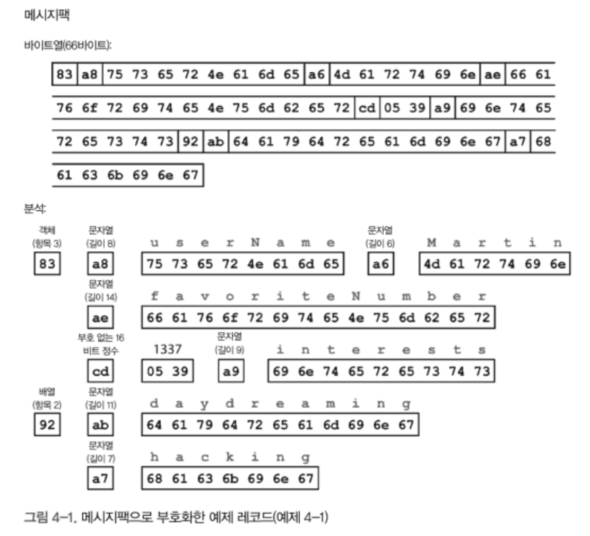
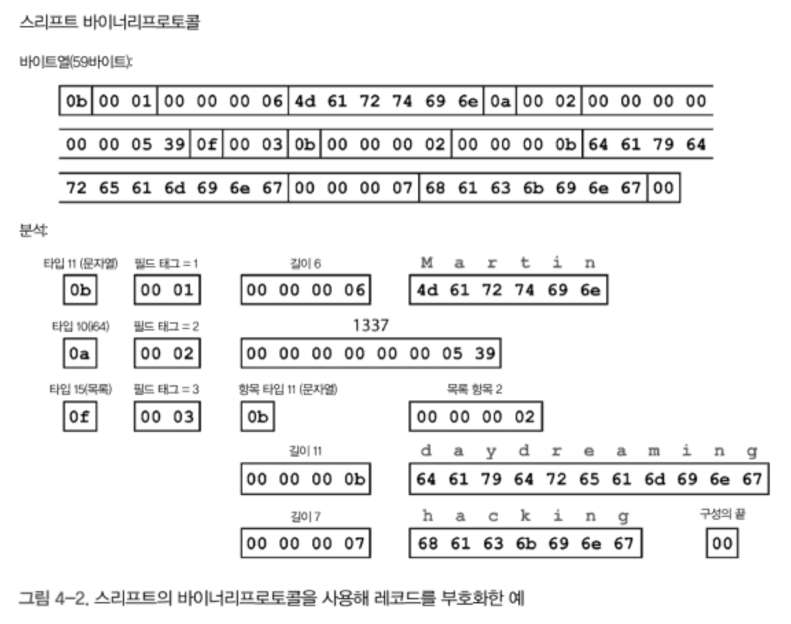
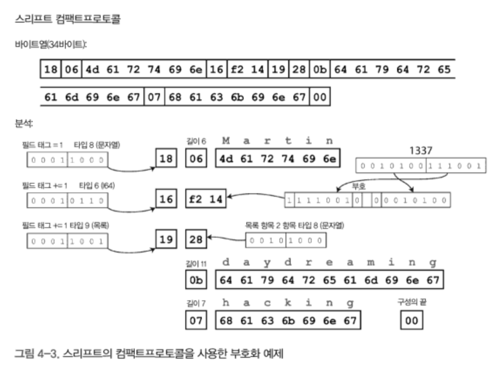
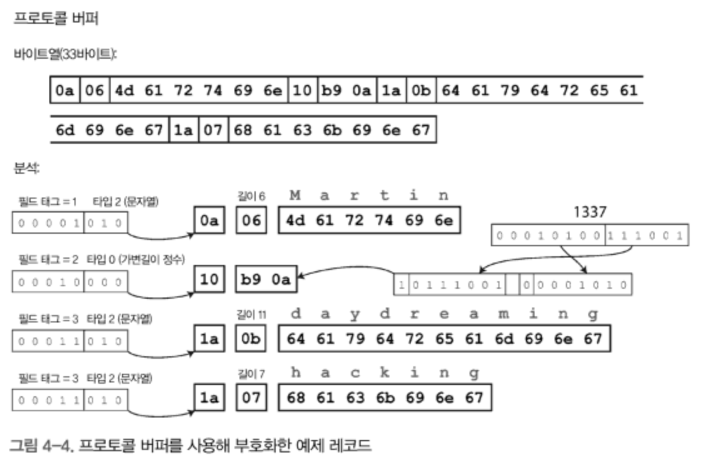
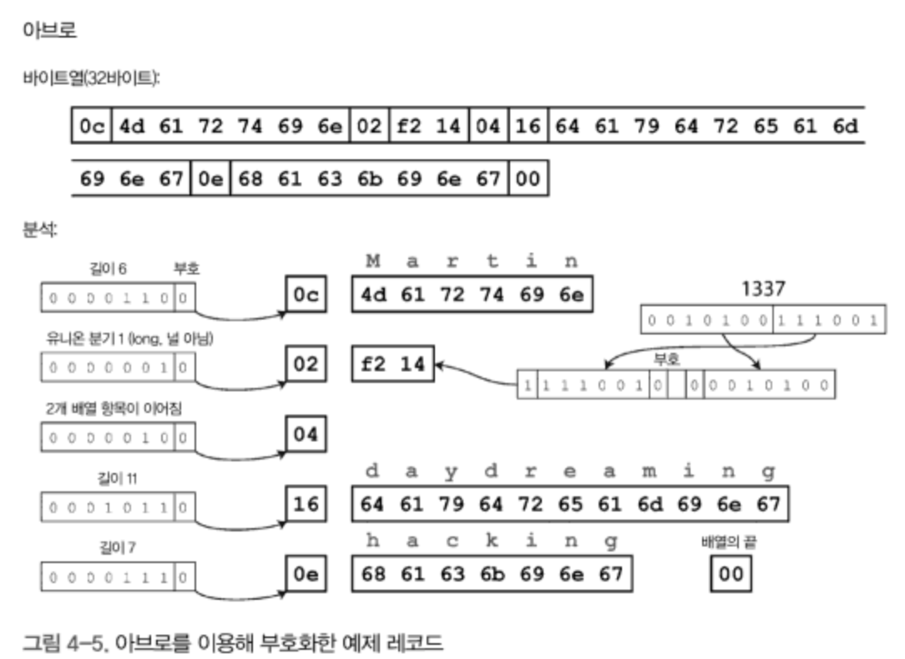
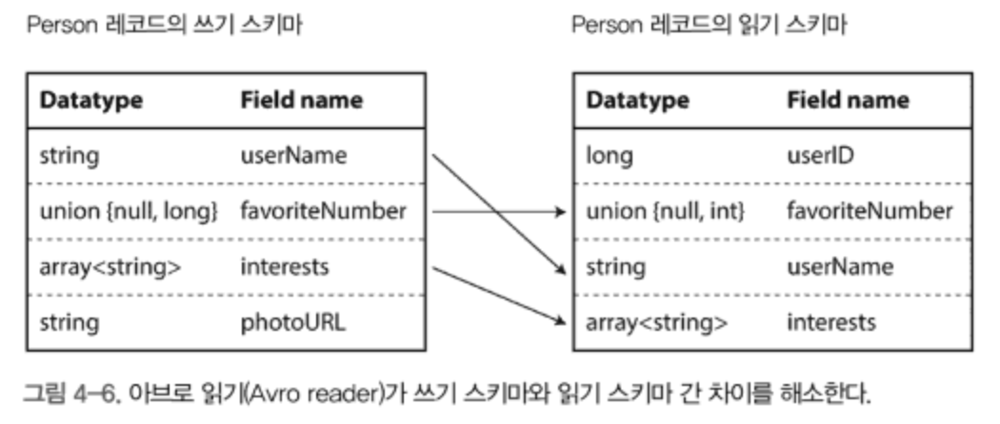
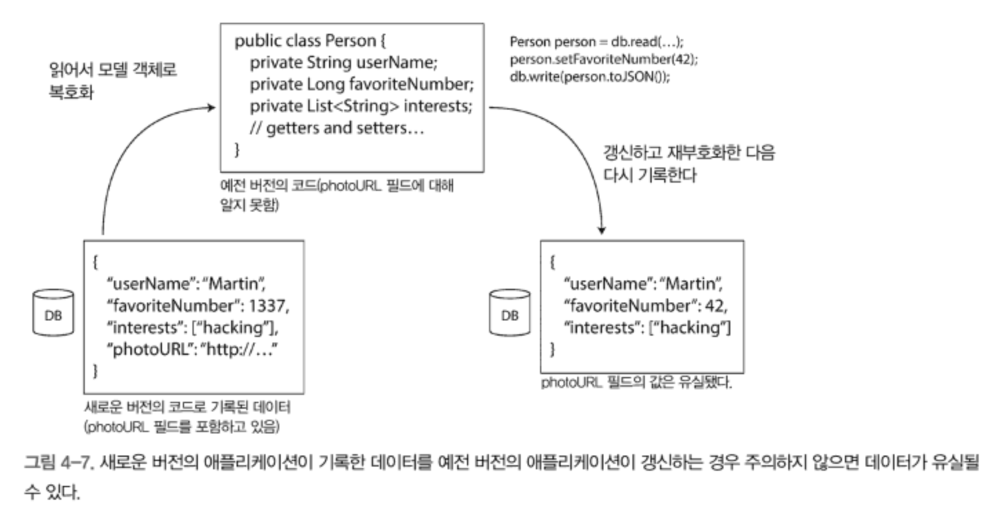

# 부호화와 발전

🤔 들어가기 앞서...

- 발전성은 **변경사항을 쉽게 적용할 수 있는가**를 의미한다.
- 대부분의 애플리케이션의 변경사항에는 데이터의 변경도 따라온다.
- 데이터 타입이나 스키마가 변경될 때, 애플리케이션 코드에 대한 변경이 발생한다.
- 하지만, 대규모 애플리케이션에서는 코드 변경을 한번에 반영하기 **어렵다**.
- **예전 버전의 코드 / 새로운 버전의 코드 / 이전 데이터 타입 / 새로운 데이터 타입**이 모든 시스템에 동시에 공존할 수 있다.
- 때문에 **양방향 호환성을 유지**해야 한다.

  - 하위 호환성: 새로운 코드는 예전 코드가 기록한 데이터를 읽을 수 있어야 함
  - 상위 호환성: 예전 코드는 새로운 코드가 기록한 데이터를 읽을 수 있어야 함

- 👏 이번 장에서는 JSON / XML / 프로토콜 버퍼(Protocol Buffers) / 스리프트(Thrift) / 아브로(Avro)과 같은 데이터 부호화를 알아보고 양방향 호환성을 어떻게 지원하는지 설명한다.  
- 👏 또, REST / RPC / Actor / Message Queue 와 같은 시스템에서 데이터 부호화 형식이 어떻게 활용되는지 본다.

_다 이해하기는 어렵다고 생각하기에 중요한 내용을 간추리려고 했다_

## 데이터 부호화 형식

- 프로그램은 데이터를 메모리에서 객체 / 구조체 / 리스트 / 배열 / 해시 테이블 / 트리 등으로 형태로 관리

- 파일이나 네트워크를 통해 전송하려면 데이터를 부호화(직렬화, 마샬링) 해야함

- 그 반대를 복호화(파싱, 역직렬화, 언마샬링)이라고 함

### 언어별 형식

- 프로그래밍 언어에서 인메모리 형식을 바이트열로 부호화하는 내장기능을 가지고 있음
- But, 문제점 많다 -> 쓰지 않는 편이 낫다
    
    - 프로그래밍 언어에 종속적임
    - 복호화시 임의의 클래스를 인스턴스화 하는 과정이 보안 취약점이 될 수 있다.
    - 데이터 버전 관리가 어렵고 상위, 하위 호환성이 불편하다.
    - 효율성이 좋지 않다.

### JSON / XML / 이진 변형

- JSON, XML, CSV는 텍스트 형식으로 육안으로 데이터를 읽을 수 있음
- But, 미묘한 문제가 있다.

    - XML과 CSV는 숫자와 숫자로 된 문자열을 구분할 수 없다.
    - JSON은 정수와 부동 소수점 수를 구별하지 않고 정밀도도 지정하지 않는다.
    - JSON과 XML은 이진 문자열을 지원하지 않는다. (Base64를 사용하면 됨, 근데 커짐)
    - JSON과 XML은 스키마를 지원하지만, 익히고 구현하기 어렵다.
    - CSV는 스키마가 없어서 각 로우와 칼럼의 의미는 애플리케이션에서 직접 정해야 한다

## 이진 부호화

- 부호화된 데이터의 크기를 줄이기 위해서 이진 형식을 사용하면 좋고 필요한 곳이 있음
- JSON과 XML용으로 다양하게 개발된 이진 부호화(BSON / Smile / WBXML 등)는 채택되지 않음

### 메시지 팩 

_메시지 팩은 C#의 부호화 라이브러리 인듯_

- 예시 데이터
    ```json
    {
        "userName": "Martin",
        "favoriteNumber": 1337,
        "interests": ["daydreaming", "hacking"]
    }
    ```
- 부호화된 데이터
    - 키 / 값 / 형식을 모두 넣음
    - 공간을 절약할 수 있다. (81 bytes -> **66 bytes**)
    

### 스리프트 / 프로토콜 버퍼

- 스리프트 인터페이스 정의 언어(inferface definition langauge, IDL)

    - 데이터를 부호화할때 쓰이는 스키마
    - 스키마 정의를 사용해 **코드를 자동으로 생성**하는 도구를 제공 (ex, 이것을 기반으로 클래스를 자동으로 생성)
    - 도구를 이용해 스키마의 레코드를 부호화 복호화 할 수 있음
    - 예시(스리프트)
        ```
        struct Person {
            1: required string      userName,
            2: optional i64         favoriteNumber,
            3: optional list<string> interests   
        }
        ```
    - 예시(프로토콜 버퍼)
        ```
        message Person {
            required string user_name       = 1;
            optional i64 favorite_number    = 2;
            repeated string interests       = 3;
        }
        ```
    - required / optional: 부호화시 사용되지 않지만, 실행시에 버그를 검출하기 위한 표시
    - repeated: 같은 필드가 반복해서 등장

- 부호화된 데이터

    - 스리프트 바이너리프로토콜(BinaryProtocol)
    
        - 각 필드에 **타입** 주석(annotation)이 있고, **길이(문자열 길이, 목록 개수)** 표시 있음
        - 필드 이름이 없는 대신, **필드 태그(1,2,3)이 있음** (스키마 정의에 나온 숫자)
        - 59 bytes
        

    - 스리프트 컴팩트프로토콜(CompactProtocol)

        - 필드 타입과 태그를 단일 바이트로 합침
        - **가변 길이 정수**를 사용 (1337을 2바이트만으로 표현)
            - 숫자 크기에 따라서 공간을 사용
            - [-64,63]은 1바이트, [-8192,8191]은 2바이트로 부호화
        - 34 bytes
        

    - 프로토콜 버퍼(ProtocolBuffers)

        - 컴팩트프로토콜과 비슷
        - 33 bytes
        

## 필드 태그와 스키마의 발전

- 스키마는 시간이 지남에 따라 변함 -> 스키마 발전(schema evolution)
- 앞선 부호화 방식(스리프트 / 프로토콜 버퍼)는 다음과 같은 특징이 있음.

    - 필드 이름은 변경할 수 있지만, 필드 태그는 변경할 수 없음
    - **상위 호환성**
        - 필드 추가시 무시할 수 있음 (예전 코드에서 새로운 필드는 무시된다)
    - **하위 호환성**
        - 새로운 필드는 required일 수 없음 (예전 코드의 데이터는 해당 필드가 없기 때문)
        - 새로운 필드는 optional이거나 기본값 필요
        - required 필드는 삭제할 수 없음 (예전 코드가 새 데이터를 읽을때 required 필드가 없기 때문)
        - optional 필드는 삭제할 수 있고, 같은 태그 번호를 재활용할 수 없음

## 데이터 타입과 스키마 발전

- 필드의 데이터 타입을 변경하면 데이터가 잘릴 위험이 있음

## 아브로

- 아파치 아브로

    - 스리프트가 하둡의 사용 사례에 적합하지 않아 2009년 하둡의 하위 프로젝트로 시작

- 스키마 언어

    > 두개의 스키마 언어가 있음  
    > 태그 번호가 없다는 것이 특징

    - 아브로 IDL

        - 사람이 편집할 수 있음
        - 예시
            ```
            record Person {
                string               userName;
                union { null, long } favoriteNumber = null;
                array<string>        interests;
            }
            ```


    - JSON 기반 스키마

        - 기계가 더 쉽게 읽을 수 있음
        - 예시
            ```
            {
                "type": "record",
                "name": "Person",
                "fields": [
                    {"name": "userName",            "type": "string"},
                    {"name": "favoriteNumber",      "type": ["null", "long"], "default": null},
                    {"name": "interests",           "type": {"type": "array", "items": "string"}},
                ]
            }
            ```

- 부호화된 데이터

    - 스키마에 나타난 순서대로 필드를 나열함
    - **데이터 타입과 태그 번호 없음**
    - 정수는 컴팩트프로토콜의 가변길이 부호화 사용
    - 같은 스키마를 사용해야 데이터를 복호화 할 수 있다
    - 32 bytes
    

### 쓰기 스키마와 읽기 스키마

- 쓰기 스키마(writer's schema)

    - 애플리케이션이 파일이나 데이터베이스에 쓰기 위해 / 네트워크를 통해 전송등의 목적으로 데이터를 부호화할때 사용

- 읽기 스키마(reader's schema)

    - 애플리케이션이 파일이나 데이터베이스에서 / 네트워크에서 수신 등으로 얻은 데이터를 복호화할때 사용

- 아브로의 스키마 호환

    - 아브로는 쓰기 스키마와 읽기 스키마가 동일하지 않을 수 있고 호환 가능하면 됨
    - 복호화시 쓰기 스키마와 읽기 스키마를 함께 읽어, 차이를 해소
    - 순서가 달라도 이름으로 필드를 찾음
    - 읽기 스키마에 없는 필드는 무시
    - 읽기 스키마에만 있는 경우 기본값으로 채움
        

### 스키마 발전 규칙

- 아브로에서 상위 호환성

    - "새 버전 쓰기 스키마" / "예전 버전 읽기 스키마"를 가질 수 있다를 의미

- 아브로에서 하위 호환성

    - "새 버전 읽기 스키마" / "예전 버전 쓰기 스키마"를 가질 수 있다를 의미

- 호환성 유지

    - 기본값이 있는 필드만 추가하거나 삭제할 수 있다.
    - 아브로에서 null을 허용하려면 union 타입을 사용해야 한다 (_파이썬의 `int | None` 처럼_)

### 그러면 쓰기 스키마는 무엇인가?

- 읽기에서 쓰기 스키마를 알아내는 방법

    - 많은 레코드가 있는 대용량 파일의 경우

        - 동일한 스키마로 부호화된 수백만 개의 레코드를 저장한 파일일때,
        - 파일의 시작부분에 쓰기 스키마를 포함시킨다.

    - 개별적으로 기록된 레코드를 가진 데이터베이스의 경우

        - 다양한 레코드가 다양한 쓰기 스키마를 사용해 쓰여진 경우,
        - 레코드의 시작 부분에 버전 번호를 포함하고 데이터베이스에 스키마 버전 목록을 유지한다.

    - 네트워크 연결을 통해 레코드 보내기

        - 두 프로세스가 양방향 네트워크 연결을 통해 통신할때, 연결 설정에서 스키마 버전 합의를 할 수 있다.

### 동적 생성 스키마

- 아브로는 동적 생성 스키마에 더 적합

    - 데이터베이스의 내용을 부호화 하고 아브로 객체 컨테이너 파일로 모두 덤프할 수 있다.
    - 데이터베이스 테이블에 맞게 레코드 스키마를 생성할 수 있다. (칼럼 이름은 아브로 필드 이름에 매핑됨)
    - 데이터베이스 스키마가 변경되면, 새로운 아브로 스키마를 생성하고 덤핑한다.

- 스리프트나 프로토콜 버터의 경우

    - 필드 태그 번호를 수동으로 할당해야 해서 까다롭다.

### 코드 생성과 동적 타입 언어

- 파이썬 / 자바스크립트 같은 동적 타입 언어는 코드를 생성하는 것이 중요하지 않다.

    - 때문에 아브로는 코드 생성을 선택적으로 제공한다.
    - 객체 컨테이너 파일이 있으면 라이브러리를 사용해 간단히 데이터를 다룰 수 있다.

### 스키마의 장점

- 이진 부호화 스키마 언어가 좋은 이유..

    - XML, JSON보다 더 간단하고 자세한 유효성 검사 규칙을 정의할 수 있다.
    - 부호화된 데이터의 크기가 작다.
    - 스키마 자체를 문서화로 사용할 수 있다.
    - 스키마를 이용해 상위 호환성과 하위 호환성을 확인할 수 있다.
    - 정적 타입 언어에서 코드를 자동으로 생성하는 기능은 유용하다.

## 데이터플로 모드

- 데이터플로

    - 하나의 프로세스에서 다른 프로세스로 데이터를 전달하는 방법

### 데이터베이스를 통한 데이터플로

- 데이터베이스에서 부호화

    - 데이터베이스에 "쓰기"하는 프로세스는 데이터를 부호화하고
    - 데이터베이스에 "읽기"하는 프로세스는 데이터를 복호화한다.

- 하위 호환성이 필요한 이유

    - 데이터베이스내 과거에 기록한 데이터는 미래에서 복호화 할 수 있어야 한다.

- 상위 호환성이 필요한 이유

    - 순회식 업그레이드로 새로운 버전을 배포할때, 아래와 같은 문제가 발생할 수 있다.
    - 새로운 버전의 photoUrl 필드가 유실되었다.
      

### 다양한 시점에 기록된 다양한 값

- 보통 데이터의 수명은 애플리케이션 코드보다 길다.
- 데이터베이스는 다양한 버전의 스키마로 부호화된 레코드를 모두 포함할 수 있어야 한다.
- 많은 관계형 데이터베이스에서는 기존 데이터를 그대로 두고 null 값을 기본값으로 갖는 새로운 칼럼을 추가할 수 있다.
    - _mysql에서는 이것이 안된다고 하던데.. 아마 clustered index에서 페이지 단위로 다시 덮어 써야 하기 때문이 아닐까?_
- 데이터베이스의 스키마 발전은 전체 다양한 데이터가 단일 스키마로 부호화된 것처럼 보이게 한다.

### 보관 저장소

- 데이터베이스의 스냅샷은 일관되게 부호화하는 것이 좋음
- 스냡샷은 수정되지 않으므로 아브로 객체 컨테이너 파일과 같은 형식이 좋다 (_아마 위의 "많은 레코드가 있는 대용량 파일의 경우"를 말하는 듯_)

### 서비스를 통한 데이터플로: REST / RPC

- 서비스

    - 클라이언트-서버 모델의 서버가 공개한 API

- 서비스 지향 설계(service-oriented architecture, SOA)

    - 서버가 클라이언트가 되어 다른 서비스에게 요청하는 아키텍처
    - 더 진화한 형태 -> 마이크로서비스 설계(microservices architecture, MSA)

- 서비스 지향 설계와 데이터 부호화

    - 서비스 지향 설계의 핵심 목표는 각 서비스를 배포와 변경에 독립적으로 만들어 유지보수를 쉽게 하는 것
    - 각 서비스는 다른 서비스에 크게 얽매이지 않고 새로운 버전을 배포할 수 있어야 함
    - 시스템 내에서 예전 버전과 새 버전의 클라이언트와 서버가 모두 실행 가능해야 함
    - 즉, **서버와 클라이언트의 데이터 부호화는 여러 서비스 API 버전간 호환이 가능해야 한다.**

### 웹 서비스 

- 웹 서비스

    - 기본 프로토콜로 HTTP를 사용하는 서비스
    - 웹 서비스에는 대중적인 REST / SOAP가 있음

- REST

    - HTTP의 원칙을 토대로 한 설계 원칙
    - 간단한 데이터타입
    - URL을 사용해 리소스 식별
    - 캐시 제어 / 인증 / 콘텐츠 유형 협상에 HTTP 기능 사용
    - REST하게 설계된 API -> RESTful

- SOAP

    - 네트워크 API 요청을 위한 XML 기반 프로토콜
    - 대부분의 HTTP 기능을 사용하지 않음
    - 광범위하고 복잡한 기능을 제공
    
- WSDL(Web Service Description Langauge)

    - SOAP 웹 서비스의 API는 WSDL라는 XML 기반언어로 기술함
    - 로컬 클래스와 메서드 호출을 사용해 원격 서비스에 접근하는 코드 생성 가능
    - 육안으로 이해하기 어렵고 WSDL 구성은 IDE로 해야 함
    
### 원격 프로시저 호출(RPC) 문제

- 원격 프로시저 호출(remote procedure call, RPC)

    - 다른 프로세스의 함수나 메서드를 호출할 수 있음

- 원격 프로시저 호출의 문제점

    > - 네트워크 요청과 로컬 함수 호출은 차이가 있음
    > - 로컬 함수 호출은 예측 가능하지만 네트워크 요청은 예측이 어려움
    >     - 네트워크 문제로 요청이나 응답이 유실될 수 있다.
    >     - 이런 문제를 제어해야 할 필요성 있음

    - 네트워크 요청은 로컬 함수 호출과 달리 타임아웃 결과가 있을 수 있고, 별도로 처리 해야 한다.
    - 네트워크 요청은 응답이 유실된 네트워크 요청의 경우 재시도를 하는데, 멱등성을 고려해야 한다.
    - 네트워크 요청은 로컬 함수 호출보다 더 느리고 지연시간을 예상하기 어렵다.
    - 로컬 함수 호출은 객체를 참조로 전달할 수 있지만, 네트워크 요청은 객체를 부호화해서 전달해야 한다.
    - 클라이언트와 서비스는 다른 언어로 구현될 수 있기 때문에 데이터타입의 호환문제가 발생한다.

### RPC의 현재 방향

- 차세대 RPC 프레임워크는 네트워크 요청과 로컬 함수 호출을 동일시하지 않는다.
- 피네글 / Rest.li는 실패할 수 있는 비동기 작업을 퓨처(future or promise)로 캡슐화 한다.
- gRPC는 일련의 요청과 응답으로 구성된 스트림을 지원한다.

### 데이터 부호화와 RPC의 발전

- 모든 서버를 갱신하고 나서 클라이언트를 갱신하면...

    - 요청은 하위 호환성만 필요하다.
    - 응답은 상위 호환성만 필요하다.

- RPC 스키마의 상하위 호환 속성은 모든 부호화로부터 상속됨

    - 스리프트, gRPC(프로토콜 버퍼), 아브로 RPC는 각 부호화 형식의 호환성 규칙에 따라 발전할 수 있다.
    - SOAP에서 요청과 응답은 XML 스키마를 사용한다.
    - RESTful API는 요청에 선택적 요청 매개변수를 추가하거나, 응답 json에 새로운 필드를 추가하는 것으로 호환성을 유지한다.

## 메시지 전달 데이터플로

- 비동기 메시지 전달 시스템

    - 클라이언트 요청(메시지)를 메시지 브로커(메시지 큐)에 저장하고 메시지 지향 미들웨어라는 중간 단계를 거쳐 전송한다

- 메시지 브로커의 장점

    - 과부하 상태일때 브로커가 버퍼처럼 동작할 수 있기 때문에 안정성이 올라간다.
    - 죽었던 프로세스에 메시지를 다시 전달할 수 있다.
    - 송신자가 수신자의 IP 주소와 포트번호를 알 필요 없다.
    - 하나의 메시지를 여러 수신자로 전송할 수 있다.
    - 송신자와 수신자를 논리적으로 분리시킨다. (_연결되지 않았다고 봐야할듯_)

### 메시지 브로커

- 게시자가 메시지를 큐 혹은 토픽으로 전송한다.
- 브로커는 해당 큐나 토픽의 소비자나 구독자에게 메시지를 전달한다.
- 메시지는 일부 메타데이터를 가진 바이트열이므로 모든 부호화 형식을 사용할 수 있음
- 부호화가 상하위 호환성을 가지면 브로커에서 게시자와 소비자를 독립적으로 변경할 수 있다. (발전성을 갖는다)

### 분산 액터 프레임워크

- 엑터 모델

    - 액터 모델은 단일 프로세스 안에서 동시성을 위한 프로그래밍 모델
    - 액터는 다른 액터와 비동기 메시지로 통신한다.
    - 이 과정에서 메시지는 유실될 수 있다.
    - 각 엑터 프로세스는 프레임워크와 독립적이고 한번에 하나의 메시지만 처리하기 때문에 스레드에 걱정할 필요가 없다.

- 분산 액터 프레임워크

    - 여러 노드 간의 애플레케이션 확장에 사용됨
    - 송신자와 수신자는 같은 노드에 있어도 / 다른 노드에 있어도 동일한 메시지 전달 구조를 사용
    - 다른 노드에 있는 경우 메시지는 바이트열로 부호화되고, 받는 쪽에서 복호화 한다.
    - 엑터 모델은 단일 프로세스 안에서도 메시지가 유실될 수 있다는 것을 가정함.
        - 때문에 위치 투명성(RPC의 로컬 함수 실행 같은 것)이 잘 동작함
    - 순회식 업그레이드 수행을 원하면 메시지가 메시지의 상하위 호환성에 주의해야 한다.

## 정리

- 많은 서비스에서 새로운 버전의 서비스를 동시에 모든 노드에 배포하는 것보다 일부 노드에만 서서히 배포하는 순회식 업그레이드를 사용한다.
- 순회식 업그레이드는 정지 시간 없이 새 버전을 릴리즈 할 수 있게 하고, 이러한 배포 방식은 발전성에도 도움이 많이 된다.
- 순회식 업그레이드는 다양한 노드에서 여러 버전의 데이터를 다루기 때문에 상하위 호환성을 모두 제공하는 방식으로 부호화할 필요가 있다.