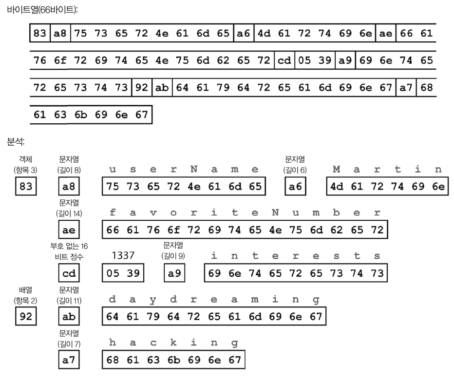
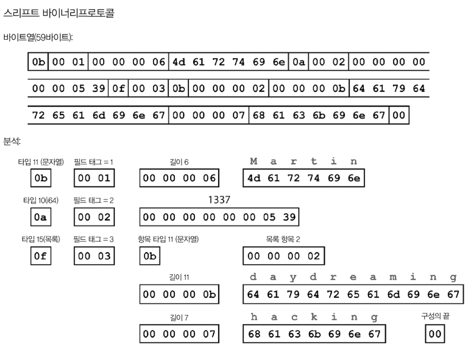
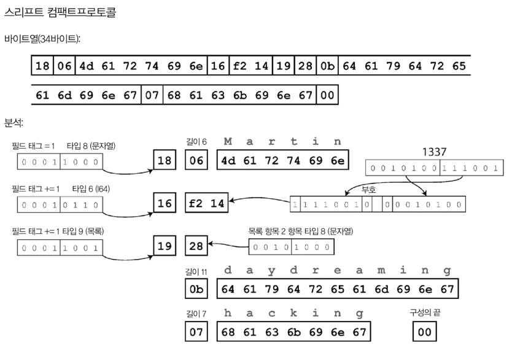
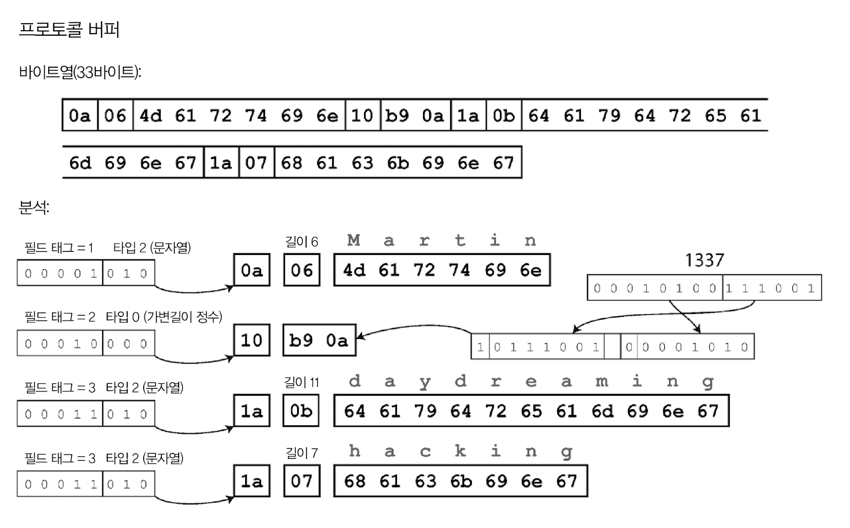
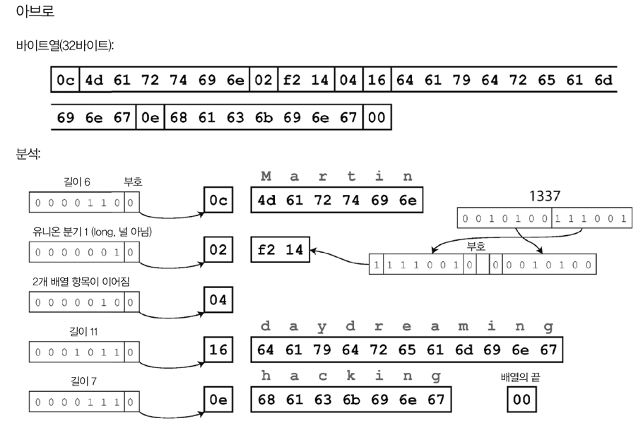

# Introduction 
- 발전성 있는 애플리케이션을 위해..
  - 변경사항을 쉽게 적용할 수 있게 시스템을 구축하자 
- 애플리케이션의 기능 변경
  - 저장하는 데이터도 변경되어야 할 수 있음 
    - 새로운 필드나 레코드 타입을 저장해야 하거나, 기존 데이터를 새로운 방법으로 제공
- 데이터 타입이나 스키마의 변경이 발생할 수 있음 
  - 애플리케이션 코드에 변경을 유발할 수 있음 
  - 예전 버전의 코드와 새로운 버전의 코드가 모든 시스템에 동시에 공존할 수도 있음 
    - 양방향으로 호환성을 유지해야 함
    - 하위 호환: 새로운 코드는 예전 코드가 기록한 데이터를 읽을 수 있어야 함 
      - 예전 버전의 코드를 알고 있으므로, 명시적으로 다룰 수 있음 
    - 상위 호환: 예전 코드는 새로운 코드가 기록한 데이터를 읽을 수 있어야 함
      - 새 코드에 추가된 것을 무시할 수 있어야 함 

> 이번 장에서 알아볼 것
> - 데이터 Encoding 형식 
>   - JSON, XML, Protocol Buffers, Thrift, Avro 등
>   - 어떻게 스키마를 변경하고, 상/하위 호환성을 지원하는지
> - 웹 서비스에서의 Encoding 
>   - REST(Representational State Transfer)
>   - Remote Procedure Call(RPC)
>   - Actor와 메세지 큐 

---

---

# 데이터 Encoding 형식 
- 메모리에 데이터를 유지하여 CPU에서 효율적으로 접근하고 조작할 수 있게 최적화 
  - Object, List, Array, HashTable, Tree...
  - 보통은 포인터를 이용해 데이터를 참조
- 데이터를 파일에 쓰거나 네트워크를 통해 전송하려면 
  - 일련의 Byte열로 변환해야 함 (ex: JSON...)
    - 메모리에서 사용하는 포인터는 다른 프로세스가 이해할 수 없음
    - 따라서, Byte열은 메모리에서 사용되는 구조와 상당히 다름 

### 인메모리 표현과 바이트열 간의 전환이 필요 
- 인메모리 표현 → Byte
  - Encoding, Serialization 또는 [Marshalling](https://ko.wikipedia.org/wiki/%EB%A7%88%EC%83%AC%EB%A7%81_(%EC%BB%B4%ED%93%A8%ED%84%B0_%EA%B3%BC%ED%95%99))이라고 함
- Byte → 인메모리 표현
  - Decoding, Deserialization 또는 Unmarshalling


## 언어별 형식 
- 많은 프로그래밍 언어들은 인메모리 객체를 Byte로 Encoding하는 기능을 제공함
  - 편의성은 좋지만 문제점이 많음 

### 언어별로 제공하는 Encoding 라이브러리의 문제점
- 특정 언어에 의존적 
  - 다른 언어로 작성된 프로그램이 데이터를 읽기가 어려움 
  - 다른 시스템과 통합하는 데 방해가 될 수도 
- Decoding 과정에서 임의의 클래스를 인스턴스화 할 수 있어야 함 (자바의 리플렉션 같은 기능을 말하는걸까) 
  - 보안 문제의 원인이 될 수 있음 
- 주요한 문제를 등한시 하게 될 수도 있음 
  - 데이터 버전 관리 
  - 효율성(Encoding/Decoding에 소요되는 CPU 시간, Encoding된 구조체의 크기) 
    - 책에 따르면 자바의 내장 직렬화는 성능이 좋지 않고 비대해지는 Encoding으로 유명하다고 함 


## JSON, XML, Binary Encoding
- JSON, XML..
  - 표준화된 Encoding 방식 
  - 텍스트 형식이라 사람이 읽을 수 있음

### 수(number)의 Encoding 은 뭔가 많이 애매하다 
- [number vs digit](https://www.britannica.com/dictionary/eb/qa/digit-or-number)
- XML, CSV에서는 "number"와 "digit으로 구성된 문자열"을 구분할 수 없음 
  - JSON에서는 number와 문자열을 구분할 수 있지만, 정수와 부동소수점 수를 구별하지 않고, 정밀도를 지정하지 않음 
- 큰 number를 다룰 때 문제가 됨 
  - 2^53 보다 큰 정수는 정확하게 표현할 수 없음 → 파싱할 때 부정확해질 수 있음 
  - ex: 트위터는 2^53 보다 큰 정수는 다음과 같이 두 형태로 표현하여 해결함  
    - id: JSON number 
    - id_str: 10진 문자열  
- JSON, XML은 Unicode string을 잘 지원함 (사람이 읽기 쉬움)
  - 하지만, Binary string은 지원하지 않음 
  - 이러한 제한을 피하는 방법
    - Binary string → Base64 Encoding → Encoded string 
    - 하지만 이는 데이터 크기를 33%나 증가시키는 문제가 있음


### Binary Encoding
- Lowest common denominator encoding format
  - 조직 내에서만 사용하는 데이터에 적합 
  - 데이터 크기를 최소화하고, Encoding/Decoding 속도를 최대화하는 것이 목적
- JSON, XML은 Binary 형식보다 훨씬 더 많은 공간을 사용함 
  - 이는 다양한 Binary Encoding 방법을 개발하게 된 이유임  
  - JSON, XML 데이터 모델 + 데이터셋 타입 확장(부동소수점, 이진 문자열)
    - MessagePack, BSON, BJSON, UBJSON, BISON, Smile, WBXML, FastInfoset... 

#### JSON을 다양한 형식으로 Binary encoding을 해보자 
```json
{
  "userName": "Martin",
  "favoriteNumber": 1337,
  "interests": [
    "daydreaming",
    "hacking"
  ] 
}
```
#### 1. 메세지팩

- JSON용 Binary encoding 형식 중 하나 
- 문자열은 아스키 or UTF-8로 Encoding 
- JSON: 81 byte vs MessagePack: 66 byte
  - 작은 공간의 절약(+ 어쩌면 인코딩 성능 향상..)이 사람의 가독성을 해칠 만큼의 가치가 있는지는 확실치 않음 


#### 2. 스리프트 & 프로토콜 버퍼 
- Apache Thrift, Protocol Buffer는 같은 원리를 기반으로 한 Binary Encoding 라이브러리
  - 여담: Thrift는 Facebook에서 개발한 것이고, Protocol Buffer는 Google에서 개발 → 2007 ~ 2008년에 오픈소스화 
- Encoding할 데이터를 위한 스키마가 필요

#### 데이터 스키마
```text
예시: Thrift의 Interface Definition Language (IDL)로 스키마 기술하기 
struct Person {
  1: required string       userName,
  2: optional i64          favoriteNumber,
  3: optional list<string> interests
}
```

```protobuf
// 예시: Protocol Buffer로 스키마 기술하기
message Person {
  required string userName = 1;
  optional int64 favoriteNumber = 2;
  repeated string interests = 3;
}
```

- 스리프트는 두 가지 Binary Encoding 형식을 지원함 
  - Binary Protocol
  - Compact Protocol

#### Binary Protocol

- 필드 태그가 필드 이름을 대신함 
  - 필드 태그는 스키마 정의에 나타난 숫자임 

#### Compact Protocol

- 필드 타입 + 태그 숫자 → 단일 바이트로 줄임 
- 가변 길이 정수(Variable-length integer) 사용
  - https://en.wikipedia.org/wiki/Variable-length_quantity
  - 7bit로 나타낼 수 있는 숫자는 1byte로 encoding 가능 (-64 ~ 63)
  - 만약 맥북이고 Freeform을 사용할 수 있다면 ... → https://www.icloud.com/freeform/041M1AYomtRKvfsg3rpCACHwg


#### Protocol Buffer의 Binary Encoding

- Thrift의 Compact Protocol과 유사함
- 가변 길이 정수로 Encoding 하는 방법에 약간의 차이가 있음 


### 필드 태그와 스키마 발전
- 스키마 발전(Schema evolution) 
  - 스키마는 필연적으로 시간이 지남에 따라 변한다

#### Thrift, Protobuf 는 상/하위 호환성을 유지하면서 어떻게 스키마를 변경할 수 있을까? 
- Encoded record는 encoded field의 연결일 뿐임 
  - 각 필드는 태그 숫자로 식별하고, 데이터 타입을 주석으로 달아줌 
  - 필드 값이 설정되지 않은 경우는 단순히 생략됨
  - 필드 이름은 자유롭게 변경할 수 있으나, **필드 태그는 변경할 수 없다** 

####  새 필드 추가 → 새로운 태그 번호 부여 
- 예전 코드가 인식 불가능한 태그 번호를 가진 필드임 
  - 이를 예전 코드가 읽으려는 경우, 해당 필드를 간단히 무시할 수 있음 
  - 데이터 타입 주석은 parser가 몇 byte를 건너뛸 수 있는지를 알려준다. 
  - 결론적으로, 예전 코드가 새로운 코드로 기록된 레코드를 읽을 수 있게 됨 
- 각 필드에 고유한 태그 번호가 있는 동안에는 태그 번호가 계속 같은 의미를 가짐 
  - 새로운 코드는 예전 데이터를 항상 읽을 수 있음 
  - 하위 호환성을 유지할 수 있음 
  - 새로운 필드를 `required`로 할 수는 없다 
    - 예전 코드는 새로운 필드를 기록하지 않음 
    - 새로운 코드는 해당 필드를 "필수"로 인식하여 오류가 발생할 수 있음
    - 따라서, 하위 호환성을 유지하기 위해서는 추가되는 필드에 대해 `optional`로 선언하거나, `required`인 경우 기본값을 세팅해줘야 함 

#### 필드 삭제
- 필드 추가할 때의 방식과 반대로 하면 됨 
  - `optional` 필드만 삭제할 수 있음 
  - `required`를 삭제하면 상/하위 호환성이 모두 깨진다. 

### 데이터 타입과 스키마 발전 
- 필드의 데이터타입을 변경하면 **값이 정확하지 않거나 잘릴 위험이 있음**
  - ex: 정수를 32bit → 64bit로 변경
    - 새로운 코드는 예전 코드 데이터를 쉽게 읽을 수 있음 
    - 하지만, 예전 코드는 새로운 코드의 데이터를 읽을 경우 값이 잘리게 됨 
- 프로토콜 버퍼의 특징
  - List, Array 타입이 없지만 필드에 `repeated` 표시자가 있음 
    - 단순히 동일한 필드 태그가 여러번 나타남
    - 단일 값인 `optional` 필드를 다중 값인 `repeated` 필드로 변경해도 문제가 없음 (데이터 타입 변경과 다름 없는 행위)
      - Q. 새로운 코드는 List로 보게 되고, 예전 코드는 List의 마지막 엘리먼트만 보게 된다는데.. 이게 정말 문제가 없을까? 
        - 예전 코드는 A라는 값을 읽어오다가, 새로운 코드는 A, B, C를 읽어오게 되는 경우, 예전 코드가 C라는 값을 읽어도 문제가 없을까..? 저자가 말하고자 했던게 뭘까..?
- 스리프트 
  - List 타입이 있음 
  - List 내의 엘리먼트의 데이터 타입을 매개변수로 받음 
    - 따라서, 단일 값 → 다중 값 변경이 허용되지 않음
  - 중첩된 List를 사용할 수 있다는 장점은 있음 

## Avro
- Thrift가 Hadoop의 유스케이스에 적합하지 않아 개발된 것
- 두 개의 스키마가 있음
  - 특징
    - 스키마에 태그번호가 없음 
```text
예시: Avro IDL (사람이 편집 가능)
record Person {
  string             userName,
  union {null, long} favoriteNumber=null,
  array<string>      interests
}
```

```json
{
  "type": "record",
  "name": "Person",
  "fields": [
    {"name": "userName",       "type": "string"},
    {"name": "favoriteNumber", "type": ["null", "long"], "default": null},
    {"name": "interests",      "type": {"type": "array", "items": "string"}}
  ]
}
```

### Binary Encoding 

- 필드나 데이터타입을 식별하기 위한 정보가 없음 
- 단순히 연결된 값으로 구성됨 
- Avro를 이용해 Binary data를 파싱하려면...
  - 스키마에 나타난 순서대로 필드를 살펴보고, **각 필드의 데이터 타입을 미리 파악**해야 함
    - 데이터를 읽는 코드가 데이터를 기록한 코드와 **정확히 같은 스키마를 사용해야 올바르게 복호화가 가능함**을 의미 
    - 읽기와 쓰기 간 스키마가 불일치하는 경우 복호화가 정확하지 않음 

### 쓰기 스키마와 읽기 스키마 


## 스키마의 장점 


---

---

# 데이터플로 모드 