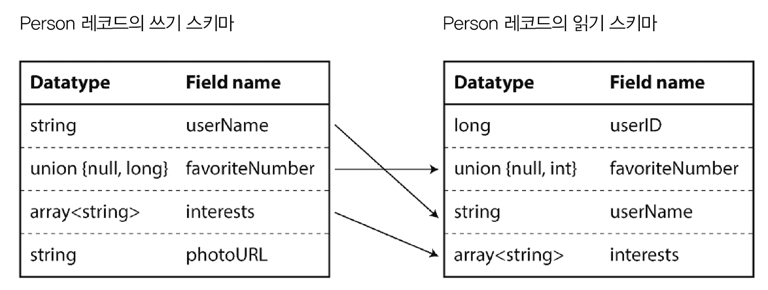
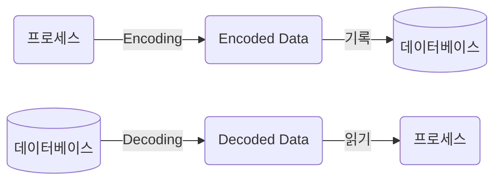
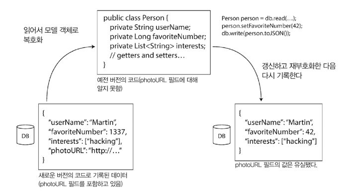
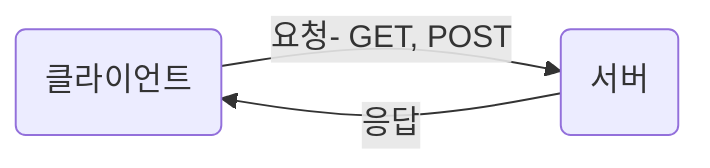

# Introduction 
- 발전성 있는 애플리케이션을 위해..
  - 변경사항을 쉽게 적용할 수 있게 시스템을 구축하자 
- 애플리케이션의 기능 변경
  - 저장하는 데이터도 변경되어야 할 수 있음 
    - 새로운 필드나 레코드 타입을 저장해야 하거나, 기존 데이터를 새로운 방법으로 제공
- 데이터 타입이나 스키마의 변경이 발생할 수 있음 
  - 애플리케이션 코드에 변경을 유발할 수 있음 
  - 예전 버전의 코드와 새로운 버전의 코드가 모든 시스템에 동시에 공존할 수도 있음 
    - 양방향으로 호환성을 유지해야 함
    - 하위 호환: 새로운 코드는 예전 코드가 기록한 데이터를 읽을 수 있어야 함 
      - 예전 버전의 코드를 알고 있으므로, 명시적으로 다룰 수 있음 
    - 상위 호환: 예전 코드는 새로운 코드가 기록한 데이터를 읽을 수 있어야 함
      - 새 코드에 추가된 것을 무시할 수 있어야 함 

> 이번 장에서 알아볼 것
> - 데이터 Encoding 형식 
>   - JSON, XML, Protocol Buffers, Thrift, Avro 등
>   - 어떻게 스키마를 변경하고, 상/하위 호환성을 지원하는지
> - 웹 서비스에서의 Encoding 
>   - REST(Representational State Transfer)
>   - Remote Procedure Call(RPC)
>   - Actor와 메세지 큐 

---

---

# 데이터 Encoding 형식 
- 메모리에 데이터를 유지하여 CPU에서 효율적으로 접근하고 조작할 수 있게 최적화 
  - Object, List, Array, HashTable, Tree...
  - 보통은 포인터를 이용해 데이터를 참조
- 데이터를 파일에 쓰거나 네트워크를 통해 전송하려면 
  - 일련의 Byte열로 변환해야 함 (ex: JSON...)
    - 메모리에서 사용하는 포인터는 다른 프로세스가 이해할 수 없음
    - 따라서, Byte열은 메모리에서 사용되는 구조와 상당히 다름 

### 인메모리 표현과 바이트열 간의 전환이 필요 
- 인메모리 표현 → Byte
  - Encoding, Serialization 또는 [Marshalling](https://ko.wikipedia.org/wiki/%EB%A7%88%EC%83%AC%EB%A7%81_(%EC%BB%B4%ED%93%A8%ED%84%B0_%EA%B3%BC%ED%95%99))이라고 함
- Byte → 인메모리 표현
  - Decoding, Deserialization 또는 Unmarshalling


## 언어별 형식 
- 많은 프로그래밍 언어들은 인메모리 객체를 Byte로 Encoding하는 기능을 제공함
  - 편의성은 좋지만 문제점이 많음 

### 언어별로 제공하는 Encoding 라이브러리의 문제점
- 특정 언어에 의존적 
  - 다른 언어로 작성된 프로그램이 데이터를 읽기가 어려움 
  - 다른 시스템과 통합하는 데 방해가 될 수도 
- Decoding 과정에서 임의의 클래스를 인스턴스화 할 수 있어야 함 (자바의 리플렉션 같은 기능을 말하는걸까) 
  - 보안 문제의 원인이 될 수 있음 
- 주요한 문제를 등한시 하게 될 수도 있음 
  - 데이터 버전 관리 
  - 효율성(Encoding/Decoding에 소요되는 CPU 시간, Encoding된 구조체의 크기) 
    - 책에 따르면 자바의 내장 직렬화는 성능이 좋지 않고 비대해지는 Encoding으로 유명하다고 함 


## JSON, XML, Binary Encoding
- JSON, XML..
  - 표준화된 Encoding 방식 
  - 텍스트 형식이라 사람이 읽을 수 있음

### 수(number)의 Encoding 은 뭔가 많이 애매하다 
- [number vs digit](https://www.britannica.com/dictionary/eb/qa/digit-or-number)
- XML, CSV에서는 "number"와 "digit으로 구성된 문자열"을 구분할 수 없음 
  - JSON에서는 number와 문자열을 구분할 수 있지만, 정수와 부동소수점 수를 구별하지 않고, 정밀도를 지정하지 않음 
- 큰 number를 다룰 때 문제가 됨 
  - 2^53 보다 큰 정수는 정확하게 표현할 수 없음 → 파싱할 때 부정확해질 수 있음 
  - ex: 트위터는 2^53 보다 큰 정수는 다음과 같이 두 형태로 표현하여 해결함  
    - id: JSON number 
    - id_str: 10진 문자열  
- JSON, XML은 Unicode string을 잘 지원함 (사람이 읽기 쉬움)
  - 하지만, Binary string은 지원하지 않음 
  - 이러한 제한을 피하는 방법
    - Binary string → Base64 Encoding → Encoded string 
    - 하지만 이는 데이터 크기를 33%나 증가시키는 문제가 있음


### Binary Encoding
- Lowest common denominator encoding format
  - 조직 내에서만 사용하는 데이터에 적합 
  - 데이터 크기를 최소화하고, Encoding/Decoding 속도를 최대화하는 것이 목적
- JSON, XML은 Binary 형식보다 훨씬 더 많은 공간을 사용함 
  - 이는 다양한 Binary Encoding 방법을 개발하게 된 이유임  
  - JSON, XML 데이터 모델 + 데이터셋 타입 확장(부동소수점, 이진 문자열)
    - MessagePack, BSON, BJSON, UBJSON, BISON, Smile, WBXML, FastInfoset... 

#### JSON을 다양한 형식으로 Binary encoding을 해보자 
```json
{
  "userName": "Martin",
  "favoriteNumber": 1337,
  "interests": [
    "daydreaming",
    "hacking"
  ] 
}
```
#### 1. 메세지팩

- JSON용 Binary encoding 형식 중 하나 
- 문자열은 아스키 or UTF-8로 Encoding 
- JSON: 81 byte vs MessagePack: 66 byte
  - 작은 공간의 절약(+ 어쩌면 인코딩 성능 향상..)이 사람의 가독성을 해칠 만큼의 가치가 있는지는 확실치 않음 


#### 2. 스리프트 & 프로토콜 버퍼 
- Apache Thrift, Protocol Buffer는 같은 원리를 기반으로 한 Binary Encoding 라이브러리
  - 여담: Thrift는 Facebook에서 개발한 것이고, Protocol Buffer는 Google에서 개발 → 2007 ~ 2008년에 오픈소스화 
- Encoding할 데이터를 위한 스키마가 필요

#### 데이터 스키마
```text
예시: Thrift의 Interface Definition Language (IDL)로 스키마 기술하기 
struct Person {
  1: required string       userName,
  2: optional i64          favoriteNumber,
  3: optional list<string> interests
}
```

```protobuf
// 예시: Protocol Buffer로 스키마 기술하기
message Person {
  required string userName = 1;
  optional int64 favoriteNumber = 2;
  repeated string interests = 3;
}
```

- 스리프트는 두 가지 Binary Encoding 형식을 지원함 
  - Binary Protocol
  - Compact Protocol

#### Binary Protocol

- 필드 태그가 필드 이름을 대신함 
  - 필드 태그는 스키마 정의에 나타난 숫자임 

#### Compact Protocol

- 필드 타입 + 태그 숫자 → 단일 바이트로 줄임 
- 가변 길이 정수(Variable-length integer) 사용
  - https://en.wikipedia.org/wiki/Variable-length_quantity
  - 7bit로 나타낼 수 있는 숫자는 1byte로 encoding 가능 (-64 ~ 63)
  - 만약 맥북이고 Freeform을 사용할 수 있다면 ... → https://www.icloud.com/freeform/041M1AYomtRKvfsg3rpCACHwg


#### Protocol Buffer의 Binary Encoding

- Thrift의 Compact Protocol과 유사함
- 가변 길이 정수로 Encoding 하는 방법에 약간의 차이가 있음 


### 필드 태그와 스키마 발전
- 스키마 발전(Schema evolution) 
  - 스키마는 필연적으로 시간이 지남에 따라 변한다

#### Thrift, Protobuf 는 상/하위 호환성을 유지하면서 어떻게 스키마를 변경할 수 있을까? 
- Encoded record는 encoded field의 연결일 뿐임 
  - 각 필드는 태그 숫자로 식별하고, 데이터 타입을 주석으로 달아줌 
  - 필드 값이 설정되지 않은 경우는 단순히 생략됨
  - 필드 이름은 자유롭게 변경할 수 있으나, **필드 태그는 변경할 수 없다** 

####  새 필드 추가 → 새로운 태그 번호 부여 
- 예전 코드가 인식 불가능한 태그 번호를 가진 필드임 
  - 이를 예전 코드가 읽으려는 경우, 해당 필드를 간단히 무시할 수 있음 
  - 데이터 타입 주석은 parser가 몇 byte를 건너뛸 수 있는지를 알려준다. 
  - 결론적으로, 예전 코드가 새로운 코드로 기록된 레코드를 읽을 수 있게 됨 
- 각 필드에 고유한 태그 번호가 있는 동안에는 태그 번호가 계속 같은 의미를 가짐 
  - 새로운 코드는 예전 데이터를 항상 읽을 수 있음 
  - 하위 호환성을 유지할 수 있음 
  - 새로운 필드를 `required`로 할 수는 없다 
    - 예전 코드는 새로운 필드를 기록하지 않음 
    - 새로운 코드는 해당 필드를 "필수"로 인식하여 오류가 발생할 수 있음
    - 따라서, 하위 호환성을 유지하기 위해서는 추가되는 필드에 대해 `optional`로 선언하거나, `required`인 경우 기본값을 세팅해줘야 함 

#### 필드 삭제
- 필드 추가할 때의 방식과 반대로 하면 됨 
  - `optional` 필드만 삭제할 수 있음 
  - `required`를 삭제하면 상/하위 호환성이 모두 깨진다. 

### 데이터 타입과 스키마 발전 
- 필드의 데이터타입을 변경하면 **값이 정확하지 않거나 잘릴 위험이 있음**
  - ex: 정수를 32bit → 64bit로 변경
    - 새로운 코드는 예전 코드 데이터를 쉽게 읽을 수 있음 
    - 하지만, 예전 코드는 새로운 코드의 데이터를 읽을 경우 값이 잘리게 됨 
- 프로토콜 버퍼의 특징
  - List, Array 타입이 없지만 필드에 `repeated` 표시자가 있음 
    - 단순히 동일한 필드 태그가 여러번 나타남
    - 단일 값인 `optional` 필드를 다중 값인 `repeated` 필드로 변경해도 문제가 없음 (데이터 타입 변경과 다름 없는 행위)
      - Q. 새로운 코드는 List로 보게 되고, 예전 코드는 List의 마지막 엘리먼트만 보게 된다는데.. 이게 정말 문제가 없을까? 
        - 예전 코드는 A라는 값을 읽어오다가, 새로운 코드는 A, B, C를 읽어오게 되는 경우, 예전 코드가 C라는 값을 읽어도 문제가 없을까..? 저자가 말하고자 했던게 뭘까..?
- 스리프트 
  - List 타입이 있음 
  - List 내의 엘리먼트의 데이터 타입을 매개변수로 받음 
    - 따라서, 단일 값 → 다중 값 변경이 허용되지 않음
  - 중첩된 List를 사용할 수 있다는 장점은 있음 

## Avro
- Thrift가 Hadoop의 유스케이스에 적합하지 않아 개발된 것
  - https://lists.apache.org/thread/65wwy2vm4c0lb6zz85c7jvfdgz5vs8y2
- 두 개의 스키마가 있음
  - 특징
    - 스키마에 태그번호가 없음 
```text
예시: Avro IDL (사람이 편집 가능)
record Person {
  string             userName,
  union {null, long} favoriteNumber=null,
  array<string>      interests
}
```

```json
{
  "type": "record",
  "name": "Person",
  "fields": [
    {"name": "userName",       "type": "string"},
    {"name": "favoriteNumber", "type": ["null", "long"], "default": null},
    {"name": "interests",      "type": {"type": "array", "items": "string"}}
  ]
}
```

### Binary Encoding 

- 필드나 데이터타입을 식별하기 위한 정보가 없음 
  - 왜 이런 선택을 했을까? 
- 단순히 연결된 값으로 구성됨 
- Avro를 이용해 Binary data를 파싱하려면...
  - 스키마에 나타난 순서대로 필드를 살펴보고, **각 필드의 데이터 타입을 미리 파악**해야 함
    - 데이터를 읽는 코드가 데이터를 기록한 코드와 **정확히 같은 스키마를 사용해야 올바르게 복호화가 가능함**을 의미 
    - 읽기와 쓰기 간 스키마가 불일치하는 경우 복호화가 정확하지 않음 

### 쓰기 스키마와 읽기 스키마 
- 아브로를 통한 Encoding은 **알고 있는 스키마 버전을 사용해 Encoding을 수행**한다. 
  - 이를 **쓰기 스키마**라고 함
- 아브로를 통해 Decoding을 하기 위해서는 **특정 스키마를 사용해 Decoding을 수행**한다.
  - 이를 **읽기 스키마**라고 함
- 애플리케이션 코드는 아브로를 사용할 경우, 쓰기 스키마와 읽기 스키마에 **의존**한다. 

#### Avro의 핵심 아이디어 
- 쓰기 스키마와 읽기 스키마가 동일하지 않아도 되고, **호환 가능**하기만 하면 됨 
- Avro Reader 
  - 
  - Decoding할 때, 쓰기 스키마와 읽기 스키마를 Resolution → Decoding
    - 쓰기 스키마에만 있는 필드 → 무시
    - 읽기 스키마에만 있는 필드 → 기본값으로 채움 

### 스키마 발전 규칙   
- 상위 호환성 
  - 새로운 버전의 쓰기 스키마 & 예전 버전의 읽기 스키마 
- 하위 호환성
  - 새로운 버전의 읽기 스키마 & 예전 버전의 쓰기 스키마
- 호환성을 유지하기 위해 기본 값이 있는 필드만 추가하거나 삭제 가능 
  - 추가된 필드에 기본값이 있어야 이전 쓰기 스키마를 읽어도 기본값으로 채워서 문제가 없도록 할 수 있다 
    - 즉, 새로운 스키마를 사용하는 읽기가 예전 스키마로 기록된 레코드를 읽으면 누락된 필드는 기본 값으로 채워진다.
  - 기본 값이 없는 필드를 추가하면 새로운 읽기가 예전 쓰기를 읽을 수 없어 하위 호환성이 꺠짐 
  - 기본 값이 없는 필드를 삭제하면 예전 읽기는 새로운 쓰기가 기록한 데이터를 읽을 수 없어 상위 호환성이 깨짐  
- null을 임의 변수 기본값으로 허용하지 않음  
  - null을 허용하려면, `union` 타입을 사용해야 한다.
    - `union {null, long, string} field;` → field가 null이거나 long이거나 string일 수 있다는 의미 
  - null일 수 있는 것과 없는 것을 명확하게 구분하는 것은 버그를 막는 데 많은 도움을 준다 
- `optional`, `required` 표시자가 없음
- 타입을 변환할 수 있어, 필드의 데이터 타입 변경이 가능함 
- 필드 이름 변경은 까다로움 
  - 별칭을 포함해야 필드 이름 매치가 가능
  - 하위 호환성은 있지만 상위 호환성은 없음 
- 유니온 타입에 엘리먼트 추가
  - 하위 호환성은 있지만 상위 호환성은 없음

### 쓰기 스키마는 무엇일까? 
- 특정 데이터를 Encoding한 쓰기 스키마가 무엇인지 인식하는 방법은 무엇일까 
  - 쓰기 스키마의 전체를 레코드에 포함할 수는 없음
  - Encoding하는 의미가 없어짐
- 많은 레코드가 있는 대용량 파일 
  - Avro의 일반적인 용도
    - 동일한 스키마로 Encoding된 수 백만개 레코드를 포함하는 큰 파일을 저장
  - 파일을 쓸 때, 파일의 시작 부분에 한 번만 쓰기 스키마를 포함시켜 해결 
    - 파일 형식을 명시 (object container file)
- 개별적으로 기록된 레코드를 가진 데이터베이스 
  - 다양한 쓰기 스키마, 서로 다른 시점에 쓰여지는 경우 모두 동일한 스키마를 가진다고 가정이 불가능함 
  - 쓰기 스키마 버전 목록을 유지 
    - 모든 Encoding된 레코드의 시작 부분에 버전 번호를 포함
  - 읽을 때는 레코드를 가져와 버전 번호를 추출 → 버전에 해당되는 쓰기 스키마를 가져옴 → Encoding 
- 네트워크 연결을 통해 레코드를 보낼 때 
  - 연결 설정에서 스키마 버전 합의를 수행 
  - 연결을 유지하는 동안 합의된 버전의 스키마를 사용 
  - Avro RPC 프로토콜이 이러한 방식을 사용
- 버저닝 값 
  - 단조 증가 정수 
  - 스키마의 해시 값

### 동적 생성 스키마
- 아브로는 스키마에 태그 번호가 포함되지 않는다는 것이 장점임 
- 이게 왜 장점일까?
  - ex: 파일로 덤프할 내용이 있는 RDBMS가 있고, Binary 형식을 사용한다고 가정 
    - Avro를 사용할 경우, 관계형 스키마로부터 Avro 스키마(JSON 형식 스키마)를 상당히 쉽게 생성할 수 있음
    - 생성한 스키마를 이용해 내용을 Encoding 
    - Avro object container file로 모두 덤프 
    - Table에 맞게 레코드 스키마 생성 & 각 컬럼이 해당 레코드의 필드가 됨 
      - DB column → Avro field
    - DB schema 변경 시, 새로운 Avro Schema를 생성 
    - Avro는 새로운 스키마를 통해 데이터를 내보냄 
      - **스키마 변경에 신경 쓸 필요가 없음**
      - Avro Reader가 새로운 쓰기 스키마와 읽기 스키마를 매칭 시킨다 
- Thrift, Protobuf
  - 필드 태그를 수동으로 할당해야만 함 
  - DB 스키마 변경 시, DB 컬럼명과 필드 태그의 매핑을 수동 갱신해야 
    - 자동으로 가능하지만, 이전에 사용된 필드 태그가 할당되지 않게끔 매우 조심해야 함 
- Avro는 동적 생성 스키마를 고려해 설계되었고, Thrift와 Protobuf는 단지 설계 목표가 아니었을 뿐임 


### 코드 생성과 동적 타입 언어 
- Thrift, Protobuf는 코드 생성에 의존함 
  - 스키마 정의 후, 특정 프로그래밍 언어로 스키마를 구현한 코드를 생성할 수 있음
    - 즉, 컴파일러를 통한 이점들을 챙길 수 있음 
      - IDE에서 타입 확인 및 자동 완성이 가능 
    - 인메모리 구조 사용 가능
- Javascript, Python, Ruby와 같은 동적 타입 프로그래밍 언어에는 컴파일러를 통한 이점을 챙길 수 없음
  - 코드 생성이 중요하지 않음  
- 동적 생성 스키마의 경우, 코드 생성은 데이터를 가져오는 데 불필요한 장애물임 
  - Avro는 정적 타입 프로그래밍 언어를 위한 코드 생성을 선택적으로 제공 
  - 코드 생성 없이도 사용 가능 
    - object container file이 있다면 JSON 파일을 보는 것과 같이 파일을 간단히 열어 볼 수 있음 
      - 해당 파일은 필요한 메타데이터가 모두 포함됨
      - self-describing의 성질을 가짐 

## 스키마의 장점 
- Thrift, Protobuf, Avro는 스키마를 통해 Binary Encoding을 수행하는 스키마 언어들임 
- 스키마 언어는 JSON, XML보다 훨씬 간단하며, 자세한 유효성 검사 규칙을 지원함 
- Database들은 Binary Encoding을 독자적으로 구현하기도 함 
  - ex: RDBMS들은 Query를 DB로 보내고 응답을 받을 수 있는 네트워크 프로토콜이 있음 
    - 데이터베이스 네트워크 프로토콜로 부터 응답을 인메모리 데이터 구조로 복호화하는 드라이버 제공 
      - ex: JDBC
- Binary Encoding의 장점 
  - Encoded data에서 필드 이름을 생략 
    - 다양한 Binary JSON보다 크기가 훨씬 작을 수 있음 
  - 스키마는 유용한 문서화 형식임 
    - Decoding 시 스키마 필요 
      - 스키마가 최신 상태인지 확신 가능
      - 자동으로 관리될 수 있는 문서화의 한 형태 
    - 반면에 수동으로 관리하는 문서는 현행화가 잘 되지 않으면 실제와 달라지기가 너무 쉬움 
  - 스키마 데이터베이스를 유지하면 스키마 변경이 적용되기 전에 상/하위 호환성 확인 가능 
  - 정적 타입 프로그래밍 언어에서, 스키마로부터 코드를 생성하는 것은 컴파일 시점에 타입 체크를 할 수 있는 장점을 제공 

### 요약 
- 스키마 발전은 Schemaless 또는 schema-on-read JSON DB가 제공하는 것과 동일한 종류의 유연성을 제공함 

---

---

# 데이터플로 모드
- 복습 해보자 
  - 메모리를 공유하지 않는 다른 프로세스로 일부 데이터를 보내고 싶을 때는 **바이트열로 Encoding을 해야 함** 
    - ex: 네트워크를 통해 데이터를 보내거나 파일로 기록할 때 
  - 발전성
    - 한번에 모든 것을 변경할 필요 없이, 시스템의 다양한 부분을 독립적으로 업그레이드 해 변경 사항을 쉽게 반영하는 능력 
  - 호환성
    - 데이터를 Encoding하는 프로세스와, 데이터를 Decoding하는 프로세스 간의 관계 

### 데이터 플로 
- 매우 추상적인 개념 
- 하나의 프로세스에서 다른 프로세스로 데이터를 전달하는 방법은 아주 많음 
- 프로세스 간 데이터를 전달하는 보편적인 방법
  - 데이터베이스
  - 서비스 호출(REST, RPC)
  - 비동기 메시지 전달 

## 데이터베이스를 통한 데이터 플로  
- 하나의 프로세스가 Encoding한 데이터를 기록하고, 다른 프로세스가 언젠가 그 데이터를 다시 읽는 방식 


- 하위 호환성 필요 
  - 이전에 기록한 내용을 미래의 자신이 Decoding할 수 있어야 함 
- DB에 동시에 다양한 프로세스가 접근하는 일은 흔함 
  - 일부 프로세스는 새로운 코드 버전을 사용하고, 일부 프로세스는 예전 코드 버전을 사용할 수 있음
  - 즉, **새로운 버전의 코드로 기록** 후, **예전 버전의 코드로 값을 읽을 가능성이 있음**
    - 따라서, 상위 호환성도 필요함 
- DB 스키마에 새로운 필드를 추가하고, 새로운 코드는 새로운 필드를 위한 값을 기록한다고 가정 
  - 새로운 필드를 모르는 예전 버전의 코드가 레코드를 읽고 갱신 후 기록할 경우 
    - 바람직한 동작 = 예전 코드가 해석할 수 없다 하더라도 새로운 필드를 그대로 유지하는 것 

### 애플리케이션에서 신경써야 하는 사례 

- 애플리케이션에서 DB 값을 Decoding → 객체로 변환 → Re-Encoding → DB에 기록하는 경우 
  - 변환 과정에서 알지 못하는 필드가 유실될 수 있음 
  - 이를 주의해야 함 (알고 있어야 함)

### 다양한 시점에 기록된 다양한 값 
- DB의 값은 언제나 갱신 가능하다 
- 애플리케이션은 새로운 버전을 배포하면 예전 버전을 새로운 버전으로 완전히 대체 가능
  - 하지만, 수년이 지난 데이터는 그 이후로 명시적으로 갱신하지 않는 한, 원래의 Encoding 상태 그대로 있음 
  - **데이터는 코드보다 더 오래 산다(data outlives code)**
- 데이터를 새로운 스키마로 기록하는 `Migration`은 가능하나, 이는 대용량 데이터셋에 대해서는 값비싼 작업이다. 
  - 기존 데이터를 재기록 하기 보다는, `NULL`을 기본 값으로 갖는 새로운 ㅋ널럼을 추가하는 간단한 스키마 변경을 사용 
  - 예전 row를 읽는 경우, 누락된 임의 컬럼은 `NULL`로 채움 
- 스키마 발전은...
  - 기본 저장소가 여러 버전의 스키마로 Encoding된 레코드를 포함해도, 전체 DB가 단일 스키마로 Encoding된 것 처럼 보이게 함 

### 보관 저장소 
- 백업 목적이나 데이터 웨어하우스로 적재하기 위해 DB 스냅숏을 수시로 만든다고 가정할 경우 
  - 소스 DB의 원본 데이터에 다양한 시점의 스키마 버전이 섞여 있더라도, 데이터 덤프는 최신 스키마를 사용해 Encoding함 
  - 즉, 데이터의 복사본을 일관되게 Encoding 
- 데이터 덤프는 한 번에 기록하고 이후에는 변하지 않음 
  - Avro Object Container File과 같은 형식이 적합함 
  - 분석 친화적인 Column 지향 형식으로 데이터를 부호화 할 좋은 기회이기도... 


## 서비스 호출을 통한 데이터 플로: REST & RPC
- 네트워크를 통해 통신하는 프로세스 
  - Client, Server 두 역할로 배치 
    - Server: API 공개 (서비스) 
    - Client: API 호출
      - 웹 브라우저, 모바일 디바이스, 데스크탑 앱.. 
  - 하나의 프로세스가 네트워크를 통해 다른 프로세스로 요청을 전송하고, 가능한 빠른 응답을 기대하는 방식 

### 웹 동작 방식 

- API는 표준화된 프로토콜과 데이터 타입으로 구성
  - HTTP, URL, SSL/TLS, HTML...
- 클라이언트가 Javascript Application이라면, 서버는 처리가 편리하도록 JSON과 같은 형태로 Encoding한 데이터를 제공 
- 서버 자체가 클라이언트가 될 수 있음 (DB의 클라이언트)
- Service-oriented architecture (SOA) → Microservices architecture (MSA)
  - 하나의 서비스가 다른 서비스의 일부 기능이나 데이터가 필요할 경우 해당 서비스에 요청을 보내는 개발 방식
  - 핵심 설계 목표 
    - 서비스를 배포와 변경에 독립적으로 만들어 변경/유지보수를 더 쉽게 할 수 있게 만드는 것 
- 서비스는 DB와 유사함 
  - DB는 임의 질의를 허용 (질의 언어는 정해져 있으나, 방법은 정해져있지 않음)
  - 서비스는 비즈니스 로직으로 미리 정해진 입/출력만 허용 
    - 클라이언트가 할 수 있는 일과 할 수 없는 일에 대한 제약을 세분화해 적용
- 핵심 
  - 서버와 클라이언트가 사용하는 Data encoding은 서비스 API의 버전 간 호환이 가능해야 함

### 웹 서비스 
- 서비스와 통신하기 위한 기본 프로토콜로 HTTP를 사용 
- 사용 예 
  - 사용자 디바이스에서 서비스로 HTTP 요청 (공공 인터넷 사용) 
  - MSA의 일부로서 같은 데이터센터에 위치한 같은 조직의 다른 서비스에 요청 (미들웨어)
  - 다른 조직의 서비스에 요청하는 서비스. 백엔드 시스템 간 데이터 교환을 위해 사용. (신용카드 처리 등 공개 API를 사용하는 경우. OAuth가 포함됨)
- REST
  - HTTP의 원칙을 토대로 한 설계 철학 
  - 간단한 데이터 타입을 강조
  - URL을 사용해 리소스를 식별하고, 캐시 제어, 인증, 콘텐츠 타입 협상에 HTTP 기능을 사용함 
  - REST 원칙에 따라 설계된 API를 RESTful이라고 함
  - 간단한 접근 방식을 선호 
  - OpenAPI 같은 정의 형식을 사용해 API를 문서화
- SOAP 
  - 네트워크 API 요청을 위한 XML 기반 프로토콜 
  - HTTP와 독립적이며, HTTP 대부분의 기능을 사용하지 않음 
  - 다양한 기능을 추가한 광범위하고 복잡한 여러 관련 표준을 제공(WS, Web service framework)
    - WSDL(Web Services Description Language)라고 부르는 XML 기반 언어를 사용 
      - XML 메세지로 Encoding/Decoding 
      - 사람이 읽을 수 없음 
      - 도구 지원, 코드 생성, IDE에 크게 의존 
  - SOAP가 지원하지 않는 프로그래밍 언어 사용자의 경우, 해당 서비스와 통합이 매우 어려움 
    - 상호 운용성에 문제...
  
### 원격 프로시저 호출(RPC) 문제 
- 예전의 웹 서비스는 많은 문제가 있었다 하더라...
  - EnterpriseJavaBeans, Remote Method Invocation (RMI) → 자바로 제한됨 
  - Distributed Component Object Model (DCOM) → 마이크로 소프트 플랫폼으로 제한 
  - CORBA(Common Object Request Broker Architecture) → 복잡하고 비용이 많이 들며, 상/하위 호환성 제공 X 
- Remote Procedure Call(RPC)
  - 원격 네트워크 서비스 요청을, 같은 프로세스 내에서 특정 프로그래밍 언어의 함수나 메서드를 호출하는 것과 동일하게 사용 가능하게 해주는 것 
    - 이런 추상화를 [위치 투명성(location transparency)](https://en.wikipedia.org/wiki/Location_transparency)이라고 함
- RPC의 결함 
  - 네트워크 요청은 로컬 함수 호출과는 매우 다름 
    - 로컬 함수
      - 예측 가능
      - 제어 가능한 매개변수에 따라 성공 or 실패 
      - 결과 반환, 예외 발생, 또는 결과 미반환 가능
      - 요청이 처리되고, 응답이 유실되는 문제가 없음 
      - 실행 시마다 거의 같은 실행 시간 소요
      - 참조를 로컬 메모리의 객체에 효율적으로 전달 가능
      - 단일 언어로 개발되어 데이터 타입 변환이 필요하지 않음 
    - 네트워크
      - 예측이 어려움 
      - 네트워크 문제로, 
        - 요청과 응답이 유실될 수 있음 
        - 원격 장비가 느려질 수 있음
        - 요청에 응답하지 않을 수 있음 
      - 위 문제는 제어가 불가능하며, 이러한 문제를 함께 고려해야 하기 때문에 예측이 어렵다.
      - 결과 반환, 예외 발생, 결과 미반환 + @ 
        - @ = 타임 아웃으로 인한 결과 미반환(무슨 일이 있었는지 알 도리가 없음), 응답을 받지 못할 경우 요청을 제대로 보냈는지 여부를 알 수 없음 
      - 실패한 네트워크 요청을 재시도 할 경우
        - 요청이 실제로는 처리됐으나, 응답만 유실될 수있음 
        - 프로토콜에 중복 제거 기법을 적용하지 않으면 재시도 작업이 여러번 수행될 수 있음
          - Idempotence(멱등성)이라는 개념이 필요함
      - 함수 호출보다 훨씬 느리고, Latency가 매우 다양함 
      - 모든 매개변수가 네트워크를 통해 전송될 수 있게끔 바이트열로 Encoding해야 함 (큰 객체일 경우 문제가 발생할 수 있음)
      - 클라이언트, 서비스 간 다른 프로그래밍 언어로 구현된 경우
        - RPC 프레임워크는 데이터 타입 변환이 필요함 

### RPC의 방향성 
- Thrift, Avro → RPC 지원 기능 내장 
- Protobuf → gRPC 구현 
- 차세대 RPC 프레임워크 
  - 원격 요청 != 함수 호출 임을 분명하게 인식 
  - gRPC는 하나의 요청과 하나의 응답 뿐만 아니라, 시간에 따른 일련 요청과 응답으로 구성된 스트림을 지원 
  - 일부는 Service discovery 기능을 제공 
    - 클라이언트가 특정 서비스를 찾을 수 있는 IP, PORT를 제공 
- JSON보다는 Binary가 RPC에서 우수한 성능을 제공할 수 있으나...  
  - RESTful API는 성능보다는 다음의 이점을 취함 
    - 실험과 디버깅에 적합
    - 모든 주요 프로그래밍 언어와 플랫폼이 지원 가능 
    - 다양한 도구 생테계 
      - 서버, 캐시, 로드밸런서, 프락시, 방화벽, 모니터링, 디버깅 도구, 테스트 도구...
- REST는 public API의 주요한 방식이고, RPC 프레임워크는 **같은 데이터 센터 내의 같은 조직이 소유한 서비스 간 요청에 적합**함 

### Data Encoding과 RPC의 발전 
- 발전성이 있으려면
  - RPC 클라이언트와 서버를 독립적으로 변경 및 배포할 수 있어야 함 
  - 모든 서버를 갱신하고 나서 클라이언트를 갱신해도 문제가 없다고 가정함 
    - 요청은 하위 호환성만 필요
    - 응답은 상위 호환성만 필요
- RPC 스키마의 상/하위 호환 속성 
  - 사용된 모든 Encoding으로 부터 상속됨 
    - 스리프트, gRPC, Avro PRC는 각 Encoding 형식의 호환성 규칙에 따라 발전 
    - RESTful API는 응답에 JSON을 가장 일반적으로 사용 
      - 요청에는 JSON, URI encoding, Form encoding 요청 매개변수를 사용 
      - 요청 매개변수 추가나 응답 객체의 새로운 필드 추가는 호환성을 유지하는 변경으로 간주함 
- RPC가 조직 경계를 넘나드는 통신에 사용될 경우 
  - 서비스 호환성 유지를 더욱 어렵게 만듦 
    - 서비스 제공자는 클라이언트를 제어할 수 없고, 강제로 업그레이드도 할 수 없음 → 호환성은 오랜 시간 동안(거의 무한정) 유지돼야 함 
    - 호환성을 깨는 변경이 필요할 경우, 여러 버전의 서비스 API를 함께 유지함
- API 버전 관리에 정해진 방식은 없다 
  - RESTful API: URL, HTTP Accept Header에 버전 번호를 사용 


## 메시지 전달 데이터플로 
- 비동기 메시지 전달 시스템(Async Message-Passing System)
  - 클라이언트 요청(메시지)을 낮은 Latency로 다른 프로세스에 전달한다 (RPC와 비슷)
  - 메시지를 네트워크 연결로 직접 전달하지 않음 
    - 임시로 메시지를 저장하는 **메시지 브로커(Message broker) 또는 메시지 큐(Message queue) 또는 메시지 지향 미들웨어(Message-oriented middleware)** 라는 중간 단계를 거쳐 전송 (DB와 비슷)
- 직접 RPC를 사용하는 방식과 비교했을 때 다음의 장점이 있음 
  - 수신자(recipient)가 사용 불가능하거나 과부하 상태일 경우, 메시지 브로커가 버퍼처럼 동작 → 시스템 안정성 향상 
  - 죽었던 프로세스에 메시지를 재전송할 수 있음 → 메시지 유실 방지 
  - 송신자(sender)가 수신자의 IP주소나 PORT 번호를 알 필요가 없음 
  - 하나의 메시지를 여러 수신자로 전송 가능 
  - 송신자와 수신자가 논리적으로 분리됨 
    - 송신자는 메시지 publish만 수행. 누가 메시지를 Consume할지 신경쓸 필요가 없음
- 단방향 통신 (RPC와 차이점)
  - 비동기 통신 패턴
    - 송신 프로세스는 메시지에 대한 응답을 기대하지 않음
    - 단순히 메시지를 보내고 잊음 

### 메시지 브로커 
- RabbitMQ, ActiveMQ, Kafka, Amazon SQS ...
- 일반적으로 다음과 같이 사용 
  - 프로세스 하나가 메시지를 이름이 지정된 **큐 또는 토픽으로 전송** → 메시지 브로커가 큐나 토픽을 구독하고 있는 하나 이상의 Consumer/Subscriber에게 메시지를 전달 
    - 동일한 큐 또는 토픽에 여러 Producer와 Consumer가 연결될 수 있음
  - 단방향 데이터 플로만 제공 
    - 소비자가 다른 토픽/큐로 메시지를 publish해서 연결할 수는 있음 
- 특정 데이터 모델 강요 X 
- 메시지는 모든 Encoding 형식 사용 가능 
  - Encoding 방식이 상/하위 호환성을 모두 가질 경우, 메시지 브로커에서 Publisher와 Consumer를 독립적으로 변경해 임의 순서로 배포할 수 있는 유연성을 가지게 됨 
  - Consubmer가 다른 토픽으로 메시지를 Re-publish한다면, 알지 못하는 필드 보존에 주의가 필요 

### 분산 액터 프레임워크 
- 액터 모델(Actor model)은 단일 프로세스 안에서 동시성을 위한 프로그래밍 모델임 
  - 스레드를 직접 처리하는 대신 로직이 액터에 캡슐화 됨
- 액터 특징 
  - 각 액터는 하나의 클라이언트나 엔티티를 나타냄 
  - 로컬 상태를 가질 수 있고, 비동기 메시지의 송수신으로 다른 액터와 통신
  - 메시지 전달을 보장하지 않음
    - 메시지가 유실될 수 있음
  - 각 액터 프로세스는 한 번에 하나의 메시지만 처리 
    - 스레드에 대해 걱정 X 
      - 경쟁 조건, 락, 데드락과 관련된 문제들을 걱정하지 않아도 됨 
  - 각 액터는 프레임워크와 독립적으로 실행됨 
- 분산 액터 프레임워크 모델 
  - 여러 노드 간 애플리케이션 확장에 사용 
  - 송/수신자가 같은 노드에 있는지 여부와 관계 없이 동일한 메시지 전달 구조 사용 
    - 다른 노드에 있는 경우 Binary Encoding을 수행하고, 네트워크를 통해 전송 
  - 단일 프로세스 안에서도 메시지가 유실될 수있다고 가정함 
    - 위치 투명성은 RPC보다 액터 모델에서 더 잘 작동

---

---

# 정리 
- Binary Encoding 방식에 따라  
  - 효율성이 다름 
  - 애플리케이션의 아키텍처 배포와 선택 사항에 영향을 미침 
- 순회식 업그레이드 
  - 애플리케이션 변경을 쉽게 할 수 있는 발전성에 도움이 많이 됨 
- 순회식 업그레이드 중이거나, 여러 이유로 다양한 노드에서 다른 버전의 애플리케이션 코드가 수행될 수 있음 
  - 시스템을 흐르는 모든 데이터는 하위 호환성(새로운 코드가 예전 데이터를 읽을 수 있음)과 상위 호환성(예전 코드가 새로운 데이터를 읽을 수 있음)을 제공하는 방식으로 Encoding해야 함
- 다양한 Encoding 형식과 호환성 속성
  - 프로그래밍 언어에 특화된 Encoding 방식은 단일 프로그래밍 언어로 제한되며, 상/하위 호환성을 제공하지 못하는 경우가 종종 있음 
  - JSON, XML, CSV와 같은 텍스트 형식은 널리 사용되며, 호환성은 사용방법에 달려있음 
    - 데이터 타입이 모호하므로 숫자나 Binary String은 주의해서 다뤄야 함 
  - Thrift, ProtoBuf, Avro와 같은 Binary Schema 기반 형식은 짧은 길이로 Encoding됨 
    - 명확하게 정의된 상/하위 호환성의 맥락에서 효율적인 Encoding 제공 
    - 정적 타입 언어에서 유용하지만 사람이 읽기 위해서는 Decoding해야 함
- 데이터 플로 모드 
  - 데이터베이스 
    - DB에 기록하는 프로세스가 Encoding하고 읽는 프로세스가 Decoding
  - 서비스 호출 
    - 클라이언트가 요청을 Encoding & 응답 Decoding하고 서버가 요청을 Decoding & 응답 Encoding,
    - RPC, REST API
  - 메시지 전달
    - 송신자가 Encoding, 수신자가 Decoding