# Introduction
## 복제란 
- 네트워크로 연결된 여러 장비에 동일한 데이터의 복사본을 유지한다는 의미 

### 필요한 이유 
- 지리적으로 가깝게 데이터를 유지 → Latency 감소
- 일부에 장애가 발생해도 다른 장비로 서비스 제공 → 고가용성
- 읽기 부하를 분산 → 읽기 Throughput 증가

### 데이터셋 크기
- 크기가 작은 경우 전체 데이터셋의 복사본 보유 가능
- 크기가 큰 경우 일부만 복사본 보유 가능
  - 파티셔닝(샤딩) 필요 

### 복제가 어려운 이유 
- 데이터가 변경되면 모든 복사본을 변경해야 하기 때문 
- 노드 간 변경 복제 알고리즘
  - Single-leader, Multi-leader, Leaderless

### Trade-off
- 동기식 vs 비동기식
- 잘못된 복제본을 처리하는 방법 
- 최종적 일관성 
- read-your-writes, monotonic reads...

---

---

# Leader & Follower
- 복제 서버(replica)
  - DB 복사본을 저장하는 각 노드
- 모든 복제 서버에 동일한 데이터가 있다는 사실을 어떻게 보장할까?
  - 모든 쓰기는 모든 복제 서버에서 처리해야 함
    - Leader-based replication
    - 복제 서버 중 하나를 Leader로 지정 
    - DB 쓰기 발생 시, Leader에게 전달
    - Local 저장소에 기록 
    - Replication log나 Change stream의 일부로 Followers에게 전달
    - 로그를 리더가 처리한 것과 동일한 순서로 모든 쓰기를 적용하여 갱신 
  - 읽기는 아무데나 보내도됨 

## 동기식 vs 비동기식 
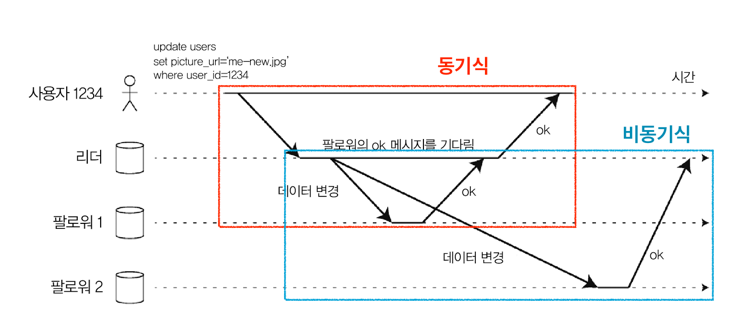

### 동기식 복제
- 팔로워가 쓰기를 수신했는지 확인 후 응답
- 팔로워가 리더와 일관성이 있게 최신 데이터 복사본을 가지는 것을 보장 
  - 따라서, 리더가 죽어도 팔로워의 데이터를 계속 사용할 수 있음 
- 근데 팔로워가 죽어서 쓰기를 수신할 수 없는 경우 쓰기가 처리되지 못함
  - 리더는 모든 쓰기를 blocking 하고, 팔로워가 복구될 때까지 대기함

### 비동기식 복제
- 쓰기 전송 후 확인하지 않고 바로 응답
- 리더가 잘못되고 복구가 불가능한 경우, 복제되지 않은 모든 쓰기가 유실됨 
  - 클라이언트가 이미 확인을 했음에도 지속성이 보장되지 않음 
- 모든 팔로워가 잘못되더라도 리더가 쓰기 처리를 계속할 수 있음 

### 반동기식 복제 
- 모든 팔로워가 동기식인 상황은 매우 비현실적임 
  - 동기식 팔로워 1개, 나머지는 비동기식으로 구성 
  - 동기식 팔로워가 죽거나 느려지면 비동기식 팔로워 중 하나가 동기식이 됨 
- 결론적으로 **적어도 두 노드에 데이터의 최신 복사본이 있는 것을 보장**

## 새로운 팔로워 설정 
- 복제 서버 수를 늘리거나 장애 노드 대체 시 새로운 팔로워 설정 필요 
  - 새로운 팔로워가 리더의 데이터 복제본을 정확히 가지고 있는지 보장할 필요가 있음 
  - 신경써야 하는 것
    - 클라이언트는 계속 DB에 기록 중인 상태
    - 데이터는 유동적임
  - 파일 복사본을 사용하는 것은 다른 시점의 데이터를 볼 수 있어서 유효 결과가 아닐 수 있음 
    - 그렇다고 데이터베이스 쓰기를 막아버리고 일관성을 보장하는 것은 비현실적(고가용성 달성 불가)

### 팔로워 설정 방법
1. 전체 DB를 잠그지 않고 리더의 DB 스냅샷을 일정 시점에 가져옴
2. 스냅샷을 새로운 팔로워 노드에 복사 
3. 팔로워가 리더에 연결하여 스냅샷 이후 발생한 모든 데이터 변경을 요청
   - 스냅샷이 리더의 복제 로그의 정확한 위치를 알아야 함 
     - Postgres: Log Sequence Number 
     - MySQL: Binlog Coordinates
4. 팔로워가 스냅샷 이후 데이터 변경(backlog)을 모두 처리 (따라잡았다고 표현)
5. 복제 완료 

## 노드 중단 처리
> 리더 기반 복제의 고가용성 
> - 개별 노드의 장애(또는 리부팅)에도 전체 시스템이 동작하게끔 유지하고, 노드 중단의 영향을 최소화 하는 것이 목표

### 팔로워 장애: 따라잡기 복구
- 리더로부터 수신한 데이터 변경 로그를 로컬 디스크에 보관
- 팔로워가 죽거나 네트워크가 중단된 경우
  - 보관된 로그에서 결함이 발생하기 전에 처리한 마지막 트랜잭션을 확인 
  - 리더에게 연결이 끊어진 동안 발생한 데이터 변경분을 모두 요청
  - 모두 적용되면 리더를 다 따라잡게 되고, 이전과 같이 데이터 변경 스트림을 계속 받을 수 있음

### 리더 장애: 장애 복구(fail over)
- 대략적인 과정 
  - 팔로워 중 하나를 새로운 리더로 승격 
  - 클라이언트가 새로운 리더로 쓰기를 전송할 수 있도록 재설정 
  - 다른 팔로워는 승격된 새로운 리더로부터 데이터 변경 스트림을 받게 됨

#### 자동 장애 복구 단계
1. 리더가 장애가 났는지 판단 
   - 노드들은 서로 메세지를 주고 받으며 health check를 수행
   - 일정 시간동안 응답하지 않을 경우 죽은 것으로 판단 
     - 리더를 의도적으로 중단한 경우는 타임아웃 X 
2. 새로운 리더 선출
   - 선출 과정 이용 
     - 나머지 팔로워들의 대다수에 의해 선택됨 
   - 제어 노드(controller node) 이용  
     - 이전에 선출해둔 제어 노드로 리더를 임명 
   - 리더 후보 
     - 이전 리더의 최신 데이터 변경사항을 가진 복제 서버 
3. 새로운 리더 사용을 위한 시스템 재설정
   - 쓰기 요청을 새로운 리더에게 보낼 수 있도록 재설정 
   - 이전 리더가 복구될 경우, 이전 리더를 팔로워로 만들고 새로운 리더를 인식할 수 있게끔 해야함 

#### 장애 복구 과정 시 주의해야 할 것 
- 비동기식 복제 
  - 새로운 리더가 이전 리더의 쓰기를 일부 수신하지 못할 수 있음 
  - 새로운 리더가 이전 리더와 충돌하는 쓰기를 수신했을 수도 있음 
  - 단순히 이전 리더의 쓰기를 폐기하는 방법이 있겠지만, 내구성에 대한 클라이언트 기대를 저버리게되는 꼴 
- 쓰기 폐기 
  - DB 외부의 다른 저장소 시스템이 DB 내용에 맞춰 조정되어야 할 경우 위험함 
  - ex: 유효하지 않은(out-of-date) MySQL 팔로워가 리더로 승격된 사례 
    - DB가 새로운 row의 PK를 할당하기 위해 auto-increment 값을 사용
    - 새로운 리더의 auto-increment 값은 이전 리더보다 뒤쳐져 있었음 
    - 이전 리더가 예전에 할당했던 PK를 재사용 해버림... 
    - 근데 이 PK를 레디스에도 사용함 
    - MySQL과 레디스의 데이터 불일치 발생
    - 일부 개인 데이터가 잘못된 사용자에게 공개 
- 스플릿 브레인
  - 두 노드가 모두 자신이 리더라고 믿는 상황 
  - 두 리더가 쓰기를 받으면서 충돌 해소 과정을 거치지 않으면 데이터 유실/오염 발생 
    - 두 리더가 감지되면 한 리더를 종료하는 메커니즘이 있으나, 이 또한 주의깊게 설계되어야 함 (그렇지 않으면 두 노드를 모두 종료) 
- 리더가 죽었다고 판단 가능한 적절한 타임 아웃이란?
  - 너무 짧으면 잘못된 판단이 발생할 수 있음 (불필요한 장애 복구)
    - 일시적인 부하 급증으로 인한 응답 지연
    - 네트워크 고장으로 인한 패킷 지연
    - 불필요한 장애 복구가 상황을 더 악화시킬수도... 
  - 너무 길면 장애 복구 시간이 길어짐 

## 복제 로그 구현 
### 구문(statement) 기반 복제  
- 모든 쓰기 요청(구문(statement))을 기록 
  - 구문 로그를 팔로워에게 전송
  - ex: RDBMS는 INSERT, UPDATE, DELETE 등의 SQL 구문을 팔로워에게 전달 → 각 팔로워가 이를 파싱 및 실행
- 복제가 깨질 수 있는 상황 
  - 비결정적 함수를 사용하는 경우 각 팔로워마다 다른 값을 생성할 가능성이 있음 
    - ex: NOW(), RAND() 등
  - Auto-increment나 데이터베이스에 존재하는 다른 데이터에 의존하는 경우 
    - 구문이 각 팔로워에서 정확히 같은 순서로 실행돼야 함 
  - Side effect를 가진 구문을 사용하는 경우 
    - Side effect가 결정적이지 않으면 팔로워에서 각각 다른 Side effect가 발생할 수 있음
    - ex: 트리거, 스토어드 프로시저 등
- 구문에 비결정성이 있는 경우, 다른 복제로 대체되어야 함 

### 쓰기 전 로그 배송 (WAL Shipping)
- 로그는 데이터베이스의 모든 쓰기를 포함하는 append-only 바이트열임  
  - 로그 구조화 저장소 엔진은 로그 자체가 저장소의 주요 부분 
    - 로그 세그먼트 작게 유지, 백그라운드로 GC 수행 
  - B-Tree는 개별 디스크 블록에 덮어 씀
    - 쓰기 전 로그(WAL, Write-Ahead Log)에 기록 
    - 고장 후 일관성 있는 상태로 index 복구 
- 완전히 동일한 로그를 사용하여 다른 노드에서 복제 서버를 구축 
  - 리더는 디스크에 로그를 기록할 뿐만 아니라, 팔로워에게 네트워크로 로그를 전송하기도 함 
  - 팔로워가 로그를 처리 → 리더와 동일한 데이터 구조의 복제본 생성 
- 단점
  - 로그는 제일 저수준의 데이터를 기술한다 
  - WAL은 어떤 디스크 블록에서 어떤 byte를 변경했는지와 같은 상세 정보를 포함한다 
  - 복제 로그가 저장소 엔진과 밀접하게 엮어버리게 됨 
    - 저장소 형식을 다른 버전으로 변경하게 될 경우 리더와 팔로워의 버전을 다르게 실행할 수 없음
    - 버전 업그레이드 시 중단 시간이 필요함

### 논리적(row 기반) 로그 복제 
- 복제 로그와 저장소 엔진 내부를 분리하는 방법 
- 저장소 엔진의 물리적 데이터 표현과 구별하기 위해 논리적 로그(logical log)라고 부름 
- 로그 특징  
  - 삽입된 row의 로그는 모든 컬럼의 새로운 값을 포함
  - 삭제된 row의 로그는 row를 고유하게 식별하는 데 필요한 정보를 포함 
    - 보통은 PK인데, PK가 없다면 모든 컬럼의 예전 값을 로깅해야 함 
  - 갱신된 row의 로그는 row를 고유하게 식별하는 데 필요한 정보와 모든 컬럼의 새로운 값을 포함 
- 여러 row를 수정하는 트랜잭션
  - 여러 로그 레코드 생성
  - 트랜잭션이 커밋됐음을 레코드에 표시
- 논리적 로그를 저장소 엔진 내부와 분리 
  - 하위 호환성을 더 쉽게 유지할 수 있음 
  - 리더와 팔로워에서 다른 버전의 소프트웨어나 다른 저장소 엔진 실행 가능
- 사용 예: MySQL의 binlog 

### 트리거 기반 복제 
- 복제를 애플리케이션 층에서 수행하는 방식 
  - 데이터의 서브셋만 복제하거나, DB를 다른 종류의 DB로 복제해야 하거나, 충돌 해소 로직이 필요한 경우
- 트리거나 스토어드 프로시저를 사용  
- 많은 오버헤드가 존재 
- 내장된 복제보다 버그나 제한 사항이 더 많이 발생 
- 유연성 때문에 사용하는 경우가 있음 

---

---

# 복제 지연 문제
- Read-scaling 
  - 간단히 팔로워를 더 추가함으로써 읽기 전용 요청을 처리하기 위한 용량 증대 가능 
  - 비동기식 복제에서만 동작 
    - 동기식으로 모든 팔로워에 복제를 시도할 경우, 하나의 팔로워만 느려져도 전체 시스템에 영향을 준다
  - 비동기 팔로워에서 데이터를 읽을 때, 팔로워가 뒤쳐진 경우 지난 데이터를 볼 수도 있음  
    - 리더-팔로워 간 일관성이 보장되지 않음
    - 하지만, 이런 불일치는 일시적일 뿐임. 팔로워가 따라잡으면 일관성이 보장됨
- 최종적 일관성 
  - 실시간은 아니더라도, 결국에는 일관성이 보장되는 것 
  - 리더에서 일어난 쓰기와 팔로워에 반영하는 사이의 지연을 "복제 지연"이라고 함. 
    - 문제가 없다면, 이는 아주 짧은 순간이다.
    - 문제가 있을 경우, 복제 지연은 커질 수 있다. 

## 자신이 쓴 내용 읽기 
- 리더에 쓰기 요청, 팔로워에 읽기 요청
  - 자주 읽지만 가끔 쓰는 경우에 적합 

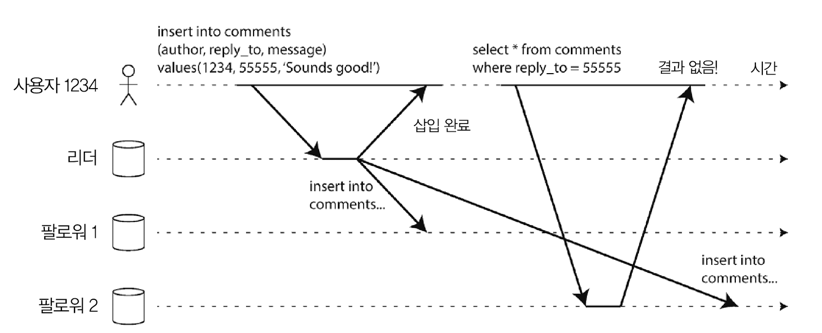
- 비동기 방식
  - 쓰기를 한 직후 바로 읽을 경우 미처 반영되지 않은 데이터를 읽을 수 있음  
- 쓰기 후 읽기(read-after-write) 일관성 필요
  - 사용자가, 자신이 제출한 모든 갱신을 볼 수 있음을 보장 (다른 사용자껀 보장 X)

### 쓰기 후 읽기 일관성 구현 방법 
- 사용자가 자신이 수정한 내용을 읽을 때는 리더에서 읽도록 함 
  - 그 밖은 팔로워에서 조회 
  - 실제로 질의하지 않고 무엇이 수정됐는지 알 수 있는 방법 필요 
    - ex: SNS의 사용자 프로필 정보 → 프로필 소유자만 편집 가능 → 사용자의 프로필은 리더에서 읽고, 다른 사용자의 프로필은 팔로워에서 읽는 규칙 
- 애플리케이션 내 대부분의 내용을 사용자가 편집할 가능성이 있는 경우 
  - 이는 리더에서 모두 읽게 하기에는 비효율적임 (읽기 확장을 한 이유가 없어짐)
  - 리더에서 읽기를 수행할지 여부를 결정할 기준이 필요 
    - ex: 마지막 갱신 시각을 기준으로 갱신 후 1분 동안은 리더에서 모든 읽기 수행 규칙을 적용 
    - ex: 팔로워에서 복제 지연을 모니터링 → 리더보다 1분 이상 늦은 모든 팔로워에 읽기 질의 금지
- 클라이언트가 가장 최근 쓰기의 타임 스탬프를 기억 
  - 복제 서버가 최소한 해당 타임 스탬프까지 갱신을 반영하게 함 
  - 복제 서버가 최신이 아닌 경우, 다른 복제 서버가 읽기를 처리 or 최신화 될 때 까지 질의 대기 
- 복제 서버가 여러 데이터 센터에 분산된 경우 복잡도 증대 
  - 리더가 제공해야 하는 모든 요청이 리더가 포함된 데이터센터로 라우팅 되어야함 

### 동일한 사용자가 여러 디바이스로 서비스를 접근할 경우 
- 디바이스 간(cross-device) 쓰기 후 읽기 일관성이 제공돼야 함 
- 추가적으로 고려해야 할 사항
  - 사용자의 마지막 갱신 타임스탬프를 중앙 집중식으로 관리 
  - 동일한 데이터 센터로 라우팅해야 함  
    - 여러 데이터 센터에 분산된 경우, 다른 디바이스의 연결이 동일한 데이터 센터로 라우팅 된다는 보장이 없음

## 단조 읽기 
- 비동기식 팔로워에서 읽을 때 **시간이 거꾸로 흐르는 현상을 목격**할 수 있음 
  - 사용자가 각기 다른 팔로워에서 여러 읽기를 수행할 때 발생 가능

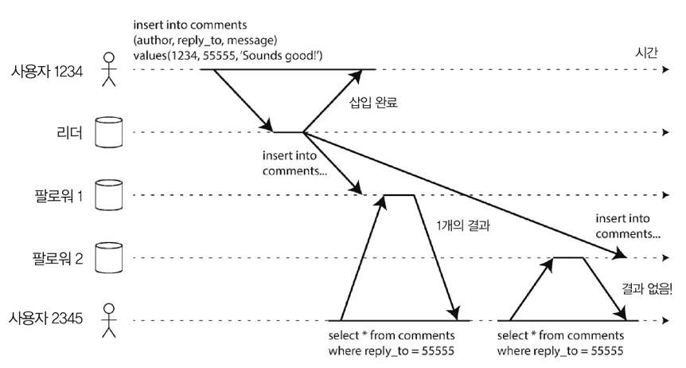
- 사용자 2345가 같은 질의를 2회 수행 
  - 첫 번째 팔로워는 복제 지연이 거의 없는 상황 → 쓰기를 알고 있음 → 최근에 추가한 코멘트를 반환 
  - 두 번째 팔로워는 복제 지연이 어느 정도 있음 → 쓰기를 알지 못함 → 최근에 추가한 코멘트를 반환하지 못함
    - 쓰여지기 전의 시점의 시스템을 보고 있는 것 
  - 사용자 입장에서, 처음에는 결과가 있었는데 두번째 요청 시 결과가 없어져버림 → 시간을 거꾸로 ...

### 단조 읽기(monotonic read)
- 위와 같은 이상 현상이 발생하지 않음을 보장 
- 일관성 보장 정도
  - `최종 일관성 < 단조 읽기 < 강한 일관성`
  - 단조 읽기는 데이터 read 시 이전 값을 볼 수 있으나, 여러번 읽어도 시간이 되돌아가는 현상을 보지는 않음
    - 즉, 이미 새로운 데이터를 읽었다면 예전 데이터를 읽지 않는 것을 보장함 
- 달성 방법 
  - 특정 사용자의 읽기가 동일한 팔로워에서 수행되게끔 하기
    - 다른 사용자는 다른 복제서버에서 읽을 수 있음 
    - ex: 사용자 ID의 해시를 기반으로 팔로워를 선택 
      - 팔로워 장애 시 다른 복제 서버로 재라우팅 필요 

## 일관된 순서로 읽기
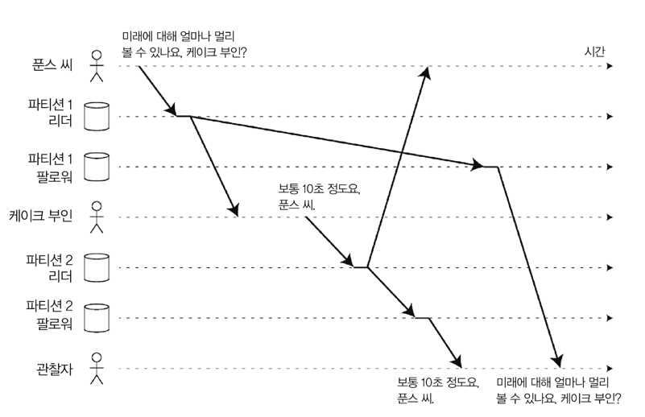
- 쓰기가 서로 인과관계를 가지고 있다고 가정해보자 
  - 위 그림처럼, 푼스 씨의 질문이 케이크 부인의 대답보다 먼저 오는것이 인과관계가 맞다 
  - 그런데, 팔로워가 서로 다른 순서로 복제되는 경우, 이러한 인과관계가 깨질 수 있음
  - 케이크 부인의 대답이 푼스 씨의 질문보다 먼저 오는 현상이 발생할 수 있음
- 이는 파티셔닝 된(샤딩 된) 데이터베이스에서 발생하는 특징적인 문제임 
  - DB가 항상 같은 순서로 쓰기를 적용하게 하면 읽기는 일관된 순서로 보기 때문에 인과성 위반이 발생하지 않을 수 있음
    - 하지만, 분산 DB에서 서로 다른 파티션은 독립적으로 동작하여 쓰기에 대한 전역 순서는 없음
    - => 사용자는 예전 상태의 일부와 새로운 상태의 일부를 함께 볼 수 있음 
  - 6장에서 to be continued...

### 일관된 순서로 읽기(Consistent Prefix Reads)
- 인과성 위반이 발생하지 않도록 보장
  - 일련의 쓰기가 특정 순서로 발생할 경우, 해당 쓰기를 읽는 모든 사용자는 같은 순서로 쓰여진 내용을 보게 됨을 보장
- 달성 방법
  - 서로 인과성이 있는 쓰기가 동일한 파티션에 기록되게끔 하는 방법 
    - 일부 애플리케이션에는 효율적이지 않음 

## 복제 지연을 위한 해결책 
- 최종적 일관성 시스템으로 작업 시
  - 복제 지연이 몇 분이나 몇 시간으로 증가할 경우 애플리케이션이 어떻게 동작할지 생각 해보아야 함 
  - 사용자에게 좋지 않은 경험을 제공할 것 같다면, 쓰기 후 읽기와 같은 강한 보장을 제공하게끔 시스템을 설계할 필요가 있음
    - 비동기식으로 동작하지만, 동기식으로 동작하는 척 하는 것이 문제 해결 방안 
- 애플리케이션 내에서 해결할 수는 있지만 굳이 그러진 말자 
  - 너무 복잡해서 잘못되기 쉽다
  - 애플리케이션 개발자는 이런 미묘한 복제 문제를 걱정하지 않아야 한다
    - 이를 위해 **트랜잭션**이라는 개념이 존재한다.
    - 트랜잭션은 **애플리케이션이 더 단순해지기 위해 DB가 더 강력한 보장을 제공하는 방법**이다.

---

---

# 다중 리더 복제 
- 단일 리더 기반 복제의 단점
  - 리더가 하나만 존재하고, **모든 쓰기가 해당 리더를 거쳐야**함
  - 리더에 장애가 나면 쓰기 불가능 
- 다중 리더 복제
  - 쓰기를 허용하는 노드를 하나 이상 두는 것
  - 쓰기 처리를 하는 각 노드는 데이터 변경을 다른 모든 노드에 전달해야 함 
  - 각 리더는 다른 리더의 팔로워 역할도 함 
- 다중 리더 복제 단점 
  - 동일한 데이터를 다른 두 개의 데이터 센터에서 동시에 변경할 수 있음
    - 이럴 때 발생하는 쓰기 충돌은 **반드시 해소해야 함**
  - 문제될 소지가 많은 것
    - Auto-increment PK
    - Trigger
    - 무결성 제약조건

## 유스케이스 
- 단일 데이터센터 내 다중 리더 설정은 복잡도에 비해 **이점이 많이 크지 않다**

### 다중 데이터 센터 
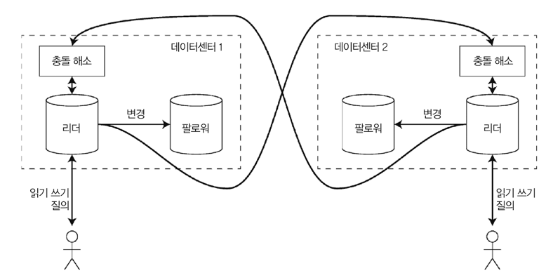
- 각 데이터 센터마다 리더 설정 
  - 데이터 센터 간에는 각 리더가 다른 리더에게 변경 사항을 복제 

#### 단일 리더 vs 다중 리더
|             | 단일 리더                                                  | 다중 리더                                                                                                                 |
|-------------|--------------------------------------------------------|-----------------------------------------------------------------------------------------------------------------------|
| 성능          | - 모든 쓰기가 리더가 있는 데이터 센터로 이동  - 쓰기 지연 시간 ↑           | - 모든 쓰기는 각 데이터 센터에서 처리   - 비동기 방식으로 다른 데이터 센터에 복제   - 사용자는 데이터 센터 간 네트워크 지연을 몰라도 됨   - 사용자가 인지하는 성능은 더 좋음 |
| 데이터센터 중단 내성 | - 리더가 있는 데이터센터가 고장나면 장애 복구를 위해 다른 데이터센터의 팔로워를 리더로 승격시킴 | - 각 데이터 센터는 다른 데이터 센터와 독립적으로 동작   - 고장난 데이터 센터가 돌아왔을 때 복제를 따라잡음                                                   |
| 네트워크 문제 내성  | - 데이터센터 내 연결의 쓰기는 동기식   - 데이터센터 내 연결 문제에 매우 민감     | - 네트워크 문제에 보다 더 잘 견딤   - 일시적인 네트워크 중단에도 쓰기 처리는 진행되기 때문                                                            |

- 네트워크 문제 내성 쪽이 이해가 잘 안됨

### 오프라인 작업을 하는 클라이언트 
- 인터넷 연결이 끊어진 동안 애플리케이션이 계속 동작해야 하는 경우 
  - ex: 휴대전화, 노트북 등의 **캘린더 앱**
    - 인터넷 연결과 관계 없이 언제든지 회의를 볼 수 있어야 함 
    - 언제라도 새로운 회의에 참가할 수 있어야 함 
  - 오프라인 상태에서 데이터를 변경 시, 온라인 상태가 되면 서버와 디바이스를 **동기화 해야 함**
- 디바이스에는 리더처럼 동작하는 로컬 데이터베이스가 있음
  - 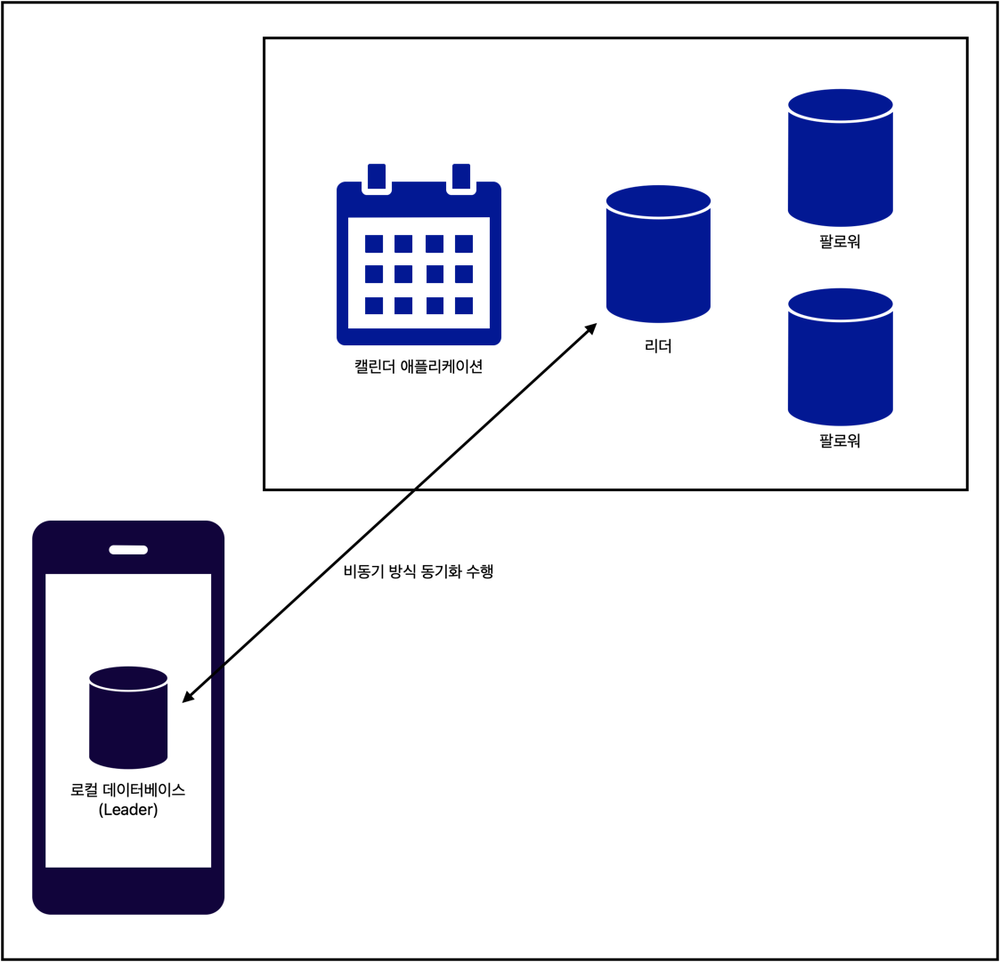
  - 다중 리더 복제와 동일함 (각 디바이스가 데이터센터)

### 협업 편집
- 동시에 여러 사람이 문서를 편집할 수 있는 **실시간 협업 편집** 애플리케이션
- 한 사용자가 문서를 편집
  - 변경 내용을 로컬 복제 서버에 적용 
  - 동일한 문서를 편집 중인 다른 사용자와 서버에 비동기 방식으로 복제 
- 편집 충돌이 없음을 보장하려면
  - 애플리케이션은 사용자가 편집하기 전에 문서의 락을 얻어야 함
  - 다른 사용자가 문서를 편집하려면 첫 번째 사용자의 변경이 커밋되고 잠금이 해제될 때까지 기다려야 함
  - 이는 **단일 리더 복제**와 동일한 방식
- 더 빠른 협업을 위해서는
  - 변경 단위를 매우 작게(단일 키 입력 등..) 해서 락을 피할 수 있음
  - 여러 사용자가 동시 편집이 가능해지지만, 충돌 해소 등 부가적인 작업이 필요함 

## 쓰기 충돌 다루기
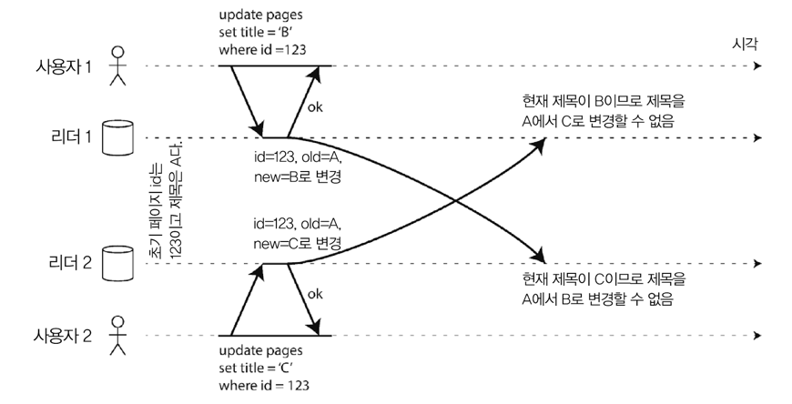
- 다중 리더 복제 방식에서 가장 큰 문제점임 

### 동기 vs 비동기 충돌 감지 
#### 단일 리더 데이터베이스
- 첫 번째 쓰기가 완료될 때까지 두 번째 쓰기를 차단
  - 또는 두 번째 쓰기 트랜잭션 중단 → 사용자가 재시도를 하도록 유도 

#### 다중 리더 데이터베이스
- 두 쓰기는 모두 성공 
  - 충돌은 이후 특정 시점에 비동기로 감지 
  - 이 때 사용자에게 충돌 해소를 요구하면 너무 늦음 
- 동기식 충돌 감지 → 다중 리더 복제의 주요 장점(각 복제가 독립적으로 쓰기를 허용)이 사라짐 

### 충돌 회피 
- 가장 간단하고, 자주 권장되는 전략 
- 특정 레코드의 모든 쓰기가 동일한 리더를 거치도록 하면 충돌이 발생하지 않음
- 데이터 센터 장애로 다른 데이터센터로 라우팅해야 하거나, 레코드의 지정된 리더를 변경하고 싶을 경우 충돌 회피가 실패함 

### 일관된 상태 수렴 
- 단일 리더 데이터베이스 → 순차적인 순서로 쓰기 적용
- 다중 리더 데이터베이스 → 쓰기 순서가 정해지지 않아 최종 값이 무엇인지 명확하지 않음 
  - 각 팔로워가 쓰기를 본 순서대로 적용한다면 일관성 없는 상태가 되어버림
    - 리더 간 최종 데이터가 달라질 수 있기 때문 
    - 모든 복제 계획은 **모든 팔로워가 최종적으로는 동일하다는 사실을 보장**해야 함
- 수렴(convergent) 방식으로 충돌을 해소 
  - 모든 변경이 복제되어 모든 팔로워에게 동일한 최종 값이 전달되게 해야 함 
- 수렴 충돌 해소를 달성하는 방법
  - 각 쓰기에 고유 ID를 부여 
    - 가장 높은 ID를 가진 쓰기를 선정 
    - 다른 쓰기는 버림
    - 대중적이지만 데이터 유실 위험이 있음
  - 각 복제 서버에 고유 ID 부여 
    - 높은 숫자의 복제 서버에서 생긴 쓰기가 낮은 숫자의 복제 서버에서 생긴 쓰기보다 항상 우선 적용됨 
    - 데이터 유실 위험이 있음
  - 어떻게든 값을 병합
    - ex: 사전 순으로 정렬 후 병합 
  - 명시적 데이터 구조에 충돌을 기록해 모든 정보를 보존 
    - 나중에 사용자에게 메세지를 보여주는 등의 충돌 해소 애플리케이션 코드를 작성 

### 사용자 정의 충돌 해소 로직
- 적합한 충돌 해소 방법은 애플리케이션마다 다름 
  - 다중 리더 복제 시스템에서는 애플리케이션 코드를 이용해 충돌 해소 로직을 작성하기도 함 
- 구성 방안
  - 쓰기 수행 중 해소
    - 복제된 변경 사항 로그에서 DB가 충돌을 감지
    - 충돌 핸들러 호출 및 충돌 해소
    - 사용자에게 충돌 내용 표시 X & 백그라운드 프로세스에서 빠르게 수행 
  - 읽기 수행 중 해소 
    - 충돌 감지 
    - 모든 충돌 쓰기를 저장 
    - 다음번 데이터를 읽을 때 여러 버전의 데이터가 애플리케이션에 반환 
    - 애플리케이션이 사용자에게 충돌 내용을 보여주거나 자동으로 충돌을 해소
    - 해소한 결과는 다시 DB에 기록 
- 충돌 해소는 **전체 트랜잭션이 아니라 개별 row나 document 수준에서 적용**됨 
  - 원자적으로 여러 다른 쓰기를 수행하는 트랜잭션인 경우, 각 쓰기가 충돌 해소를 위해 별도로 간주됨 

### 자동 충돌 해소 
- 충돌 없는 복제 데이터 타입(conflict-free replicated data type, CRDT)
  - Set, Map, Sorted list, Counter 등을 위한 데이터 구조의 집합으로 여러 사용자가 편집할 수 있고 합리적인 방법으로 충돌을 자동 해소
    - two-way merge function을 사용
  - https://en.wikipedia.org/wiki/Conflict-free_replicated_data_type
    - 애플리케이션은 다른 복제본과의 조정 없이 독립적으로, 동시에 모든 복제본을 업데이트할 수 있습니다
    - 알고리즘(데이터 유형 자체의 일부)은 발생할 수 있는 모든 불일치를 자동으로 해결합니다. 
    - 복제본은 특정 시점에 서로 다른 상태를 가질 수 있지만 결국에는 수렴이 보장됩니다.
- 병합 가능한 영속 데이터 구조(mergeable persistent data structure)
  - git 과 유사하게 명시적으로 히스토리를 추적하고 three-way merge function 을 사용함 
- 운영 변환(operational transformation) 
  - 이더패드, 구글 독스와 같은 협업 편집 애플리케이션의 충돌 해소 알고리즘 
  - 텍스트 문서를 구성하는 문자 목록과 같은 정렬된 항목의 동시 편집을 위해 설계되었음 

### 충돌은 무엇인가? 
- 동일한 레코드의 동일한 필드를 동시에 수정하는 것과 같은 **명백한 충돌**이 있음 
- 어떤 종류의 충돌은 감지하기가 조금 더 어려움 
  - ex: 예약 시스템 
    - 언제, 누가 예약했는지 추적 
    - 특정 시간대에 한 사람 또는 조직만 예약하게끔 보장해야 함 
    - 두 개의 다른 예약이 같은 시간대에 생길 때...
      - 두 예약이 다른 리더에서 이뤄질 경우 충돌이 발생할 수 있음

## 다중 리더 복제 토폴로지
- 복제 토폴로지?
  - 쓰기를 한 노드에서 다른 노드로 전달하는 통신 경로를 설명하기 위한 개념
- 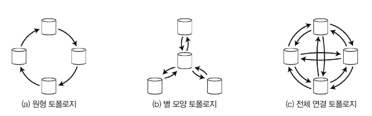
  - 원형 토폴로지
    - MySQL은 해당 토폴로지만 제공 
    - 각 노드가 하나의 노드로부터 쓰기를 받고, 자신의 쓰기도 추가해서 다른 노드에 전달 
  - 별 모양 토폴로지
    - 지정된 루트 노드 하나가 다른 모든 노드에 쓰기를 전달한다 
  - 전체 연결 토폴로지 
    - 모든 리더가 각자의 쓰기를 다른 모든 리더에 전송 

- 원 모양, 별 모양 토폴로지 
  - 무한 복제 루프 방지 알고리즘 필요
    - 각 노드에 고유 식별자가 있음 
    - 쓰기 전달 시 식별자를 태깅해서 전달 
    - 자신의 식별자가 태깅된 경우는 변경 사항을 무시
  - 하나의 노드에 장애 발생 시 복제 메세지 흐름에 방해를 줄 수 있음 
    - 해당 노드가 복구될 때까지 통신 불가 
    - 장애 노드를 회피하게끔 재설정 가능

- 전체 연결 토폴로지
  - 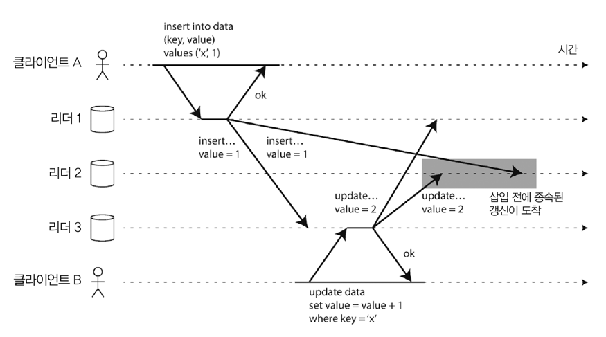
    - 일부 네트워크 연결이 다른 연결보다 빠른 경우 일부 복제 메세지가 다른 메세지를 추월하여 잘못된 순서로 도착할 수 있음 
      - 인과성 문제가 발생
  - 올바르게 정렬하기 위해 **버전 벡터(version vector)** 라는 기법을 사용할 수 있음

> 다중 리더 복제 시스템을 사용하려면...
> - 위와 같은 문제점들을 인지하고, 문서를 주의 깊게 읽은 후, 철저하게 테스트하고 믿을 만한 보장을 제공하는지 확인해야 한다. 

---

---

# 리더 없는 복제
- Dynamo style
  - Dynamo db가 리더 없는 복제를 사용한 후 유행 
  - 이와 비슷한 구성을 가진 DB를 다이나모 스타일이라고 함
- 클라이언트가 여러 복제 서버에 직접 쓰기를 전송 or Coordinator node가 쓰기를 전달

## 노드가 다운됐을 때 데이터베이스에 쓰기 
- 리더 없는 복제 방식은 노드 중 하나가 다운되더라도 장애 복구가 필요하지 않음 

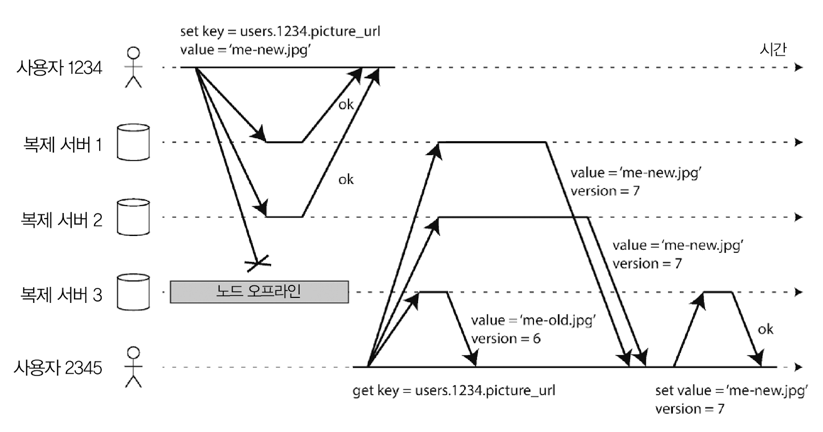
두 개의 ok응답이 올 경우 쓰기가 성공한 것으로 간주한다고 가정
1. 사용자 1234가 쓰기를 모든 복제 노드에 병렬로 전송 
2. 사용 가능한 두 복제 노드는 쓰기를 받았지만, 사용 불가능한 노드는 쓰기를 놓침 
3. 사용자 1234는 쓰기가 성공하였다고 판단함 
4. 사용 불가능한 노드가 복구됨
5. 노드가 다운된동안 발생한 모든 쓰기가 누락된 상태 
6. 다른 사용자가 해당 노드에서 값을 읽을 경우 **오래된(outdated)** 값을 얻을 수 있음 

- 문제 해결 
  - 클라이언트가 DB에서 읽을 때 **읽기 요청을 병렬로 여러 노드에 전송**
  - 버전 숫자를 이용해 어떤 값이 최신 내용인지 결정

### 읽기 복구와 안티 엔트로피 
- 복제는 최종적으로 모든 데이터가 복제 서버에 복사된 것을 보장해야 함
  - 사용 불가능한 노드가 복구된 후 누락된 쓰기를 따라 잡아야 함 
- 다이나모 스타일 데이터 스토어가 제공하는 메커니즘
  - 읽기 복구
    - 여러 노드에서 병렬로 읽기 수행
    - 오래된 응답 감지 
    - 새로운 값을 해당 노드에 다시 기록 
    - 읽기가 자주 발생할 때 적합 
  - 안티 엔트로피 처리
    - 백그라운드 프로세스를 두고 복제 서버간 데이터 차이를 지속적으로 확인 
    - 누락된 데이터를 하나의 복제 서버에서 다른 서버로 복사 
    - 특성 순서로 쓰기를 복사하여 상당한 지연이 있을 수 있음 

### 읽기와 쓰기를 위한 정족수  
- 성공한 쓰기가 적어도 N개의 복제 서버에 존재한다는 것을 보장한다면, 나머지 복제 서버의 데이터가 오래된 데이터임을 의미함 

#### 정족수 읽기와 쓰기 
- `w + r > n` → 읽을 때 최신 값을 얻을 것으로 기대 
  - n: 복제 서버의 수
  - w: 쓰기가 확정될 수 있는 "쓰기가 성공한 노드"의 개수
  - r: 읽기를 위해 질의해야 하는 노드의 개수 
- n개의 복제 서버가 있을 때, w개의 노드에서 성공해야 쓰기가 확정되고, 모든 읽기는 최소한 r개의 노드에 질의해야 함
- 이를 따르는 읽기와 쓰기를 정족수(quorum) 읽기와 쓰기 라고 함
  - 유효한 읽기, 쓰기를 위해 필요한 최소 투표수를 r, w로 생각할 수 있음
- 일반적인 선택 
  - n = 홀수 (3 or 5)
  - w = r = (n + 1) / 2 를 반올림한 값 (복제 서버 대수의 과반수가 되도록)
- `w < n`
  - 노드 하나를 사용할 수 없어도 여전히 쓰기 처리 가능
- `r < n`
  - 노드 하나를 사용할 수 없어도 여전히 읽기 처리 가능 
- `n = 3, w = 2, r = 2` 
  - 사용 불가능한 노드 하나를 용인 
- `n = 5, w = 3, r = 3`
  - 사용 불가능한 노드 둘을 용인
  - 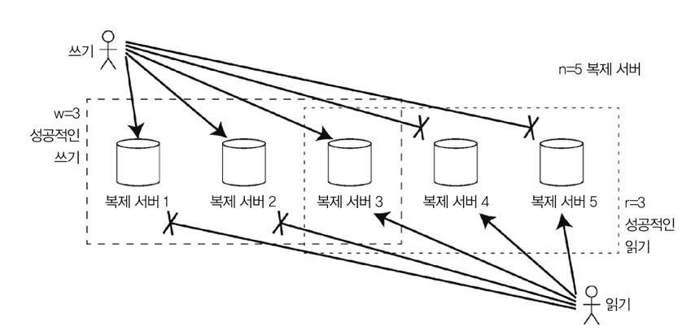
- 일반적으로 읽기와 쓰기는 항상 모든 n개의 복제 서버에 병렬로 전송 
  - w, r은 얼마나 많은 노드를 기다릴지를 결정 
    - 읽기나 쓰기가 성공했다고 간주하려면 몇 개의 노드에서 성공을 확인해야 하는지
- 사용 가능한 노드가 w, r 수 보다 적다면 쓰기나 읽기는 에러를 반환함 
  - 노드가 성공했는지 여부만 중요 

## 정족수 일관성의 한계
- `w + r > n`을 만족할 경우 모든 읽기가 키의 최신 값을 반환할 것으로 기대 
  - 읽은 노드 중 최신 값을 가진 노드가 하나 이상 있어야 함 
  - w, r이 작을수록 오래된 값을 읽을 확률이 높음
- `w + r > n`을 만족해도 오래된 값을 반환하는 에지 케이스가 존재 
  - 느슨한 정족수를 사용할 경우
    - w개의 쓰기가 r개의 읽기와 다른 노드에서 수행될 수 있음
    - r개의 노드와 w개의 노드가 겹치는 것이 보장되지 않음
  - 두 개의 쓰기가 동시에 발생하면 어떤 쓰기가 먼저 발생했는지 불분명함 
    - 안전한 해결책
      - 동시 쓰기를 합치는 방법 
      - 타임 스탬프를 기반으로 승자를 결정하면 쓰기가 유실될 수 있음
  - 쓰기와 읽기가 동시에 발생할 경우
    - 쓰기가 일부 복제 서버에만 반영될 수 있어 읽기가 최신 값을 반환하는지 여부가 불분명함 
  - 쓰기가 일부 복제 서버에서는 성공했으나, 다른 복제 서버에서는 실패한 경우
    - 전체 성공 서버가 w개보다 적다면  
      - 쓰기가 실패된 것으로 보고가 되어버림
      - 하지만 성공한 복제 서버에서는 롤백하지 않음
      - 따라서 이어지는 읽기에 쓰기 값이 반환될수도 반환되지 않을 수도 있게 됨
  - 새 값을 전달하는 노드에 장애가 발생한 경우 
    - 예전 값을 가진 다른 복제 서버에서 해당 데이터가 복원됨 
    - 새로운 값을 저장한 복제 서버 수가 w개보다 적어져 정족수 조건이 깨짐 
  - 시점 문제로 에지 케이스가 있을 수 있음

### 최신성 모니터링 
- 데이터베이스가 최신 결과를 반환하는지 여부를 모니터링 하는 것은 중요함 
  - 복제 상태를 지속적으로 파악해서 뒤쳐질 경우 원인을 명확히 조사할 수 있어야 함 
- 리더 기반 복제
  - 복제 지연에 대한 지표를 노출하여 모니터링 시스템에 제공 
  - 리더의 현재 위치 - 팔로워의 현재 위치 = 복제 지연량 
    - 위치 = 복제 로그의 위치(로컬에 적용된 쓰기의 수)
- 리더 없는 복제 시스템
  - 쓰기가 적용 된 순서 고정이 불가능하여 모니터링이 어려움 
  - 읽기 복구만 사용하고 안티 엔트로피는 사용하지 않을 경우, 자주 읽히지 않는 값이 얼마나 오래되었는지 알 수 없음

  
## 느슨한 정족수와 암시된 핸드오프
- 정족수가 있는 데이터베이스는 개별 노드 장애나 지연을 용인함
- 가끔 오래된 값 읽기를 허용하는 유스케이스에 사용하기 매우 좋은 방법 
- 응답 가능한 데이터베이스 노드가 적어질 경우, 정족수를 충족할 수 없는 경우가 발생함 

### Trade-off
- w나 r 노드 정족수를 만족하지 않는 모든 요청에 오류를 반환할지 
  - 일단 쓰기를 받아들이고 값이 저장되는 n개 노드에 속하지는 않지만 연결 가능한 노드에 기록할지
- 후자를 느슨한 정족수라고 표현함 
  - w, r 개수만큼의 성공 응답이 필요하지만, 값을 위해 지정된 n개의 "홈 노드"에 없는 노드가 포함될 수 있음 
  - 장애가 해제되면 홈 노드가 아닌 노드에 기록된 모든 쓰기를 홈 노드로 전송함 
  - 이를 **암시된 핸드오프**라고 부름 
- 느슨한 정족수는 쓰기 가용성을 높이는 데 유용함 
  - w 노드 어딘가에는 저장이 됨 
  - 암시된 핸드오프가 완료될 때 까지는 r 노드의 읽기가 저장된 데이터를 본다는 보장은 없음 

### 다중 데이터센터 운영 
- 리더 없는 복제도 다중 데이터센터 운영에 적합함 

## 동시 쓰기 감지 
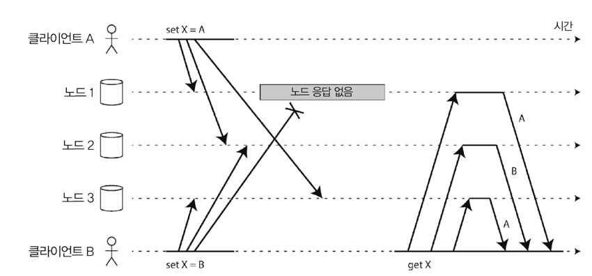
- 여러 클라이언트가 동시에 같은 키에 쓰는 것을 허용
- 이벤트가 다른 순서로 도착할 수 있음 
- 쓰기를 단순히 덮어 쓸 경우 영구적으로 일관성이 깨지는 상황이 발생 
- 최종적 일관성을 위해 복제본들은 동일한 값을 가져야 함 

### 최종 쓰기 승리(동시 쓰기 버리기)
- 예전 값을 버리고 가장 최신 값으로 덮어쓰는 방법
  - 어떤 값이 최신인지 구분하는 방법이 필요 
- 임의로 순서를 정할 수 있음
  - 쓰기에 타임 스탬프를 붙여 순서를 정하는 방식 → 최종 쓰기 승리(LWW) 라고 부르는 충돌 해소 알고리즘
- LWW
  - 최종적 일관성을 달성하기 위한 방법
  - 지속성을 희생함 
    - 쓰기가 모두 성공으로 보고되어도, 쓰기 중 하나만 남고 다른 쓰기는 무시됨 
    - 심지어는 동시 쓰기가 아니더라도, 쓰기가 삭제될 수 있음 
  - 캐싱과 같이 손실된 쓰기를 허용하는 상황에 적합한 알고리즘 
  - 모든 쓰기 작업에 UUID와 같은 고유한 키를 부여해서, 동시에 갱신하는 상황을 방지할 수 있음 

### "이전 발생" 관계와 동시성 
- 두 가지 작업이 동시에 수행됐는지 여부를 결정하는 방법 
- 두 작업 간 인과성이 있는 경우 
  - A → B 인 경우, B가 A에 대해 알거나 의존적임 
    - A는 B의 이전 발생(happened-before)임 
  - 한 작업이 다른 작업 이전에 발생했는지 여부가 **동시성 의미**를 정의하는 핵심 
    - 인과성이 없으면 단순히 동시 작업임 
    - 따라서, 두 작업 간 인과성을 파악하여 **동시성인지 아닌지 여부를 알 수 있는 알고리즘이 필요**함 
- 한 작업이 다른 작업 전에 발생할 경우
  - 나중 작업은 이전 작업을 덮어쓸 수 있음 
  - 동시에 발생한 경우는 충돌을 해소해야 함 

> 동시성, 시각, 상대성
> - 두 작업이 정확히 같은 시각에 발생했는지 알기란 상당히 어려움 
> - 동시성을 정의하기 위해 정확한 시각은 중요하지 않음 
>   - 작업이 서로 알 수 없다면, 시간 간격을 두고 발생하더라도 동시에 수행한 것으로 간주함 

### 이전 발생 관계 파악하기
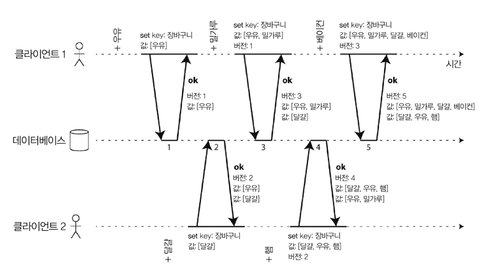
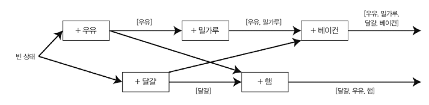
- 두 작업이 동시에 발생했는지 또는 하나가 이전 발생인지 여부를 결정하는 알고리즘이 필요
- 클라이언트는 서버 데이터와 동일한 최신 상태로 유지하지 못함 
  - 항상 다른 작업이 동시에 수행됐기 때문 
  - 예전 버전의 값을 덮어 쓰기 때문에, 최종적으로 손실된 쓰기는 없음
- 서버는 버전 번호를 보고 두 작업이 동시에 수행됐는지 여부를 결정한다
  - 서버가 모든 키에 대한 버전 번호를 유지 
  - 기록 시마다 버전 번호 증가 
  - 기록한 값은 새로운 버전 번호를 가지고 저장됨
  - 클라이언트가 키를 읽을 때, 서버는 최신 버전 뿐만 아니라 덮어쓰지 않은 모든 값을 반환함 
  - 클라이언트가 키를 기록할 때, 이전 읽기의 버전 번호를 포함해야 하고 이전 읽기에서 받은 모든 값을 함께 합쳐야함 
  - 서버가 특정 번호를 가진 쓰기를 받을 때, 해당 버전 이하 모든 값을 덮어쓸 수 있음 
    - 이보다 높은 버전 번호의 모든 값은 유지해야 함 

### 동시에 쓴 값 병합 
- 어떤 데이터도 자동으로 삭제되지 않음을 보장 
  - 클라이언트 추가적인 작업 필요 
- 여러 작업이 동시에 발생할 경우, 클라이언트가 동시에 쓴 값을 합쳐 정리해야 함 
- 병합하는 합리적인 접근 방식은 합집합을 취하는 것임 
  - 근데 삭제한 값을 합집합을 취해버리면 삭제한 값이 다시 보일 수 있음 
  - 제거한 값임을 나타내기 위해 해당 버전 번호에 표시를 남겨둬야 함 
    - Tombstone 이라는 삭제 표시를 이용

### 버전 벡터 
- 다중 복제본에서는 단일 버전 번호로는 충분하지 않음 
  - key당 버전 번호 + 복제본 당 버전 번호 로 이뤄져야 함 
  - 각 복제본은 쓰기를 처리할 때 자체 버전 번호르 증가시키고, 각기 다른 복제본의 버전 번호도 계속 추적함
    - 덮어쓸 값과 형제로 유지할 값을 나타냄 
- 버전 벡터
  - 모든 복제본의 버전 번호 모음 
  - 값을 읽을 때, 데이터베이스 복제본에서 클라이언트로 보냄
  - 이후에 값이 기록될 때 데이터베이스로 재전송
  - 버전 벡터를 이용해 덮어 쓰기와 동시 쓰기를 구분 
  - 버전 벡터 구조는 하나의 복제본을 읽어 복제본에 다시 쓰는 작업이 안전함을 보장함 
  - ex: 리악의 dotted version vector

---

---

# 정리 
- 복제는 다양한 용도로 사용
  - 고가용성
    - 여러 장비가 다운돼도 시스템이 계속 동작하게 함 
  - 연결이 끊긴 작업
    - 네트워크 중단이 있어도 애플리케이션이 계속 동작하게 함 
  - 지연 시간
    - 지리적으로 사용자에게 더 가까이 데이터를 배치하여 빠르게 작업 수행
  - 확장성 
    - 복제본에서 읽기 수행 → 단일 장비에서 다룰 수 있는 양보다 많은 양의 읽기 작업 처리 
- 동시성, 잘못될 수 있는 모든 사항을 주의 깊게 생각하고, 그 결함의 결과를 주의 깊게 다뤄야 함 
- 최소한 사용 불가능한 노드와 네트워크 중단에는 대처해야 함
- 복제에 대한 세 가지 주요 접근 방식
  - 단일 리더 복제
  - 다중 리더 복제
  - 리더 없는 복제
- 동기 vs 비동기 
  - 비동기: 복제 지연, 서버 장애에 대해 어떤 일이 일어났는지 파악하는 작업이 중요 
- 복제 지연으로 발생할 수 있는 일관성 문제 해결
  - 쓰기 후 읽기 일관성
    - 사용자가 자신이 제출한 데이터를 볼 수 있음을 보장
  - 단조 읽기
    - 어떤 시점에 데이터를 본 후에는 예전 시점 데이터를 볼 수 없게 함 
  - 일관된 순서로 읽기
    - 인과성이 있는 상태의 데이터를 볼 수 있게 함 
- 동시성 문제 
  - 여러 쓰기가 동시에 발생하는 상황을 허용함에 따라 발생하는 충돌 문제 해결 알고리즘 필요 
